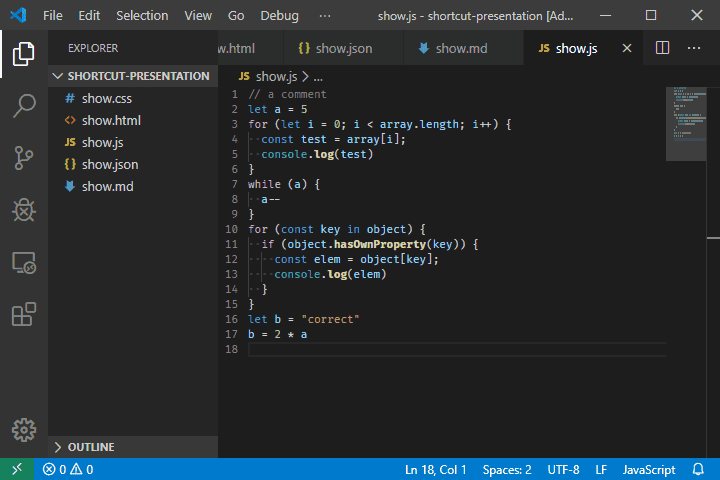
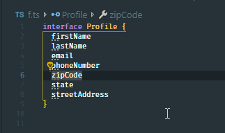
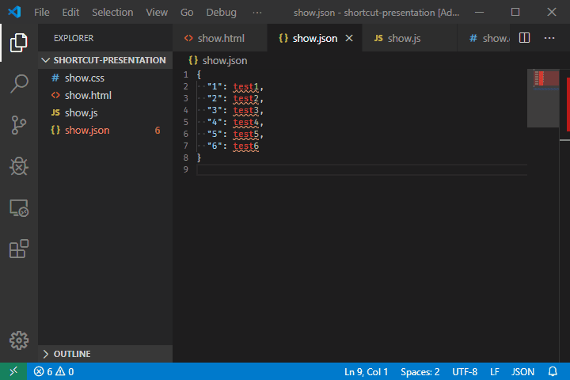

## 快速生成标签

```bash
E 代表HTML标签。
E#id 代表id属性。
E.class 代表class属性。
E[attr=foo] 代表某一个特定属性。
E{foo} 代表标签包含的内容是foo。
E>N 代表N是E的子元素。
E+N 代表N是E的同级元素。
E^N 代表N是E的上级元素。
```

```html
<!-- ul>li{list $}*3 -->

<ul>
  <li>list 1</li>
  <li>list 2</li>
  <li>list 3</li>
</ul>
```

- [VsCode 中使用 Emmet 神器快速编写 HTML 代码](https://www.cnblogs.com/summit7ca/p/6944215.html)
- [VSCode 快速生成代码](https://segmentfault.com/a/1190000018615760?utm_source=tag-newest)

## 快捷键

| 效果                         | 快捷键                        | 效果图                                                                   |
| ---------------------------- | ----------------------------- | ------------------------------------------------------------------------ |
| 禅模式编程模式               | `⌘ + k` + `Z`                 |     |
| 选中当前行                   | `⌘ + L`                       |                                                                          |
| 选中所有找到的匹配项         | `⇧ + ⌘ + L`                   |
| 格式化部分代码               | `⌘ + K ⌘ + F`                 |
| 复制光标                     | `command + Option + 上下箭头` |  |
| 在所选的每一行的末尾插入光标 | `⇧ + ⌥ + I`                   |       |
| 插入多个光标                 | Option + 点击                 |

[VSCode 常用快捷键 Mac](https://blog.csdn.net/caicai1171523597/article/details/88216088)
