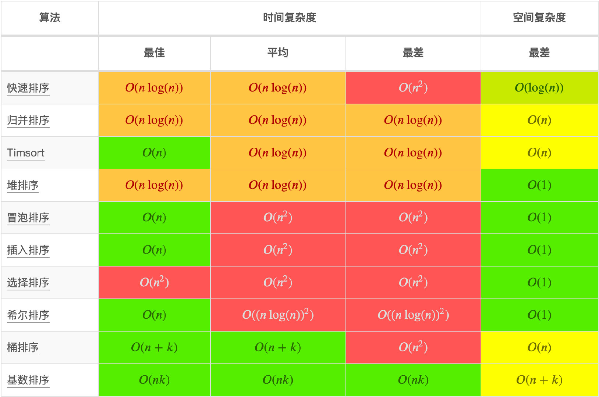

## 排序算法复杂度速查

## 算法

<MainIndex path='algorithm' />

## Mark

- [手把手撕 LeetCode 题目，扒各种算法套路的裤子](https://github.com/labuladong/fucking-algorithm)
- [前端该如何准备数据结构和算法？](https://juejin.im/post/5d5b307b5188253da24d3cd1)
- [用 JavaScript 实现的算法和数据结构，附详细解释和刷题指南](http://www.conardli.top/docs/)
- [前端算法系统练习指南](http://47.98.159.95/leetcode-js/nav/)
- [10 问 10 答，带你快速入门前端算法](https://juejin.im/post/5e92f8bcf265da47f60eb3b1)
- [(1.8w 字)负重前行，前端工程师如何系统练习数据结构和算法？【上】](https://juejin.im/post/5e2f88156fb9a02fdd38a184)
- [JavaScript 数据结构](https://www.cnblogs.com/jaxu/tag/JavaScript%E6%95%B0%E6%8D%AE%E7%BB%93%E6%9E%84/)
