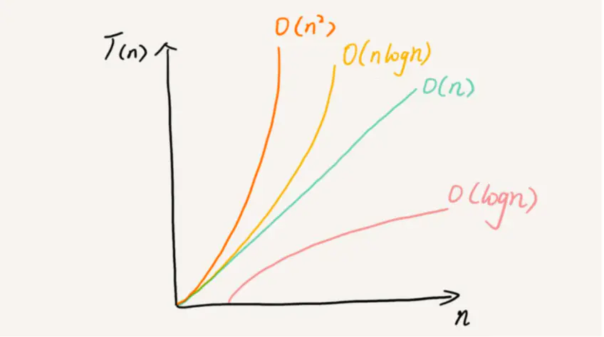

在开始学习之前，我们首先要搞懂时间复杂度和空间复杂度的概念，它们的高低共同决定着一段代码质量的好坏：

## 时间复杂度分析的方法

### 1️⃣ 只关注循环执行次数最多的一段代码

时间复杂度表达的是一种趋势，即随着输入的不同，代码运行时间的趋势是怎样的。所以我们通常会忽略掉常量和低阶系数，只需要关注最大阶的量级就可以了。所以分析算法复杂度的时候只需要关注循环执行次数最多的那一段代码就可以了。下面一个简单的例子。

```js {3}
function cal(n) {
  let sum = 0
  for (let i = 1; i <= n; i++) {
    sum = sum + i
  }
  return sum
}
```

我们很容易看到循环最多的是第 3、4 行代码，所以对这块进行重点分析，**这两行代码被执行了 n 次，所以总的时间复杂度就为 `O(n)`**

### 2️⃣ 加法法则：总复杂度等于量级最大的那段代码的复杂度

```js
function cal(n) {
  let sum_1 = 0
  for (let p = 1; p < 100; p++) {
    sum_1 = sum_1 + p
  }

  let sum_2 = 0
  for (let q = 1; q < n; q++) {
    sum_2 = sum_2 + q
  }

  let sum_3 = 0
  for (let i = 0; i <= n; i++) {
    for (let j = 1; j < n; j++) {
      sum_3 = sum_3 + i + j
    }
  }

  return sum_1 + sum_2 + sum_3
}
```

代码分三部分，分别求 sum_1、sum_2、sum_3，我们一个一个分析。

求 sum_1，循环了 100 次，因为 100 是个常量，和 n 没有任何关系。所以求 sum_1 的时间复杂度为 `O(1)`

求 sum_2，循环了 n 次，和 n 是有关系的，并且 n 是多少就循环多少次，所以求 sum_2 的时间复杂度为 `O(n)`

求 sum_3，看到有两个 for 循环，其中执行最多的代码有 `sum_3 = sum_3 + i + j`;外层的 for 循环执行了 n 次，内层的 for 循环在每次外层循环一次时会执行 n 次，所以最多执行了`n*n`次。所以 sum_3 的时间复杂度为 `O(n^2)`

整体的时间复杂度为 `O(1)`、`O(n)`、`O(n^2)`的最大值，即 `O(n^2)`

### 3️⃣ 乘法法则：嵌套代码的复杂度等于嵌套内外代码复杂度的乘积

```js
function cal(n) {
  let ret = 0
  for (let i = 1; i <= n; i++) {
    ret = ret + f(i)
  }
}
function f(n) {
  let sum = 0
  for (let i = 0; i <= n; i++) {
    sum = sum + i
  }
  return sum
}
```

单独看 cal()函数，假设 f()是一个普通操作，那么 cal()的时间复杂度就是 O(n)，但是 f()不是一个简单的操作，f()的时间复杂度也是 `O(n)`,并且 f()是嵌套在 cal()的循环中，所以 cal()函数的时间复杂度为 `O(n) * O(n) = O(n^2)`

## 几种常见的时间复杂度

虽然代码千差万别，但是常见的复杂度也就那几种。按照复杂度的数量级进行排序如下：

`O(1)` < `O(logn)` < `O(n)` < `O(nlogn)` < `O(n^2)` < `O(n^3)` < `O(n^k)` < `O(2^n)` < `O(n!)`

上面的几种复杂度量级可以分为两种，一种是多项式级别和非多项式级别，上面的复杂度量级中 `O(2^n)`和 `O(n!)`就是非多项式级别，随着 n 的增长，执行时间会极具增加，所以讨论这两种基本上没多大意义。我们常见的一些复杂度其实就是几种多项式级别的复杂度。

1. `O(1)`: 并不是只执行了一行代码，而是代码的执行时间不随着 n 的增长而增长，那么时间复杂度就是 `O(1)`。下面举个例子：

```js
function cal(n) {
  let sum = 0
  for (let i = 1; i <= 10000; i++) {
    sum = sum + i + n
  }
}
```

不管 n 多大，整个代码都是执行 10000 次，这个函数的时间复杂度就是 `O(1)`。

2. `O(logn)`：这种的可能不大好直接说，我们直接上代码去分析

```js
function cal(n) {
  let i = 1
  while (i <= n) {
    i = i * 2
  }
}
```

我们从代码中可以看到，i 每次是乘 2 的，所以循环出来就是 2^1 2^2 2^3 ... 2^x = n，我们知道 x 的值是多少就知道运行了多少次，根据数学运算，`x=log` 以 2 为底 n 的对数，所以时间复杂度为 `O(log_2^n)`

3. O(m + n)、O(m \* n)

```js
functin cal(m, n) {
  let sum_1 = 0
  for (let i = 0; i < m; i++) {
    sum_1 = sum_1 + i
  }

  let sum_2 = 0
  for (let j = 0; j < m; i++) {
    sum_2 = sum_2 + j
  }

  return sum_1 + sum_2
}
```

上面的代码，有两个输入，根据之前的标准，要找循环次数最多的代码作为时间复杂度，但是两个输入是不确定哪个大哪个小，无法忽略其中一个。所以整个代码的时间复杂度为 `O(m + n)`

## 空间复杂度

前面的时间复杂度讲的是执行时间与数据规模之间的增长关系，空间复杂度则是算法的存储空间和数据规模之间的增长关系。

```js
function fn(n) {
  let arr = new Array(n)
  for (let i = 0; i < n; i++) {
    arr[i] = i
  }
}
```

上面的第二行代码我们创建了一个长度为 n 的数组，和创建了一个 i 变量，但是 i 变量是常量级别的，和 n 没有关系所以可以忽略。剩下的除了一个长度为 n 的数组没有占用其他的空间，所以整个代码的空间复杂度为 `O(n)`。

我们常见的空间复杂度 `O(1)`，`O(n)`，`O(n^2)` ,像 `O(logn)`，`O(nlogn)` 这样的对数阶在空间复杂度中就基本上不会碰到

## 内容小节



用一张图来表示各个复杂度随着数据量的增长趋势，让我们能更直观的感受到不同算法之间的性能差异。一些基本的算法基本上复杂度都是图上的这几个。在看代码的时候，多思考，也可以多想想自己现在写的代码时间空间复杂度是多少，是否能够降低，长此以往，能够大大提升自己的代码质量和代码性能。
