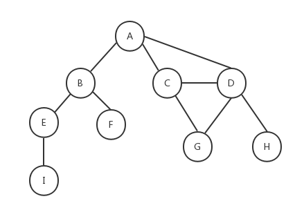
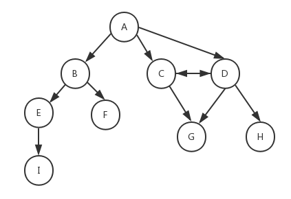
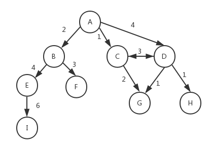
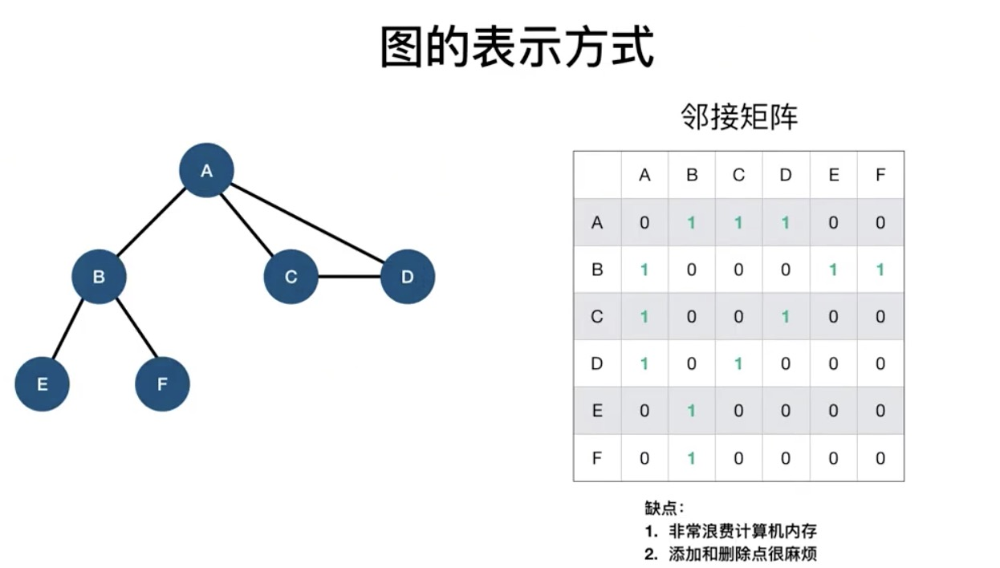
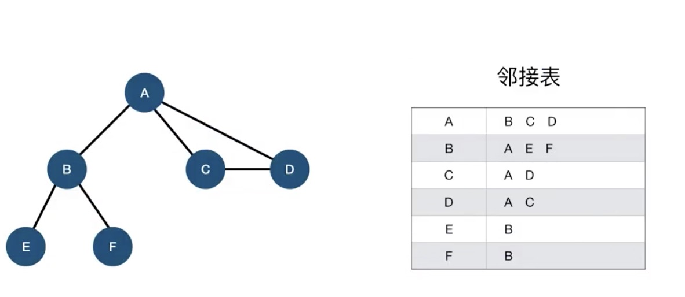
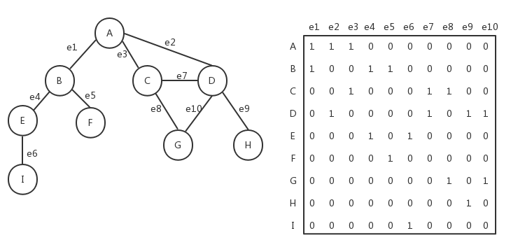
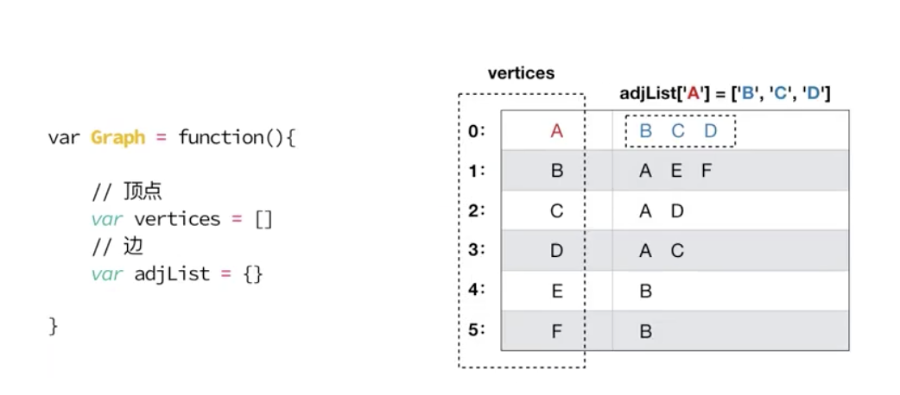
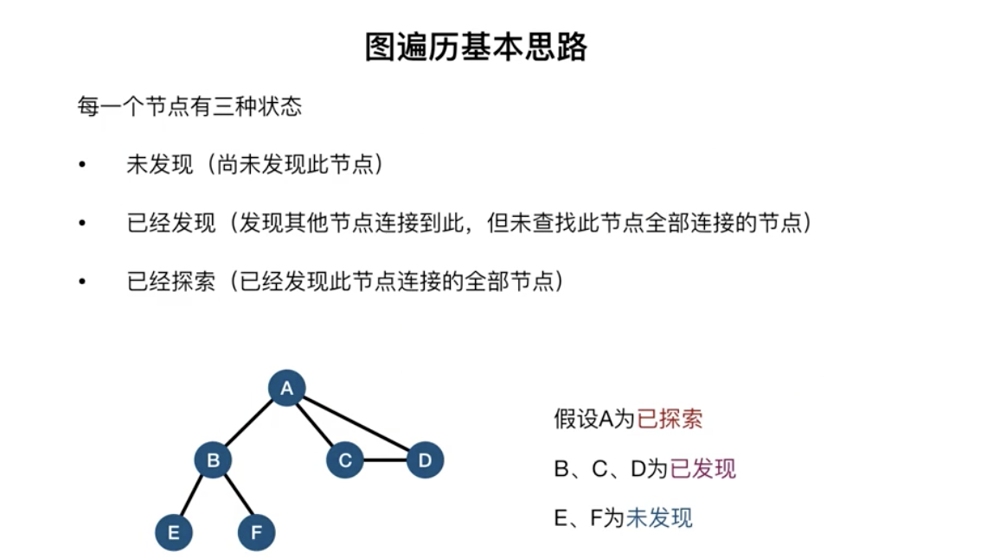

## 图的概念

在计算机科学中，图是一种网络结构的抽象模型，它是一组由边连接的顶点组成。一个图 G = (V, E)由以下元素组成：

- V：一组顶点
- E：一组边，连接 V 中的顶点

下图表示了一个图的结构：



在介绍如何用 `JavaScript` 实现图之前，我们先介绍一些和图相关的术语。

- `相邻顶点`: **一条边连接在一起的顶点**， A 和 B 是相邻顶点，A 和 D 是相邻顶点，A 和 C 是相邻顶点......A 和 E 是不相邻顶点。
- `度`: **一个顶点的度是其相邻顶点的数量**，A 和其它三个顶点相连，所以 A 的度为 3，E 和其它两个顶点相连，所以 E 的度为 2......
- `路径`: **一组相邻顶点的连续序列**，如上图中包含路径 ABEI、路径 ACDG、路径 ABE、路径 ACDH 等。
- `简单路径`: **路径中不包含有重复的顶点**，如果将环的最后一个顶点去掉，它也是一个简单路径。例如路径 ADCA 是一个环，它不是一个简单路径，如果将路径中的最后一个顶点 A 去掉，那么它就是一个简单路径。
- `无环`: **如果图中不存在环，则称该图是无环的**
- `无向图`: **如果图的边没有方向，则该图是无向图**，上图所示为无向图。反之则称为有向图。

下图所示为有向图：



在有向图中，如果两个顶点间在双向上都存在路径，则称这两个顶点是**强连通**的，如上图中 C 和 D 是强连通的，而 A 和 B 是非强连通的。如果有向图中的任何两个顶点间在双向上都存在路径，则该有向图是**强连通**的，非强连通的图也称为**稀疏图**。

此外，图还可以是**加权的**。前面我们看到的图都是**未加权的**，下图为一个加权的图：



可以想象一下，前面我们介绍的`树`和`链表`也属于图的一种特殊形式。图在计算机科学中的应用十分广泛，例如我们可以搜索图中的一个特定顶点或一条特定的边，或者寻找两个顶点间的路径以及最短路径，检测图中是否存在环等等。

存在多种不同的方式来实现图的数据结构，下面介绍几种常用的方式。

## 图的几个表示的方式

### 邻接矩阵

在邻接矩阵中，我们用一个二维数组来表示图中顶点之间的连接，如果两个顶点之间存在连接，则这两个顶点对应的二维数组下标的元素的值为 1，否则为 0。下图是用邻接矩阵方式表示的图：



如果是加权的图，我们可以将邻接矩阵中二维数组里的值 1 改成对应的加权数。邻接矩阵方式存在一个缺点，如果图是非强连通的，则二维数组中会有很多的 0，这表示我们使用了很多的存储空间来表示根本不存在的边。另一个缺点就是当图的顶点发生改变时，对于二维数组的修改会变得不太灵活。

### 邻接表

图的另外一种实现方式是邻接表，它是对邻接矩阵的一种改进。邻接表由图中每个顶点的相邻顶点列表所组成。如下图所示，我们可以用数组、链表、字典或散列表来表示邻接表。



### 关联矩阵

我们还可以用关联矩阵来表示图。在关联矩阵中，矩阵的行表示顶点，列表示边。关联矩阵通常用于边的数量比顶点多的情况下，以节省存储空间。如下图所示为关联矩阵方式表示的图：



## 用邻接表方式实现图结构

下面我们重点看下如何用邻接表的方式表示图。我们的 `Graph` 类的骨架如下，它用邻接表方式来实现无向图：


就如链表里存储这 `head` 和 树存储着 `root` 结构，同样图里面可以用

- `vertices`: 用来存放图中的**顶点**
- `adjList`: 用来存储**边**

```js
class Graph {
  constructor() {
    this.vertices = [] // 用来存放图中的顶点
    this.adjList = new Dictionary() // 用来存放图中的边
  }

  // 向图中添加一个新顶点
  addVertex(v) {}

  // 向图中添加a和b两个顶点之间的边
  addEdge(a, b) {}
}
```

在 `Graph` 类中，我们用数组 `vertices` 来保存图中的所有顶点，用用字典（请参考[字典和散列表的实现](./dict-hashtable.md)一文中的 `Dictionary` `类）adjList` 来保存图中每一个顶点到相邻顶点的关系列表，在字典中，顶点被作为键值。

然后在 `Graph` 类中，我们提供两个方法，方法 `addVertex()`用来向图中添加一个新顶点，方法 `addEdge()`用来向图中添加给定的顶点 a 和顶点 b 之间的边。让我们来看下这两个方法的实现。

```js
addVertex(v) {
  if (!this.vertices.includes(v)) {
    this.vertices.push(v)
    this.adjList.set(v, [])
  }
}
```

要添加一个新顶点，首先要判断该顶点在图中是否已经存在了，如果已经存在则不能添加。如果不存在，就在 `vertices` 数组中添加一个新元素，然后在字典 `adjList` 中添加一个以该顶点作为 key 的新元素，值为空数组。

```js
addEdge(a, b) {
  // 如果图中没有顶点a，先添加顶点a
  if (!this.adjList.has(a)) {
    this.addVertex(a)
  }
  // 如果图中没有顶点b，先添加顶点b
  if (!this.adjList.has(b)) {
    this.addVertex(b)
  }

  this.adjList.get(a).push(b) // 在顶点a中添加指向顶点b的边
  this.adjList.get(b).push(a) // 在顶点b中添加指向顶点a的边
}
```

`addEdge()`方法也很简单，首先要确保给定的两个顶点 a 和 b 在图中必须存在，如果不存在，则调用 `addVertex()`方法进行添加，然后分别在字典中找到键值为顶点 a 和键值为顶点 b 的元素，在对应的值中添加一个新元素。

下面是 `Graph` 类的完整代码，其中的 toString()方法是为了我们测试用的，它的存在不是必须的。

```js
class Graph {
  constructor() {
    this.vertices = [] // 用来存放图中的顶点
    this.adjList = new Dictionary() // 用来存放图中的边
  }

  // 向图中添加一个新顶点
  addVertex(v) {
    if (!this.vertices.includes(v)) {
      this.vertices.push(v)
      this.adjList.set(v, [])
    }
  }

  // 向图中添加a和b两个顶点之间的边
  addEdge(a, b) {
    // 如果图中没有顶点a，先添加顶点a
    if (!this.adjList.has(a)) {
      this.addVertex(a)
    }
    // 如果图中没有顶点b，先添加顶点b
    if (!this.adjList.has(b)) {
      this.addVertex(b)
    }

    this.adjList.get(a).push(b) // 在顶点a中添加指向顶点b的边
    this.adjList.get(b).push(a) // 在顶点b中添加指向顶点a的边
  }

  // 获取图的vertices
  getVertices() {
    return this.vertices
  }

  // 获取图中的adjList
  getAdjList() {
    return this.adjList
  }

  toString() {
    let s = ''
    this.vertices.forEach(v => {
      s += `${v} -> `
      this.adjList.get(v).forEach(n => {
        s += `${n} `
      })
      s += '\n'
    })
    return s
  }
}
```

对于本文一开始给出的图，我们添加下面的测试用例：

```js
let graph = new Graph()
let myVertices = ['A', 'B', 'C', 'D', 'E', 'F']
myVertices.forEach(v => {
  graph.addVertex(v)
})
graph.addEdge('A', 'B')
graph.addEdge('A', 'C')
graph.addEdge('A', 'D')
graph.addEdge('B', 'E')
graph.addEdge('B', 'F')
graph.addEdge('C', 'D')

console.log(graph.toString())
```

下面是测试结果：

```js
A -> B C D
B -> A E F
C -> A D
D -> A C
E -> B
F -> B
```

可以看到，与示意图是相符合的。

## 图的遍历方式

和树类似，我们也可以对图进行遍历，以访问图中的所有顶点。图的遍历方式分为两种：**广度优先（Breadth-First Search，BFS）**和**深度优先（Depth-First Search，DFS）**。对图的遍历可以用来寻找特定的顶点或两个顶点之间的最短路径，以及检查图是否连通、图中是否含有环等。



| 算法     | 数据结构 | 描述                                                                   |
| -------- | -------- | ---------------------------------------------------------------------- |
| 深度优先 | 栈       | 将图的顶点存入栈中，顶点是沿着路径被探索的，存在新的相邻顶点就去访问。 |
| 广度优先 | 队列     | 将图的顶点存入队列中，最先入队列的顶点先被探索。                       |

### 广度优先遍历 <Badge text="队列" />

广度优先算法会从指定的第一个顶点开始遍历图，先访问这个顶点的所有相邻顶点，然后再访问这些相邻顶点的相邻顶点，以此类推。最终，广度优先算法会先广后深地访问图中的所有顶点。

比如上面的例子。广度优先遍历会先把 A 旁边的节点全部遍历一遍。第一层遍历 A -> B -> C -> D 结束，再遍历第二层 D -> E -> F，所以相当于优先遍历图的横向，当然对于图来说没有横向的概念的，这里只是为了方便理解。

在接下来要实现的算法中，我们按照如下的约定对图中的顶点进行遍历，每个顶点最多访问两次：

- 白色：表示该顶点未被访问。
- 灰色：表示该顶点被访问过，但未被探索。
- 黑色：表示该顶点被访问并且被探索过。



### 深度优先遍历<Badge text="栈" />

从 A 开始的话，遍历会不断的探寻最深的一个顶点，即 A -> B -> E，然后在逐渐往回寻找近的 B -> C -> D

参考

[JavaScript 数据结构——图的实现](https://www.cnblogs.com/jaxu/p/11338294.html)
