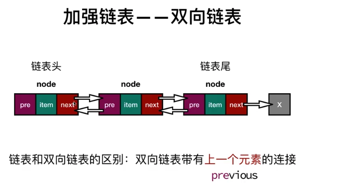
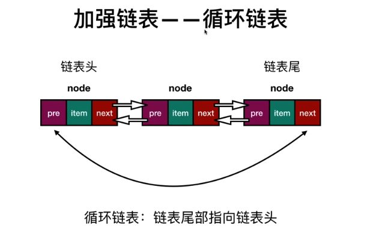

## 链表简介

在 [栈和队列](./stack-queue)说了栈和队列在 `javascript` 中的实现,我们运用 `javascript` 提供的 API 很容易的实现了栈和队列，**_但这种数据结构有一个很明显的缺点，因为数组大小是固定的所以我们在移除或是添加一项数据的时候成本很高。_**

相比数组我们今天主角——链表就要来的随性的多，简单的理解可以是这样：在内存中，栈和队列（数组）的存在就是一个整体，如果想要对她内部某一个元素进行移除或是添加一个新元素就要动她内部所有的元素，所谓牵一发而动全身；而链表则不一样，每一个元素都是由元素本身数据和指向下一个元素的指针构成，所以添加或是移除某一个元素不需要对链表整体进行操作，只需要改变相关元素的指针指向就可以了。

链表在实际生活中的例子也有很多，比如自行车的链条，环环相扣，但添加或是移除某一个环节只需要对症下药，对相关环节进行操作就 OK。再比如：火车，火车就是一个链表，每一节车厢就是元素，想要移除或是添加某一节车厢，只需要把连接车厢的链条改变一下就好了。那么，在 `javascript` 中又该怎么去实现链表结构呢？


## 单项链表的实现

| 方法                      | 说明                                                          |
| ------------------------- | ------------------------------------------------------------- |
| insert(position, element) | 插入元素                                                      |
| append(element)           | 尾部添加元素                                                  |
| indexOf(element)          | 返回链表中某元素的索引，如果没有返回-1                        |
| remove(element)           | 从链表移除一项                                                |
| removeAt(position)        | 从链表特定位置移除一项                                        |
| size                      | 返回链表的长度                                                |
| toString                  | 重写继承自 Object 类的 toString()方法，因为我们使用了 Node 类 |
| print                     | 打印链表数据                                                  |


### append


### insert


### removeAt


### indexOf


### 代码实现

```js
function LinkedList() {
  var head = null // 链表头
  var length = 0 // 链表长度

  // 辅助类 节点
  var Node = function(element) {
    this.element = element
    this.next = null
  }

  // 链表尾添加元素
  this.append = function(element) {
    var node = new Node(element)
    if (head === null) {
      head = node //第一个Node实例进入链表，之后在这个LinkedList实例中head就不再是null了
    } else {
      var current = head
      while (current.next) {
        //循环链表知道找到最后一项，循环结束current指向链表最后一项元素
        current = current.next
      }
      current.next = node //找到最后一项元素后，将他的next属性指向新元素node,j建立链接
    }
    length++ //更新链表长度
  }

  this.insert = function(position, element) {
    //检查是否越界，超过链表长度或是小于0肯定不符合逻辑的
    if (position > -1 && position <= length) {
      var node = new Node(element)

      if (position === 0) {
        // 往链表头插入元素
        var current = head
        head = node
        head.next = current
      } else {
        var index = 0
        var previous = null
        var current = head
        //循环链表，找到正确位置，循环完毕，previous，current分别是被添加元素的前后元素
        while (index < position) {
          previous = current
          current = current.next
          index++
        }
        previous.next = node
        node.next = current
      }

      length++ // 更新链表长度
      return true
    }
    return false
  }

  this.removeAt = function(position) {
    // 检查是否越界，超过链表长度或是小于0肯定不符合逻辑的
    if (position > -1 && position < length) {
      if (position === 0) {
        var current = head
        head = current.next // 移除第一项，相当于head=null
      } else {
        // 循环链表，找到正确位置循环完毕，previous，current分别是被添加元素的前后元素
        var index = 0
        var previous = null
        var current = head
        while (index < position) {
          previous = current
          current = current.next
          index++
        }
        //链接previous和current的下一个元素，也就是把current移除了
        previous.next = current.next
      }
      length--
      return current.element
    }
    return null
  }

  this.indexOf = function(element) {
    var index = 0
    var current = head
    while (current) {
      if (current.element === element) {
        return index
      }
      current = current.next
      index++
    }
    return -1
  }

  this.remove = function(element) {
    var index = this.indexOf(element)
    return this.removeAt(index)
  }

  this.isEmpty = () => length === 0

  this.size = () => length

  this.toString = function() {
    var current = head,
      string = ''

    while (current) {
      string += current.element
      current = current.next
    }
    return string
  }

  this.print = function() {
    console.log(this.toString())
  }
}

var l = new LinkedList()

l.append(1) // ...
```

## 双向链表



双向循环链表：将双向链表的头尾指针相连，就构成了双向循环链表。这种链表从任意一个节点都可以同时向两个方向进行节点遍历。

```js
function DoublyLinkedList() {
  var head = null // 链表头
  var length = 0 // 链表长度

  // 辅助类 节点
  var Node = function(element) {
    this.element = element
    this.next = null
    this.prev = null
  }

  // 链表尾添加元素
  this.append = function(element) {
    var node = new Node(element)
    var current = head
    var previous = null

    if (head === null) {
      head = node
    } else {
      while (current) {
        previous = current
        current = current.next
      }
      previous.next = node
      node.prev = previous
    }
    length++
  }

  /**
   * position === 0
   *  head === null [head = node]
   *  head !== null [head.prev = node, node.next = head] >>> finally = node
   *
   * position !== 0
   *  找到插入节点 previous node current >>> [previous.next = node, node.prev = previous, node.next = current, current.prev = node]
   */
  this.insert = function(position, element) {
    if (position > -1 && position <= length) {
      var node = new Node(element)

      if (position === 0) {
        // 往链表头插入元素
        if (!head) {
          head = node
        } else {
          node.next = head
          head.prev = node
          head = node
        }
      } else {
        var index = 0
        var previous = null
        var current = head
        while (index < position) {
          previous = current
          current = current.next
          index++
        }

        previous.next = node //先连上添加的节点
        node.prev = previous //再断开之前的连接

        node.next = current
        current.prev = node
        // now previous <<node>> current
      }

      length++
      return true
    }
    return false
  }

  this.removeAt = function(position) {
    if (position > -1 && position < length) {
      if (position === 0) {
        // 列表头移除元素
        var current = head
        head = current.next
        head.prev = null
      } else {
        var index = 0
        var previous = null
        var current = head
        while (index < position) {
          previous = current
          current = current.next
          index++
        }
        if (position === length - 1) {
          // 移除最后一项
          previous.next = null
        } else {
          previous.next = current.next
          current.next.prev = previous
        }
      }
      length--
      return current.element
    }
    return null
  }

  this.indexOf = function(element) {
    var index = 0
    var current = head
    while (current) {
      if (current.element === element) {
        return index
      }
      current = current.next
      index++
    }
    return -1
  }

  this.remove = function(element) {
    var index = this.indexOf(element)
    return this.removeAt(index)
  }

  this.isEmpty = () => length === 0

  this.size = () => length

  //获取头结点元素
  this.getHead = () => head

  //获取未结点元素
  this.getTail = function() {
    var previous,
      current = head
    while (current) {
      previous = current
      current = current.next
    }
    return previous
  }
}

var l = new DoubleLinkedList()

l.append(1)
l.append(2)
l.append(3)
l.insert(0, 4)
l.insert(2, 5)
```

## 循环链表



循环链表可以像单向链表那样只有单向引用，也可以像双向链表那样有双向引用。循环链表和其他链表的区别在于最后一个元素指向下一个元素的引用不是 `null`，而是指向第一个元素（`head`）。

```js
function CircularLinkedList() {
  var head = null // 链表头
  var length = 0 // 链表长度

  // 辅助类 节点
  var Node = function(element) {
    this.element = element
    this.next = null
    this.prev = null
  }

  // 链表尾添加元素
  this.append = function(element) {
    var node = new Node(element)
    var current = head
    var previous = null

    if (head === null) {
      head = node
    } else {
      while (current.next !== head) {
        //最后一个元素将是head，而不是null

        current = current.next
      }
      current.next = node //建立连接
    }
    node.next = head //首尾相连起来变成一个环列表
    length++
  }

  this.insert = function(position, element) {
    if (position >= 0 && position <= length) {
      var node = new Node(element)
      var current = head
      var previous = null
      var index = 0

      if (position === 0) {
        // 往链表头插入元素
        node.next = current
        while (current.next !== head) {
          current = current.next
        }
        head = node
        current.next = head
      } else {
        while (index < position) {
          previous = current
          current = current.next
          index++
        }

        previous.next = node //先连上添加的节点
        node.next = current

        if (node.next === null) {
          //在最后一个元素更新
          node.next = head
        }
      }

      length++
      return true
    }
    return false
  }

  this.removeAt = function(position) {
    if (position > -1 && position < length) {
      var current = head
      var previous = null
      var index = 0

      if (position === 0) {
        // 列表头移除元素
        while (current.next !== head) {
          current = current.next
        }
        head = head.next
        current.next = head //更新最后一项
      } else {
        while (index < position) {
          previous = current
          current = current.next
          index++
        }
        previous.next = current.next
      }
      length--
      return current.element
    }
    return null
  }

  this.indexOf = function(element) {
    var current = head
    var index = -1

    if (element == current.element) {
      //检查第一项
      return 0
    }
    index++
    while (current.next !== head) {
      //检查列表中间
      if (element == current.element) {
        return index
      }
      current = current.next
      index++
    }
    if (element == current.element) {
      //检查最后一项
      return index
    }
    return -1
  }

  this.remove = function(element) {
    var index = this.indexOf(element)
    return this.removeAt(index)
  }

  this.isEmpty = () => length === 0

  this.size = () => length

  //获取头结点元素
  this.getHead = () => head

  this.toString = function() {
    var current = head
    var s = current.element
    while (current.next !== head) {
      current = current.next
      s += ', ' + current.element
    }
    return s.toString()
  }

  this.print = function() {
    console.log(this.toString())
  }
}
```

## 后记

说到现在一直都是线性表，就是顺序数据结构，他们都是有顺序的，数据都是一条绳子上的蚂蚱。那么，如果数据是没有顺序的呢？那又该使用哪种数据结构呢？这个放到[数据结构——集合](./set)中学习。

参考

- [学习 Javascript 数据结构之链表](https://blog.damonare.cn/2016/11/26/%E5%AD%A6%E4%B9%A0Javascript%E6%95%B0%E6%8D%AE%E7%BB%93%E6%9E%84%E4%B9%8B%E9%93%BE%E8%A1%A8/)
