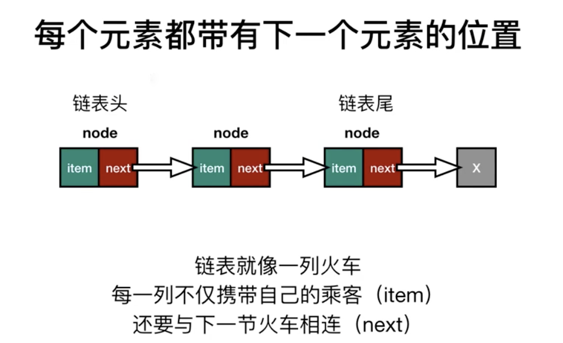
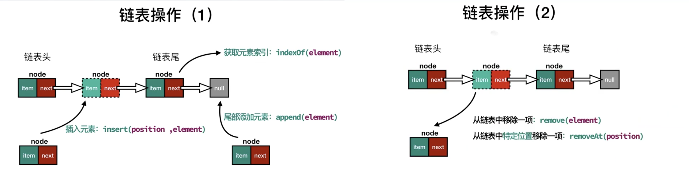
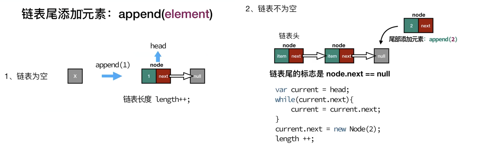
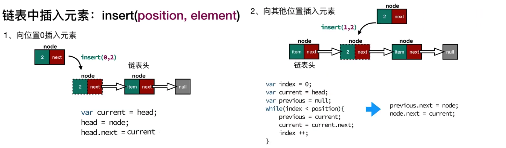
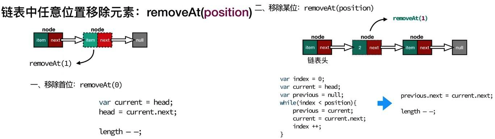
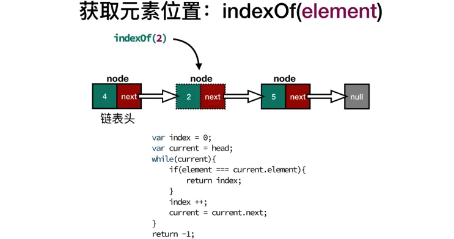

链表存储有序的元素集合，但不同于数组，链表中的元素在内存中并不是连续放置的。每个元素由一个存储元素本事的节点和一个指向下一个元素的引用组成。相对于传统的数组，链表的一个好处在于，添加或者删除元素的时候不需要移动其他元素。然而，链表需要使用指针，因此实现链表时需要额外注意。



## 链表的操作

| 方法                      | 说明                   |
| ------------------------- | ---------------------- |
| insert(position, element) | 插入元素               |
| append(element)           | 尾部添加元素           |
| indexOf(element)          | 获取元素索引           |
| remove(element)           | 从链表移除一项         |
| removeAt(position)        | 从链表特定位置移除一项 |



## 单项链表的实现

### append



### insert



### removeAt



### indexOf



### 代码实现

```js {12,27,55,78,91}
function LinkedList() {
  var head = null // 链表头
  var length = 0 // 链表长度

  // 辅助类 节点
  var Node = function(element) {
    this.element = element
    this.next = null
  }

  // 链表尾添加元素
  this.append = function(element) {
    var node = new Node(element)
    if (head === null) {
      head = node
    } else {
      var current = head
      while (current.next) {
        // 循环 找到链表尾节点
        current = current.next
      }
      current.next = node
    }
    length++
  }

  this.insert = function(position, element) {
    if (position > -1 && position < length) {
      var node = new Node(element)

      if (position === 0) {
        // 往链表头插入元素
        var current = head
        head = node
        head.next = current
      } else {
        var index = 0
        var previous = null
        var current = head
        while (index < position) {
          previous = current
          current = current.next
          index++
        }
        previous.next = node
        nodex.next = current
      }

      length++
      return true
    }
    return false
  }

  this.removeAt = function(position) {
    if (position > -1 && position < length) {
      if (position === 0) {
        // 列表头移除元素
        var current = head
        head = current.next
      } else {
        var index = 0
        var previous = null
        var current = head
        while (index < position) {
          previous = current
          current = current.next
          index++
        }
        previous.next = current.next // current 就是被移除的元素
      }
      length--
      return current.element
    }
    return null
  }

  this.indexOf = function(element) {
    var index = 0
    var current = head
    while (current) {
      if (current.element === element) {
        return index
      }
      current = current.next
      index++
    }
    return -1
  }

  this.remove = function(element) {
    var index = this.indexOf(element)
    return this.removeAt(index)
  }

  this.isEmpty = () => length === 0

  this.size = () => length
}

var l = new LinkedList()

l.append(1) // ...
```
