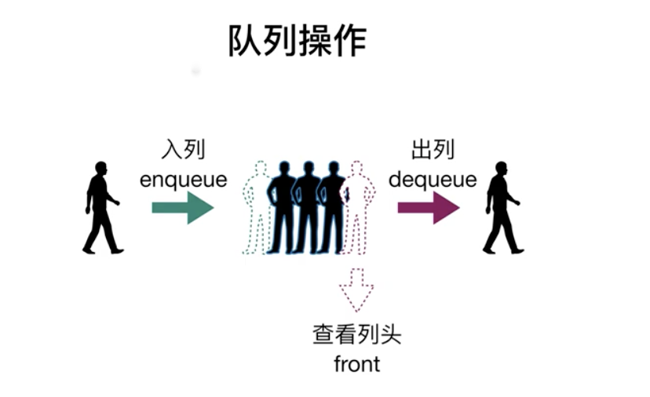

我们已经接触了栈，接下来要说的队列和栈十分相似，**他们都是线性表，元素都是有序的**。

队列遵循的是 FIFO，也就是先进先出的原则。队列从尾部添加新元素，从顶部移除元素，最新添加的元素必须排列在队列的末尾。



:::details 队列的方法

| 方法名  | 操作                                                                   |
| ------- | ---------------------------------------------------------------------- |
| enqueue | 向队列尾部添加一个（或是多个）元素。                                   |
| dequeue | 移除队列的第一个元素，并返回被移除的元素。                             |
| front   | 回队列的第一个元素——最先被添加的也是最先被移除的元素。队列不做任何变动 |
| isEmpty | 检查队列是否为空                                                       |
| size    | 获取队列长度                                                           |
| print   | 打印队列的元素                                                         |

:::

## 队列的实现

代码：

```js
function Queue() {
  let items = []

  // 向队列添加元素（一个或多个）
  this.enqueue = function(element) {
    if (element instanceof Array) items = items.concat(element)
    else items.push(element)
  }

  // 从队列移除元素
  this.dequeue = function() {
    return items.shift()
  }

  // 返回队列中的第一个元素
  this.front = function() {
    return items[0]
  }

  // 判断队列是否为空
  this.isEmpty = function() {
    return items.length === 0
  }

  // 返回队列的长度
  this.size = function() {
    return items.length
  }

  // 清空队列
  this.clear = function() {
    items = []
  }

  // 打印队列内的所有元素
  this.print = function() {
    console.log(items.toString())
  }
}
```

与栈的实现方式类似，唯一不同的是从队列移除元素时取的是队列头部的元素（最先添加的），而栈则是取的顶部元素（最后添加的）。下面是一些测试用例及返回结果：

```js
let queue = new Queue()
console.log(queue.isEmpty()) // true

queue.enqueue('John')
queue.enqueue(['Jack', 'Camila'])
queue.print() // John,Jack,Camila
console.log(queue.size()) // 3
console.log(queue.isEmpty()) // false
console.log(queue.front()) // John

console.log(queue.dequeue()) // John
queue.print() // Jack,Camila

queue.clear()
queue.print() //
```

注意，我们允许批量向队列中添加元素，为此我们需要判断 `enqueue` 方法的参数类型，如果参数是数组，则用 `concat()`函数连接两个数组，如果参数不是数组，则直接用 `push()` 函数将元素添加到队列中。

## ES6 版本（Class && WeakMap）<Badge text="闭包" type="warning" />

与栈的实现方式一样，这里我们也同样给出用 ES6 的 `WeakMap` 类来实现的队列版本。

```js
let Queue = (function() {
  const items = new WeakMap()

  class Queue {
    constructor() {
      items.set(this, [])
    }

    enqueue(element) {
      let q = items.get(this)
      if (element instanceof Array) items.set(this, q.concat(element))
      else q.push(element)
    }

    dequeue() {
      let q = items.get(this)
      return q.shift()
    }

    front() {
      return items.get(this)[0]
    }

    isEmpty() {
      return items.get(this).length === 0
    }

    size() {
      return items.get(this).length
    }

    clear() {
      items.set(this, [])
    }

    print() {
      console.log(items.get(this).toString())
    }
  }

  return Queue
})()
```

---

参考 [JavaScript 数据结构——队列的实现与应用](https://www.cnblogs.com/jaxu/p/11268862.html)
