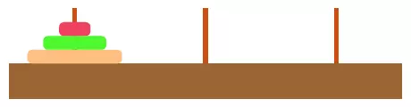

## 写在前面

我们知道，我们可以在数组的任意位置添加或是删除元素，然而，有时候我们还需要一种在添加或是删除元素的时候有更多控制的数据结构。有两种数据结构类似于数组。但在添加或是删除元素的时候更为的可控。他们就是`栈和队列`。

当然，本篇文章讲述`栈`这个概念

在计算机编程中，栈是一种很常见的数据结构，它遵从**后进先出**（`LIFO——Last In First Out`）原则，新添加或待删除的元素保存在栈的同一端，称作栈顶，另一端称作栈底。在栈中，新元素总是靠近栈顶，而旧元素总是接近栈底。

栈 示意图 >> 

## 栈和函数

在讲述一个概念，让我们加深对栈的认识，莫过于 JavaScript 函数的调用


执行顺序

1. 执行 `fn2`, `fn2` 入栈
2. `fn2` 中执行 `fn1`, `fn1` 入栈
3. `fn1` 执行完毕 出栈
4. `fn2` 执行完毕 出栈

再看这一段：

```TS
function func1() { alert(1) }
function func2() {
  setTimeout(func1, 0)
  alert(2)
}
test()
```

如果没有 setTimeout, 和前面的例子一样。但是 setTimeout 实际上是让 alert(1) 脱离了当前函数调用堆栈，实际的执行结果是 alert(2)、alert(1）

## 栈的实现

### function 实现

| 方法名  | 操作                                             |
| ------- | ------------------------------------------------ |
| push    | 栈顶添加元素                                     |
| pop     | 移除栈顶的元素，同时返回被移除元素               |
| peek    | 返回栈顶的元素，但并不对栈顶的元素做出任何的修改 |
| isEmpty | 检查栈是否为空                                   |
| clear   | 移除所有元素                                     |
| size    | 获取栈长度                                       |
| print   | 打印栈中的所有元素                               |

```js
// [栈底, ..... 栈顶]
function Stack() {
  let items = []

  this.push = function(element) {
    items.push(element)
  }

  this.pop = function() {
    return items.pop()
  }

  this.peek = function() {
    return items[items.length - 1]
  }

  this.isEmpty = function() {
    return items.length === 0
  }

  this.size = function() {
    return items.length
  }

  this.clear = function() {
    items = []
  }

  this.print = function() {
    console.log(items.toString())
  }
}
```

我们用最简单的方式定义了一个 `Stack` 类，接下来我们尝试写一些测试用例来看看这个类的一些用法。

```js
let stack = new Stack()
console.log(stack.isEmpty()) // true

stack.push(5)
stack.push(8)
console.log(stack.peek()) // 8 peek 返回栈顶元素

stack.push(11)
console.log(stack.size()) // 3
console.log(stack.isEmpty()) // false

stack.push(15)
stack.pop()
stack.pop()
console.log(stack.size()) // 2
stack.print() // 5,8

stack.clear()
stack.print()
```

返回结果也和预期的一样！我们成功地用 JavaScript 模拟了栈的实现。但是这里有个小问题，由于我们用 JavaScript 的 function 来模拟类的行为，并且在其中声明了一个私有变量 items，因此这个类的每个实例都会创建一个 items 变量的副本，如果有多个 `Stack` 类的实例的话，这显然不是最佳方案。我们尝试用 ES6（ECMAScript 6）的语法重写 `Stack` 类。

### Class 实现

```js
class Stack {
  constructor() {
    this.items = []
  }

  push(element) {
    this.items.push(element)
  }

  pop() {
    return this.items.pop()
  }

  peek() {
    return this.items[this.items.length - 1]
  }

  isEmpty() {
    return this.items.length === 0
  }

  size() {
    return this.items.length
  }

  clear() {
    this.items = []
  }

  print() {
    console.log(this.items.toString())
  }
}
```

没有太大的改变，我们只是用 ES6 的简化语法将上面的 `Stack` 函数转换成了 `Stack` 类。类的成员变量只能放到 constructor 构造函数中来声明。虽然代码看起来更像类了，但是成员变量 items 仍然是公有的.

```js
let stack = new Stack()
console.log(stack) // Stack {items: Array(0)}
```

我们不希望在类的外部访问 items 变量而对其中的元素进行操作，因为这样会破坏栈这种数据结构的基本特性。我们可以借用 ES6 的 `Symbol` 来限定变量的作用域。

### 使用 Symbol 私有化 items

```js
let _items = Symbol()

class Stack {
  constructor() {
    this[_items] = []
  }

  push(element) {
    this[_items].push(element)
  }

  pop() {
    return this[_items].pop()
  }

  peek() {
    return this[_items][this[_items].length - 1]
  }

  isEmpty() {
    return this[_items].length === 0
  }

  size() {
    return this[_items].length
  }

  clear() {
    this[_items] = []
  }

  print() {
    console.log(this[_items].toString())
  }
}
```

这样，我们就不能再通过 `Stack` 类的实例来访问其内部成员变量 `_items` 了。但是仍然可以有变通的方法来访问 `_items` ：

```js
let stack = new Stack()
let objectSymbols = Object.getOwnPropertySymbols(stack)
```

### 使用 WeakMap 私有化 items

通过 `Object.getOwnPropertySymbols()` 方法，我们可以获取到类的实例中的所有 `Symbols` 属性，然后就可以对其进行操作了，如此说来，这个方法仍然不能完美实现我们想要的效果。我们可以使用 ES6 的 `WeakMap` 类来确保 `Stack` 类的属性是私有的：

```js
const items = new WeakMap()

class Stack {
  constructor() {
    items.set(this, [])
  }

  push(element) {
    let s = items.get(this)
    s.push(element)
  }

  pop() {
    let s = items.get(this)
    return s.pop()
  }

  peek() {
    let s = items.get(this)
    return s[s.length - 1]
  }

  isEmpty() {
    return items.get(this).length === 0
  }

  size() {
    return items.get(this).length
  }

  clear() {
    items.set(this, [])
  }

  print() {
    console.log(items.get(this).toString())
  }
}
```

现在，items 在 `Stack` 类里是真正的私有属性了，但是，它是在 `Stack` 类的外部声明的，这就意味着谁都可以对它进行操作，虽然我们可以将 Stack 类和 items 变量的声明放到闭包中，但是这样却又失去了类本身的一些特性（如扩展类无法继承私有属性）。所以，尽管我们可以用 ES6 的新语法来简化一个类的实现，但是毕竟不能像其它强类型语言一样声明类的私有属性和方法。有许多方法都可以达到相同的效果，但无论是语法还是性能，都会有各自的优缺点。

```js
let Stack = (function() {
  const items = new WeakMap()
  class Stack {
    constructor() {
      items.set(this, [])
    }

    push(element) {
      let s = items.get(this)
      s.push(element)
    }

    pop() {
      let s = items.get(this)
      return s.pop()
    }

    peek() {
      let s = items.get(this)
      return s[s.length - 1]
    }

    isEmpty() {
      return items.get(this).length === 0
    }

    size() {
      return items.get(this).length
    }

    clear() {
      items.set(this, [])
    }

    print() {
      console.log(items.get(this).toString())
    }
  }
  return Stack
})()
```

## 栈的应用

### 十进制转换

将十进制数字 10 转换成二进制数字，过程大致如下（例如 8 转为 2 进制）：

| 次数   | 商（向下取整） | 余数 | 入栈 |
| ------ | :------------: | :--: | :--: |
| 第一次 |       8        |  0   |  0   |
| 第二次 |       4        |  0   |  0   |
| 第三次 |       2        |  0   |  0   |
| 第四次 |       1        |  1   |  1   |

入栈 0 0 0 1
出栈 1 0 0 0


### 汉诺塔

汉诺塔问题描述：

> 现有三根柱子 a、b、c，a 柱上套有若干个圆盘，这些圆盘大小各异，按从大到小的顺序自下而上摆放，如下图所示。现在要把套在 a 柱子上的圆盘全部转移到 c 柱上，并且在移动圆盘时必须遵守以下规则：
>
> 1、一次只能移动柱子最上端的一个圆盘
>
> 2、小圆盘上不能放大圆盘
>
> 将一个圆盘从一根柱子移到另一根柱子，算移动“1 次”，那么，将若干个圆盘全部从 a 移到 c 最少需要移动几次呢?



#### 分析

寻找规律（把所有的圆盘移动到 C）：

1. 圆盘个数 === 1, sum = 1

| 次数 |  动作  |  A   |  B  |   C   |
| :--: | :----: | :--: | :-: | :---: |
|  0   |        | [1]  | []  |  []   |
|  1   | A -> C | `[]` | []  | `[1]` |

2. 圆盘个数 === 2, sum = 3

| 次数 |  动作  |   A    |   B   |    C     |
| :--: | :----: | :----: | :---: | :------: |
|  0   |        | [2, 1] |  []   |    []    |
|  1   | A -> B | `[2]`  | `[1]` |    []    |
|  2   | A -> C |  `[]`  |  [1]  |  `[2]`   |
|  3   | B -> C |   []   | `[]`  | `[2, 1]` |

3. 圆盘个数 === 3, sum = 7

| 次数 |  动作  |     A     |    B     |      C      |
| :--: | :----: | :-------: | :------: | :---------: |
|  0   |        | [3, 2, 1] |    []    |     []      |
|  1   | A -> C | `[3, 2]`  |    []    |    `[1]`    |
|  2   | A -> B |   `[3]`   |  `[2]`   |     [1]     |
|  3   | C -> B |    [3]    | `[2, 1]` |    `[1]`    |
|  4   | A -> C |   `[]`    |  [2, 1]  |    `[3]`    |
|  5   | B -> A |   `[1]`   |  `[2]`   |     [3]     |
|  6   | B -> C |    [1]    |   `[]`   |  `[3, 2]`   |
|  7   | A -> C |    []     |   `[]`   | `[3, 2, 1]` |

以此类推...故不难发现规律,移动次数为：`sum = 2^n - 1`

算法分析（递归）：

把一堆圆盘从一个柱子移动另一根柱子，必要时使用辅助的柱子。可以把它分为三个子问题（参见圆盘个数 2）：

1. 首先，移动一对圆盘中较小的圆盘到辅助柱子上，从而露出下面较大的圆盘，
2. 其次，移动下面的圆盘到目标柱子上
3. 最后，将刚才较小的圆盘从辅助柱子上在移动到目标柱子上

把三个步骤转化为简单数学问题：

```ts
1. 把 n-1 个盘子由 A 移到 B   // 在最小下面的盘子移动到 【辅助柱】
2. 把 第 n 个盘子由 A 移到 C  // 最小圆盘的移动到 【目标柱】
3. 把 n-1 个盘子由 B 移到 C  // 将在最小下面的盘子从【辅助柱】移动到 【目标柱】
```

```js
function hanoi(disc, source, buffer, target) {
  if (disc > 0) {
    hanoi(disc - 1, source, target, buffer)
    console.log('Move disc ' + disc + ' from ' + source + ' to ' + target)
    hanoi(disc - 1, target, source, buffer)
  }
}
```

下面是执行结果：

```js
hanoi(3, 'A', 'B', 'C')
```

```bash
Move disc 1 from A to C
Move disc 2 from A to B
Move disc 1 from B to C
Move disc 3 from A to C
Move disc 1 from C to A
Move disc 2 from C to B
Move disc 1 from B to A
```

#### 用栈实现汉诺塔

例如

```js
输入： A = [3, 2, 1], B = [], C = []
输出：C = [3, 2, 1]
```

我们在前面定义的栈的数据结构应用进来，完整的代码如下

```js
let towerOfHanoi = function(n, from, help, to) {
  if (n > 0) {
    towerOfHanoi(n - 1, from, to, help) // A -> B

    to.push(from.pop()) // A -> C

    console.log(`MOVE：${n}`)
    console.log('from', from.getItems(), 'help', help.getItems(), 'to', to.getItems())
    console.log('--------') // getItems return items

    towerOfHanoi(n - 1, help, from, to) // B -> C
  }
}

function hanoiStack(plates) {
  const from = new Stack(),
    help = new Stack(),
    to = new Stack()

  for (let i = plates; i > 0; i--) {
    from.push(i)
  }

  towerOfHanoi(plates, from, help, to)
}

hanoiStack(3)
```

result:

```js
MOVE：1
from [ 3, 2 ] help [] to [ 1 ]
--------
MOVE：2
from [ 3 ] help [ 1 ] to [ 2 ]
--------
MOVE：1
from [] help [ 3 ] to [ 2, 1 ]
--------
MOVE：3
from [] help [ 2, 1 ] to [ 3 ]
--------
MOVE：1
from [ 2 ] help [ 3 ] to [ 1 ]
--------
MOVE：2
from [] help [ 1 ] to [ 3, 2 ]
--------
MOVE：1
from [] help [] to [ 3, 2, 1 ]
--------
```

---

栈的应用在实际编程中非常普遍，下一章我们来看看另一种数据结构：[队列](./queue)。

参考 [JavaScript 数据结构——栈的实现与应用](https://www.cnblogs.com/jaxu/p/11264017.html)
