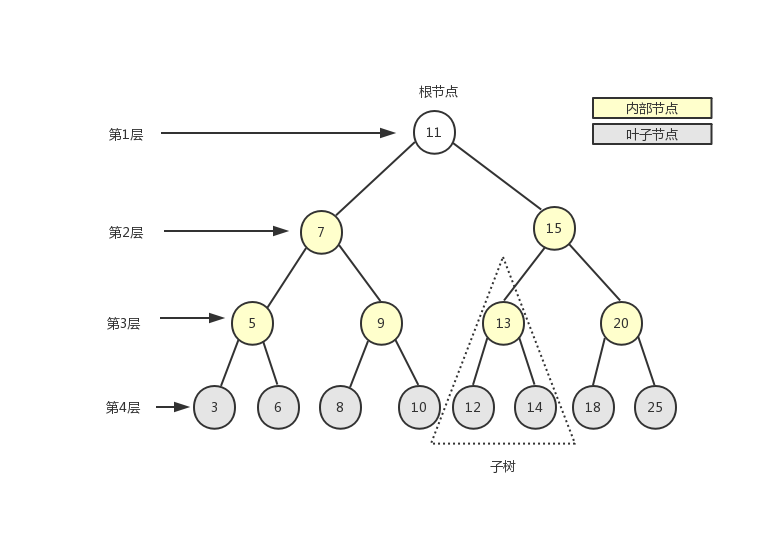
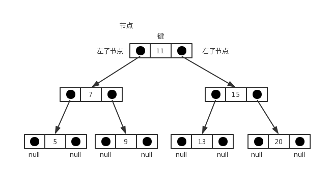
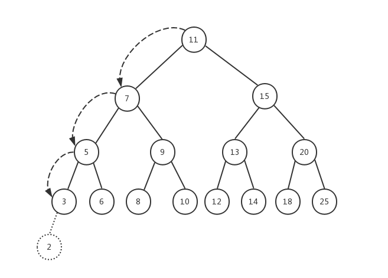
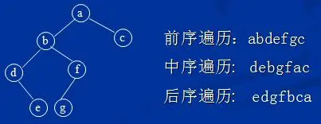

## 树的概念

我们这一篇所说的`树`就是一种数据逻辑结构，即研究的是数据和数据之间的关系。

> 之前所说的`栈`、`队列`、`链表`都是一种线性结构，相信大家也能发现这种**线性结构**的数据关系有一个共同点，就是数据都是一对一的，对于`集合`这种数据结构，数据是散乱的，他们之间的关系就是隶属于同一个集合。和线性表不同的是，**树这种数据结构是一对多的**，

树是一种非顺序的数据结构。下图展示了树的定义：



这里介绍有关树的术语:

```js
1. 节点的度：一个节点含有的子树的个数称为该节点的度；
2. 树的度：一棵树中，最大的节点的度称为树的度；
3. 叶节点：度为零的节点；
4. 父节点：若一个节点含有子节点，则这个节点称为其子节点的父节点；
5. 子节点：一个节点含有的子树的根节点称为该节点的子节点
6. 兄弟节点：具有相同父节点的节点互称为兄弟节点
7. 节点的层次：从根开始定义起，根为第 1 层，根的子节点为第 2 层，以此类推
8. ...
```

## 二叉搜索树

> 二叉树中的节点最多只能有两个子节点，一个是左子节点，一个是右子节点。左右子节点的顺序不能颠倒。因此，二叉树中不存在度大于 2 的节点。

二叉搜索树（`BST——Binary Search Tree`）是二叉树的一种，它规定在**左子节点上存储小（比父节点）的值，在右子节点上（比父节点）存储大（或等于）的值**。上图就是一个二叉搜索树。

- 父节点 > 子节点
- 左节点 < 右节点

下面是二叉搜索树的数据结构示意图：



首先创建一个类来表示二叉查找树，它的内部应该有一个 `Node` 类，用来表示节点

```js
let Node = function(key) {
  this.key = key
  this.left = null
  this.right = null
}
```

以下是我们要实现的 `BinarySearchTree` 类的骨架部分：

```js
class BinarySearchTree {
  constructor() {
    this.root = null
  }

  // 向树中插入一个节点
  insert(key) {}

  // 在树中查找一个节点
  search(key) {}

  // 通过中序遍历方式遍历树中的所有节点
  inOrderTraverse() {}

  // 通过先序遍历方式遍历树中的所有节点
  preOrderTraverse() {}

  // 通过后序遍历方式遍历树中的所有节点
  postOrderTraverse() {}

  // 返回树中的最小节点
  min() {}

  // 返回树中的最大节点
  max() {}

  // 从树中移除一个节点
  remove(key) {}
}
```

### 插入节点的实现

先来看看向树中添加一个节点

```js
insert(key) {
  let newNode = new Node(key)

  if (this.root === null) this.root = newNode
  else insertNode(this.root, newNode)
}
```

当树的 `root` 为 `null` 时，表示树为空，这时直接将新添加的节点作为树的根节点。否则，我们需要借助于私有函数 `insertNode()`来完成节点的添加。

在 `insertNode()`函数中，我们需要根据新添加节点的 `key` 的大小来递归查找树的左侧子节点或者右侧子节点，因为根据我们的二叉搜索树的定义，值小的节点永远保存在左侧子节点上，值大的节点（包括值相等的情况）永远保存在右侧子节点上。下面是 `insertNode()`函数的实现代码：

```js
function insertNode(node, newNode) {
  if (newNode.key < node.key) {
    if (node.left === null) node.left = newNode
    else insertNode(node.left, newNode)
  } else {
    if (node.right === null) node.right = newNode
    else insertNode(node.right, newNode)
  }
}
```

所有新节点只能作为叶子节点被添加到树中。在本文一开始给出的树的结构图中，如果要添加节点 2，对应的操作步骤如下：



我们传入树的根节点，依次进行递归，找到对应的叶子节点，然后修改节点的左子节点或右子节点指针，使其指向新添加的节点。

在上例中，如果要添加节点 4，它对应的位置应该是节点 3 的右子节点，因为 4 比 3 大。如果要添加节点 21，对应的位置应该是节点 25 的左子节点......

### 树的遍历

下面我们来看看树的三种遍历方式：

- 前序遍历：首先访问根节点，然后遍历左子树，最后遍历右子树，可记录为根—左—右；
- 中序遍历：首先访问左子树，然后访问根节点，最后遍历右子树，可记录为左—根—右；
- 后序遍历：首先遍历左子树，然后遍历右子树，最后遍历根节点，可记录为左—右—根。


