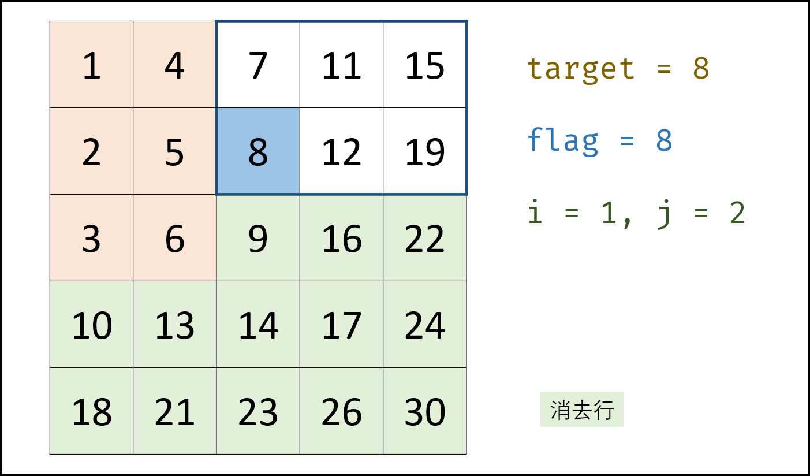

## 题目

在一个 n \* m 的二维数组中，每一行都按照从左到右递增的顺序排序，每一列都按照从上到下递增的顺序排序。请完成一个函数，输入这样的一个二维数组和一个整数，判断数组中是否含有该整数。

**示例:**

现有矩阵 matrix 如下：

```TS
[
  [1, 4, 7, 11, 15],
  [2, 5, 8, 12, 19],
  [3, 6, 9, 16, 22],
  [10, 13, 14, 17, 24],
  [18, 21, 23, 26, 30]
]
```

给定 target = 5，返回 `true`。

给定 target = 20，返回 `false`。

**限制：**

0 <= n <= 1000

0 <= m <= 1000

```js
/**
 * @param {number[][]} matrix
 * @param {number} target
 * @return {boolean}
 */
var findNumberIn2DArray = function(matrix, target) {}
```

## 第一版：二分的暴力实现

当时想法：遍历列，如果 `行[0] < target && target < 行[最后一个]`，然后使用二分法查找这一行，可以实现但是不推荐，**还没总结出规律**！

```js
var findNumberIn2DArray = function(matrix, target) {
  for (let i = 0; i < matrix.length; i++) {
    const arr = matrix[i],
      len = arr.length
    if (arr[0] === target || arr[i] === target) return true
    if (arr[0] < target && target < arr[len - 1] && binarySearch(arr, len, target)) return true
  }
  return false
}

function binarySearch(arr, len, target) {
  let min = 0,
    max = len - 1

  while (min <= max) {
    const mid = (max + min) >> 1 // 相当于 Math.floor((min + max) / 2)
    if (target > arr[mid]) {
      min = mid + 1
    } else if (target < arr[mid]) {
      max = mid - 1
    } else {
      return true
    }
  }
  return false
}
```

解题的本质还是观察出规律。

## 第二版：总结规律

:::tip 解题思路

若使用暴力法遍历矩阵 `matrix` ，则时间复杂度为 `O(N*M)O(N∗M)` 。暴力法未利用矩阵 “**从上到下递增、从左到右递增**” 的特点，显然不是最优解法

利用矩阵特点引入标志数，并通过标志数性质降低算法时间复杂度

:::

- 左下角元素： 为所在列最大元素，所在行最小元素。
- 右上角元素： 为所在行最大元素，所在列最小元素。

从矩阵 matrix 左下角元素（索引设为 (i, j) ）开始遍历，并与目标值对比：

- 当 matrix[i][j] > target 时： 行索引向上移动一格（即 i--），即消去矩阵第 i 行元素；
- 当 matrix[i][j] < target 时： 列索引向右移动一格（即 j++），即消去矩阵第 j 列元素；
- 当 matrix[i][j] == target 时： 返回 true。
- 若行索引或列索引越界，则代表矩阵中无目标值，返回 false 。

算法本质： 每轮 i 或 j 移动后，相当于生成了“消去一行（列）的新矩阵”， 索引(i,j) 指向新矩阵的左下角元素（标志数），因此可重复使用以上性质消去行（列）。

**复杂度分析：**

- 时间复杂度 O(M+N)O(M+N) ：其中，NN 和 MM 分别为矩阵行数和列数，此算法最多循环 M+NM+N 次。
- 空间复杂度 O(1)O(1) : i, j 指针使用常数大小额外空间。



答案

```TS
var findNumberIn2DArray = function (matrix, target) {
  if (matrix.length === 0) { // 空矩阵 返回 false
    return false
  } else if (matrix.length === 1) { // 单二维数组 使用二分查找
    return binarySearch(matrix[0], target)
  } else { // 二维矩阵
    let j = 0,
      jLen = matrix[0].length,
      i = matrix.length - 1 // 起始位置 matrix[i][j] 左下角

    while (i >= 0 && j < jLen) {
      if (target > matrix[i][j]) { // 向右查找
        j++
      } else if (target < matrix[i][j]) { // 向上查找
        i--
      } else {
        console.log(i, j, target, matrix[i][j])
        return true
      }
    }
    return false
  }

}

function binarySearch(arr, target) {
  let min = 0,
    max = arr.length - 1

  while (min <= max) {
    const mid = (max + min) >> 1 // 相当于 Math.floor((max + min) / 2)
    if (target > arr[mid]) {
      min = mid + 1
    } else if (target < arr[mid]) {
      max = mid - 1
    } else {
      return true
    }
  }

  return false
}
```
