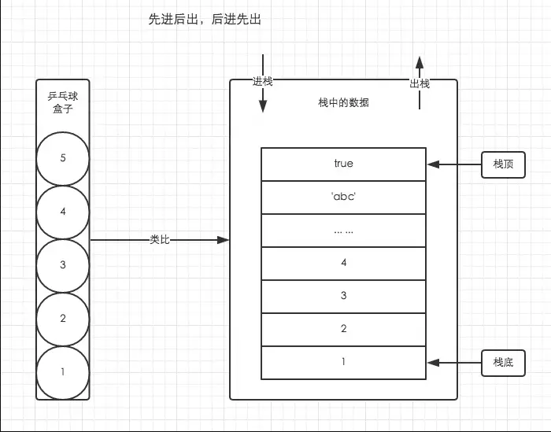
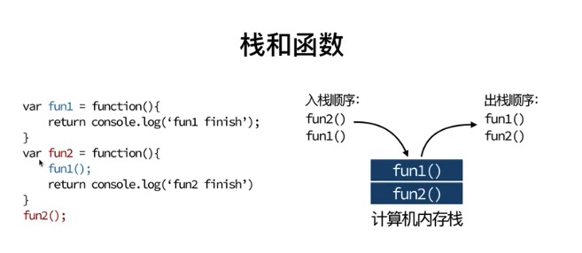
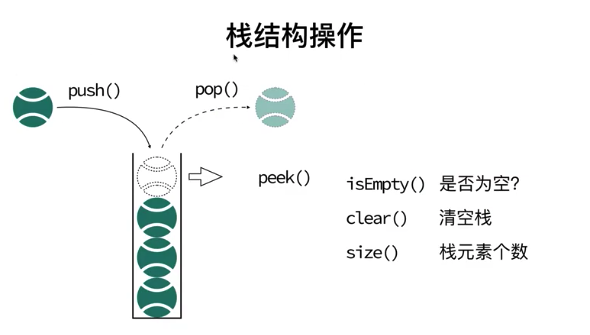
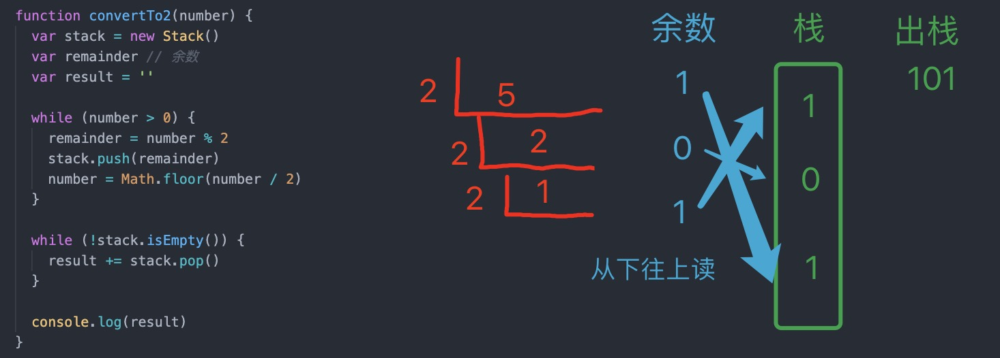

## 什么是栈

栈是一种特殊的列表，栈内的元素只能通过列表的一端访问，这一端称为栈顶。

栈被称为是一种**后入先出**（`LIFO，last-in-first-out`）的数据结构。

由于栈具有后入先出的特点，所以任何不在栈顶的元素都无法访问。为了得到栈底的元素，必须先拿掉上面的元素。

:::details 图示

:::

## 栈和函数

> 栈的作用：在编程语言的编程器和内存中保存变量、方法调用。

`Javascript` 中的函数调用也是通过堆栈实现的。举个例子：



1. 执行 `fn2`, `fn2` 入栈
2. `fn2` 中执行 `fn1`, `fn1` 入栈
3. `fn1` 执行完毕 出栈
4. `fn2` 执行完毕 出栈

再看这一段：

```TS
function test() {
  setTimeout(function() { alert(1) }, 0)
  alert(2)
}
test()
```

注意这段代码中的 `setTimeout` 延迟设为了 0，就是延迟 0 毫秒，貌似是不做任何延迟立刻执行，即 1，2。但实际的执行结果确是 2，1。为什么？这得从 `Javascript` 调用堆栈(`call stack`)和 `setTimeout` 的功能说起。

首先，`JavaScript` 是单线程的，即同一时间只执行一条代码，所以每一个 JavaScript 代码执行块会 “阻塞” 其它异步事件的执行。其次，和其他的编程语言一样，`Javascript` 中的函数调用也是通过堆栈实现的。

在执行函数 test 的时候，test 先入栈，如果不给 alert(1)加 setTimeout，那么 alert(1)第 2 个入栈，最后是 alert(2)。但现在给 alert(1)加上 setTimeout 后，alert(1)就被加入到了一个新的堆栈中等待，并 “尽可能快” 的执行。这个尽可能快就是指在 a 的堆栈完成后就立刻执行，因此实际的执行结果就是先 alert(2)，再 alert(1)。在这里 setTimeout 实际上是让 alert(1)脱离了当前函数调用堆栈。

## 栈的实现



| 方法名  | 操作           |
| ------- | -------------- |
| push    | 栈顶添加元素   |
| pop     | 栈顶移除元素   |
| peek    | 查看栈顶       |
| isEmpty | 检查栈是否为空 |
| clear   | 移除所有元素   |
| size    | 获取栈长度     |

```js
// [栈底, ..... 栈顶]

function Stack() {
  var items = [] // 私有【this.items 就为公有的了】

  // 栈顶添加元素
  this.push = function(element) {
    items.push(element)
  }

  // 栈顶移除元素
  this.pop = items.pop

  // peek 检查栈顶元素
  this.peek = () => items[items.length - 1]

  // 检查是否为空
  this.isEmpty = () => items.length === 0

  // 获取栈的大小
  this.size = () => items.length

  this.clear = function() {
    items = []
  }
}
```

## 用栈实现 10 进制转 2 进制



:::details 展开代码

```js
function convertTo2(number) {
  var stack = new Stack()
  var remainder // 余数
  var result = ''

  while (number > 0) {
    remainder = number % 2
    stack.push(remainder)
    number = Math.floor(number / 2)
  }

  while (!stack.isEmpty()) {
    result += stack.pop()
  }

  return result
}
```

:::

例如 8 转为 2 进制

| 次数   | 商（向下取整） | 余数 | 入栈 |
| ------ | :------------: | :--: | :--: |
| 第一次 |       8        |  0   |  0   |
| 第二次 |       4        |  0   |  0   |
| 第三次 |       2        |  0   |  0   |
| 第四次 |       1        |  1   |  1   |

入栈 0 0 0 1
出栈 1 0 0 0

得到结果为 `1000`

参考

- [「前端进阶」JS 中的栈内存堆内存](https://juejin.im/post/5d116a9df265da1bb47d717b)
- [数据结构与算法 javascript 描述（栈、队列、链表、集合、字典、树、图 系列课程详解 ）](https://www.bilibili.com/video/BV1SJ41117ui?p=3)
