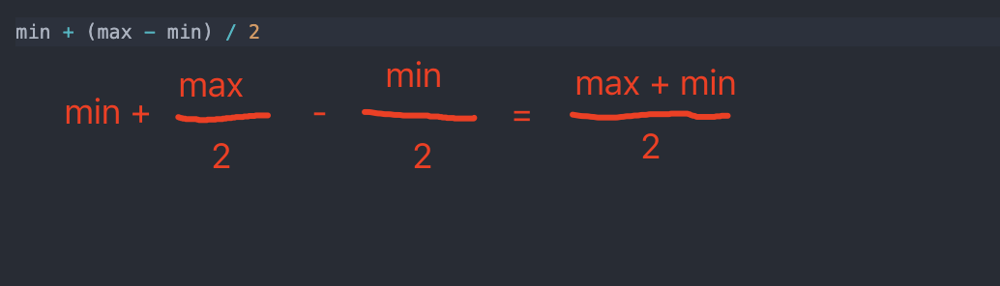

二分查找是一种基于比较目标值和数组中间元素的教科书式算法。

- 如果目标值等于中间元素，则找到目标值。
- 如果目标值较小，继续在左侧搜索。
- 如果目标值较大，则继续在右侧搜索。

复杂度分析

- 时间复杂度：`O(logN)`。
- 空间复杂度：`O(1)`。

## 第一版：基本实现

实现代码如下：

```js {6}
function binarySearch(arr, target) {
  let min = 0,
    max = arr.length - 1

  while (min <= max) {
    const mid = Math.floor((min + max) / 2)
    if (target > arr[mid]) {
      min = mid + 1
    } else if (target < arr[mid]) {
      max = mid - 1
    } else {
      return mid
    }
  }
  return -1
}
```

现在问你，上面的代码有没有问题？哪段代码会出现 `bug` ？

有的，仔细看这里我们已经标出来了

```js
const mid = Math.floor((min + max) / 2)
```

这句代码在 `min` 和 `max` 很大的时候，会出现溢出的情况。

## 第二版：避免整数溢出问题

那怎么改进呢？一般的做法是这样的：**将加法变成减法**。

```js
const mid = Math.floor(min + (max - min) / 2)
```

我们可以简单推导一下：



代码更新为

```js {6}
function binarySearch(arr, target) {
  let min = 0,
    max = arr.length - 1

  while (min <= max) {
    const mid = Math.floor(min + (max - min) / 2)
    if (target > arr[mid]) {
      min = mid + 1
    } else if (target < arr[mid]) {
      max = mid - 1
    } else {
      return mid
    }
  }
  return -1
}
```

还有一种更高逼格的写法，也是官方的二分搜索法的实现写法：使用 **位运算**。

```js {6}
function binarySearch(arr, target) {
  let min = 0,
    max = arr.length - 1

  while (min <= max) {
    const mid = (max + min) >>> 1 // 位运算，无符号右移一位，同 Math.floor((min + max) / 2)
    if (target > arr[mid]) {
      min = mid + 1
    } else if (target < arr[mid]) {
      max = mid - 1
    } else {
      return mid
    }
  }
  return -1
}
```

## leetcode

> 在排序数组中查找元素的第一个和最后一个位置

给定一个按照升序排列的整数数组 `nums`，和一个目标值 `target`。找出给定目标值在数组中的开始位置和结束位置。

你的算法时间复杂度必须是  `O(log n)` 级别。

如果数组中不存在目标值，返回  `[-1, -1]`。

示例 1:

```TS
输入: nums = [5,7,7,8,8,10], target = 8
输出: [3,4]

输入: nums = [5,7,7,8,8,10], target = 6
输出: [-1,-1]
```

```js
/**
 * @param {number[]} nums
 * @param {number} target
 * @return {number[]}
 */
var searchRange = function(nums, target) {
}
```


:::details 答案

```js
var searchRange = function (nums, target) {
  let min = 0,
    max = nums.length - 1

  while (min <= max) {
    var mid = (max + min) >>> 1
    if (target > nums[mid]) {
      min = mid + 1
    } else if (target < nums[mid]) {
      max = mid - 1
    } else {
      let start = mid,
        end = mid

      while (start > min && nums[start] === nums[start - 1]) start--
      while (end < max && nums[end] === nums[end + 1]) end++
      return [start, end]
    }
  }
  return [-1, -1]
}
```
:::