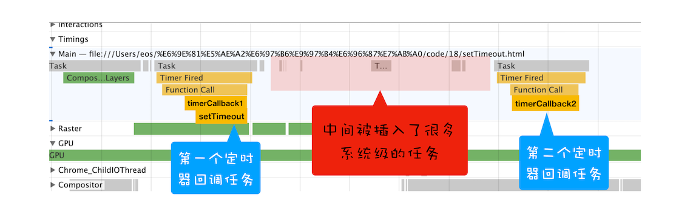
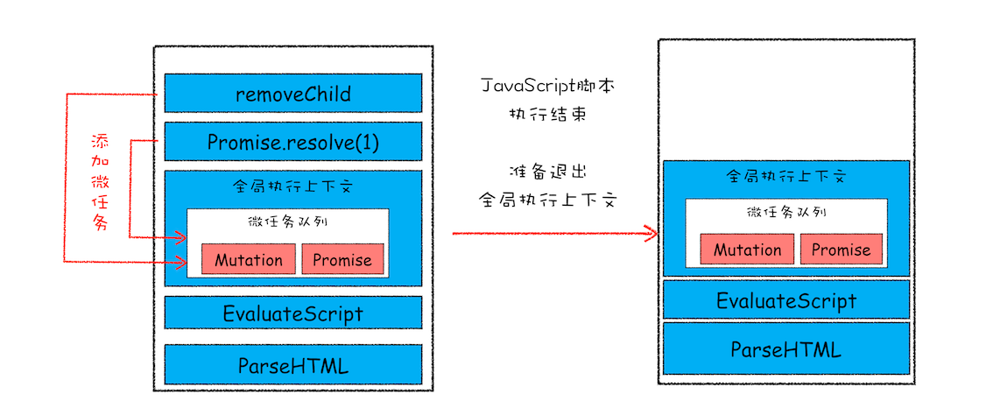

## 宏任务

页面中的大部分任务都是在主线程上执行的，这些任务包括了：

- 渲染事件（如解析 DOM、计算布局、绘制）；
- 用户交互事件（如鼠标点击、滚动页面、放大缩小等）；
- JavaScript 脚本执行事件；
- 网络请求完成、文件读写完成事件。

为了协调这些任务有条不紊地在主线程上执行，页面进程引入了消息队列和事件循环机制，渲染进程内部会维护多个消息队列，比如延迟执行队列和普通的消息队列。然后主线程采用一个 for 循环，不断地从这些任务队列中取出任务并执行任务。我们把这些消息队列中的任务称为`宏任务`。

页面的渲染事件、各种 IO 的完成事件、执行 JavaScript 脚本的事件、用户交互的事件等都随时有可能被添加到消息队列中，而且添加事件是由系统操作的，**JavaScript 代码不能准确掌控任务要添加到队列中的位置，控制不了任务在消息队列中的位置，所以很难控制开始执行任务的时间**。为了直观理解，你可以看下面这段代码

```js
function timerCallback2() {
  console.log(2)
}
function timerCallback() {
  console.log(1)
  setTimeout(timerCallback2, 0)
}
setTimeout(timerCallback, 0)
```

在这段代码中，我的目的是想通过 `setTimeout` 来设置两个回调任务，并让它们按照前后顺序来执行，中间也不要再插入其他的任务，因为如果这两个任务的中间插入了其他的任务，就很有可能会影响到第二个定时器的执行时间了。

但实际情况是我们不能控制的，比如在你调用 `setTimeout` 来设置回调任务的间隙，消息队列中就有可能被插入很多系统级的任务。你可以打开 `Performance` 工具，来记录下这段任务的执行过程，也可参考文中我记录的图片：



`setTimeout` 函数触发的回调函数都是宏任务，如图中，左右两个黄色块就是 `setTimeout` 触发的两个定时器任务。

现在你可以重点观察上图中间浅红色区域，这里有很多一段一段的任务，这些是被渲染引擎插在两个定时器任务中间的任务。试想一下，如果中间被插入的任务执行时间过久的话，那么就会影响到后面任务的执行了。

所以说宏任务的时间粒度比较大，执行的时间间隔是不能精确控制的，对一些高实时性的需求就不太符合了，比如后面要介绍的监听 DOM 变化的需求。

## 微任务

在理解了宏任务之后，下面我们就可以来看看什么是微任务了。

异步回调主要有两种：

**第一种是把异步回调函数封装成一个 <span class='orange'>宏任务</span>，添加到消息队列尾部，当循环系统执行到该任务的时候执行回调函数**。这种比较好理解，比如 `setTimeout` 和 `XMLHttpRequest`

**第二种方式的执行时机是在主函数执行结束之后、当前宏任务结束之前执行回调函数，这通常都是以 <span class='orange'>微任务</span>形式体现的。**

---

不过要搞清楚微任务系统是怎么运转起来的，就得站在 V8 引擎的层面来分析下。

我们知道当 JavaScript 执行一段脚本的时候，V8 会为其创建一个全局执行上下文，在创建全局执行上下文的同时，V8 引擎也会在内部创建一个微任务队列。

顾名思义，这个微任务队列就是用来存放微任务的，因为在当前宏任务执行的过程中，有时候会产生多个微任务，这时候就需要使用这个微任务队列来保存这些微任务了。不过这个微任务队列是给 V8 引擎内部使用的，所以你是无法通过 JavaScript 直接访问的。

也就是说每个宏任务都关联了一个微任务队列。那么接下来，我们就需要分析两个重要的时间点——微任务产生的时机和执行微任务队列的时机。

---

我们先来看看微任务是怎么产生的？在现代浏览器里面，产生微任务有两种方式。

第一种方式是使用 `MutationObserver` 监控某个 DOM 节点，然后再通过 JavaScript 来修改这个节点，或者为这个节点添加、删除部分子节点，当 DOM 节点发生变化时，就会产生 DOM 变化记录的微任务。

第二种方式是使用 `Promise`，当调用 Promise.resolve() 或者 Promise.reject() 的时候，也会产生微任务。

通常情况下，在当前宏任务中的 JavaScript 快执行完成时，也就在 JavaScript 引擎准备退出全局执行上下文并清空调用栈的时候，JavaScript 引擎会检查全局执行上下文中的微任务队列，然后按照顺序执行队列中的微任务。。**WHATWG 把执行微任务的时间点称为检查点**。当然除了在退出全局执行上下文式这个检查点之外，还有其他的检查点，不过不是太重要，这里就不做介绍了。

如果在执行微任务的过程中，产生了新的微任务，同样会将该微任务添加到微任务队列中，V8 引擎一直循环执行微任务队列中的任务，直到队列为空才算执行结束。也就是说在执行微任务过程中产生的新的微任务并不会推迟到下个宏任务中执行，而是在当前的宏任务中继续执行。

为了直观地理解什么是微任务，你可以参考下面的示意图:




该示意图是在执行一个 ParseHTML 的宏任务，在执行过程中，遇到了 JavaScript 脚本，那么就暂停解析流程，进入到 JavaScript 的执行环境。从图中可以看到，全局上下文中包含了微任务列表。

在 JavaScript 脚本的后续执行过程中，分别通过 Promise 和 removeChild 创建了两个微任务，并被添加到微任务列表中。接着 JavaScript 执行结束，准备退出全局执行上下文，这时候就到了检查点了，JavaScript 引擎会检查微任务列表，发现微任务列表中有微任务，那么接下来，依次执行这两个微任务。等微任务队列清空之后，就退出全局执行上下文。
