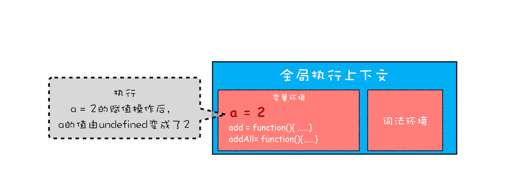

在上篇文章中，我们讲到了，当一段代码被执行时，JavaScript 引擎先会对其进行编译，并创建执行上下文。但是并没有明确说明到底什么样的代码才算符合规范。

那么接下来我们就来明确下，哪些情况下代码才算是“一段”代码，才会在执行之前就进行编译并创建执行上下文。一般说来，有这么三种情况

1. 当 JavaScript 执行全局代码的时候，会编译全局代码并创建全局执行上下文，而且在整个页面的生存周期内，全局执行上下文只有一份。
2. 当调用一个函数的时候，函数体内的代码会被编译，并创建函数执行上下文，一般情况下，函数执行结束之后，创建的函数执行上下文会被销毁。
3. 当使用 eval 函数的时候，eval 的代码也会被编译，并创建执行上下文。

## 函数调用

```js
var a = 2
function add() {
  var b = 10
  return a + b
}
add()
```

这段代码很简单，先是创建了一个 add 函数，接着在代码的最下面又调用了该函数。

那么下面我们就利用这段简单的代码来解释下函数调用的过程。

在执行到函数 add() 之前，JavaScript 引擎会为上面这段代码创建全局执行上下文，包含了声明的函数和变量，你可以参考下图：


从图中可以看出，代码中全局变量和函数都保存在全局上下文的变量环境中。

执行上下文准备好之后，便开始执行全局代码，当执行到 add 这儿时，JavaScript 判断这是一个函数调用，那么将执行以下操作：

1. 首先，从**全局执行上下文**中，取出 add 函数代码。
2. 其次，对 add 函数的这段代码进行编译，并创建**该函数的执行上下文**和**可执行代码**。
3. 最后，执行代码，输出结果。

完整流程你可以参考下图：


就这样，当执行到 add 函数的时候，我们就有了两个执行上下文了——全局执行上下文和 add 函数的执行上下文。

也就是说在执行 JavaScript 时，可能会存在多个执行上下文，那么 JavaScript 引擎是如何管理这些执行上下文的呢？

答案是**通过一种叫栈的数据结构来管理的**。那什么是栈呢？它又是如何管理这些执行上下文呢？

## 什么是 JavaScript 的调用栈

JavaScript 引擎正是利用栈的这种结构来管理执行上下文的。在执行上下文创建好后，JavaScript 引擎会将执行上下文压入栈中，通常把这种用来管理执行上下文的栈称为执行上下文栈，又称**调用栈**。

为便于你更好地理解调用栈，下面我们再来看段稍微复杂点的示例代码：

```js
var a = 2
function add(b, c) {
  return b + c
}
function addAll(b, c) {
  var d = 10
  result = add(b, c)
  return a + result + d
}
addAll(3, 6)
```

下面我们就一步步地分析在代码的执行过程中，调用栈的状态变化情况。

**第一步，创建全局上下文，并将其压入栈底**。如下图所示：


全局执行上下文压入到调用栈后，JavaScript 引擎便开始执行全局代码了。首先会执行 a=2 的赋值操作，执行该语句会将全局上下文变量环境中 a 的值设置为 2。设置后的全局上下文的状态如下图所示：



接下来，**第二步是调用 addAll 函数**。当调用该函数时，JavaScript 引擎会编译该函数，并为其创建一个执行上下文，最后还将该函数的执行上下文压入栈中，如下图所示：


addAll 函数的执行上下文创建好之后，便进入了函数代码的执行阶段了，这里先执行的是 d=10 的赋值操作，执行语句会将 addAll 函数执行上下文中的 d 由 undefined 变成了 10。

然后接着往下执行，**第三步，当执行到 add 函数**调用语句时，同样会为其创建执行上下文，并将其压入调用栈，如下图所示：


当 add 函数返回时，该函数的执行上下文就会从栈顶弹出，并将 result 的值设置为 add 函数的返回值，也就是 9。如下图所示：


紧接着 addAll 执行最后一个相加操作后并返回，addAll 的执行上下文也会从栈顶部弹出，此时调用栈中就只剩下全局上下文了。最终如下图所示：


至此，整个 JavaScript 流程执行结束了。

好了，现在你应该知道了**调用栈是 JavaScript 引擎追踪函数执行的一个机制**，当一次有多个函数被调用时，通过调用栈就能够追踪到哪个函数正在被执行以及各函数之间的调用关系。

## 如何利用浏览器查看调用栈的信息

这么说可能有点抽象，这里我们拿上面的那段代码做个演示，你可以打开“开发者工具”，点击“Source”标签，选择 JavaScript 代码的页面，然后在第 3 行加上断点，并刷新页面。你可以看到执行到 add 函数时，执行流程就暂停了，这时可以通过右边“call stack”来查看当前的调用栈的情况，如下图


除了通过断点来查看调用栈，你还可以使用 console.trace() 来输出当前的函数调用关系，比如在示例代码中的 add 函数里面加上了 console.trace()，你就可以看到控制台输出的结果，如下图：


