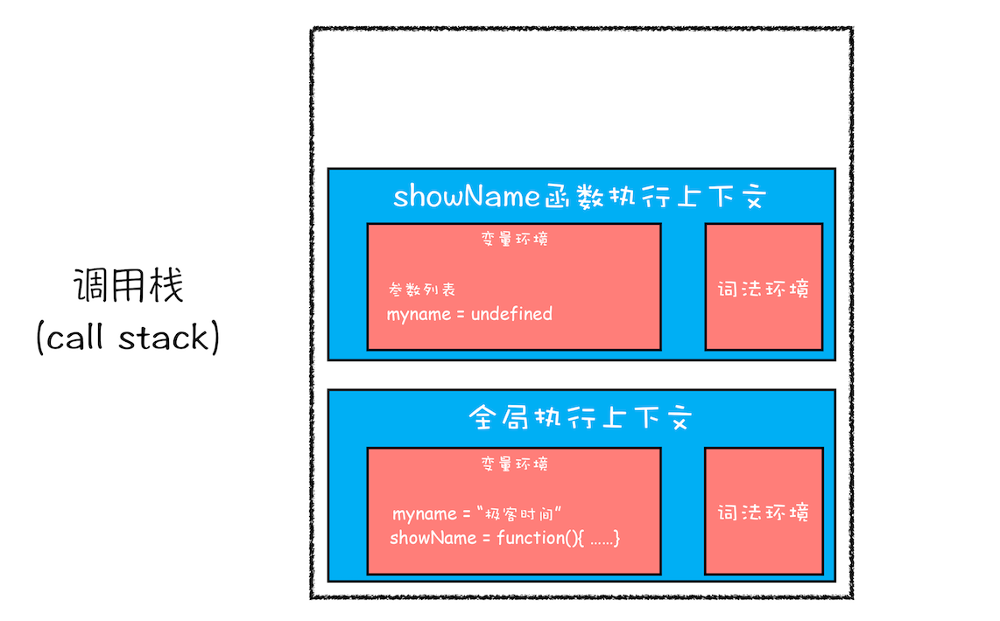
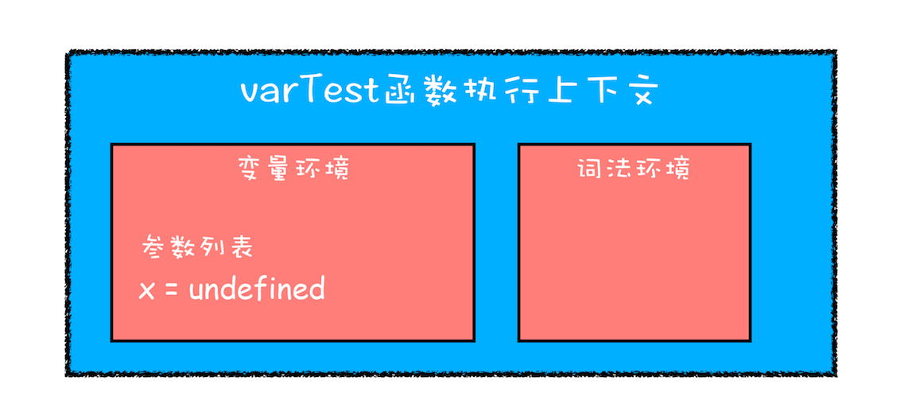
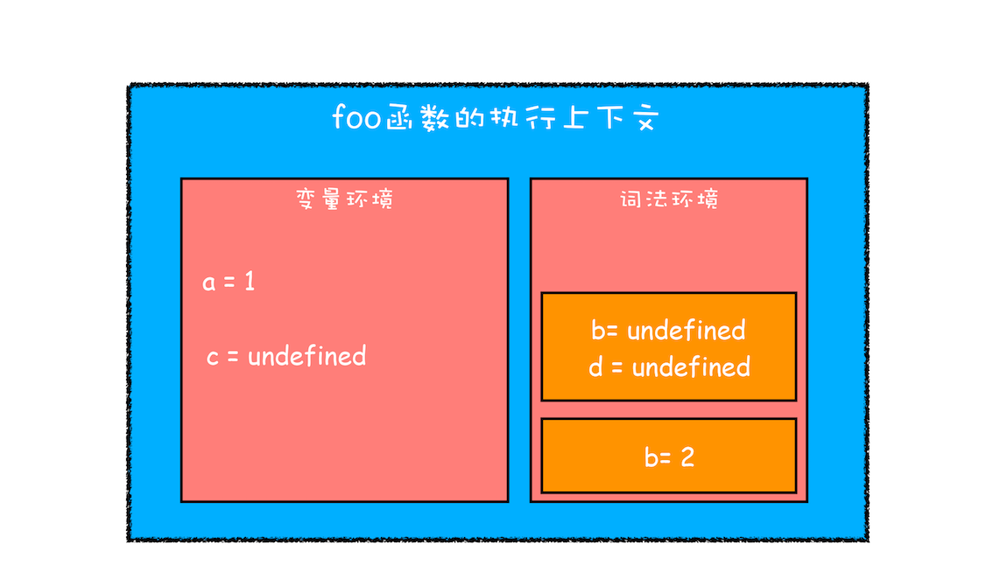

在前面 [变量提升：JS 是按顺序执行的吗?](./variable-promotion.md)这篇文章中，我们已经讲解了 JavaScript 中变量提升的相关内容，正是由于 JavaScript 存在变量提升这种特性，从而导致了很多与直觉不符的代码，这也是 JavaScript 的一个重要设计缺陷。

## 作用域（scope）

为什么 JavaScript 中会存在变量提升这个特性，而其他语言似乎都没有这个特性呢？要讲清楚这个问题，我们就得先从作用域讲起。

**作用域是指在程序中定义变量的区域，该位置决定了变量的生命周期。通俗地理解，作用域就是变量与函数的可访问范围，即作用域控制着变量和函数的可见性和生命周期。**

在 ES6 之前，ES 的作用域只有两种：全局作用域和函数作用域。

- **全局作用域**中的对象在代码中的任何地方都能访问，其生命周期伴随着页面的生命周期。
- **函数作用域**就是在函数内部定义的变量或者函数，并且定义的变量或者函数只能在函数内部被访问。函数执行结束之后，函数内部定义的变量会被销毁。

相较而言，其他语言则都普遍支持**块级作用域**。块级作用域就是使用一对大括号包裹的一段代码，比如函数、判断语句、循环语句，甚至单独的一个{}都可以被看作是一个块级作用域。

```JS
//if块
if (1) {}

//while块
while (1) {}

//函数块
function foo() {}

//for循环块
for (let i = 0; i < 100; i++) {}

//单独一个块
{}
```

### 静态作用域与动态作用域

**JavaScript 采用词法作用域(lexical scoping)，也就是静态作用域。**

因为 JavaScript 采用的是词法作用域，函数的作用域在函数定义的时候就决定了。

而与词法作用域相对的是动态作用域，函数的作用域是在函数调用的时候才决定的。

让我们认真看个例子就能明白之间的区别：

```js
var value = 1

function foo() {
  console.log(value)
}

function bar() {
  var value = 2
  foo()
}

bar()

// 结果是 ???
```

假设 JavaScript 采用静态作用域，让我们分析下执行过程：

执行 foo 函数，先从 foo 函数内部查找是否有局部变量 value，如果没有，就根据书写的位置，查找上面一层的代码，也就是 value 等于 1，所以结果会打印 1。

假设 JavaScript 采用动态作用域，让我们分析下执行过程：

执行 foo 函数，依然是从 foo 函数内部查找是否有局部变量 value。如果没有，就从调用函数的作用域，也就是 bar 函数内部查找 value 变量，所以结果会打印 2。

前面我们已经说了，JavaScript 采用的是静态作用域，所以这个例子的结果是 1。

## 变量提升所带来的问题

### 变量容易在不被察觉的情况下被覆盖掉

```js
var myname = '极客时间'
function showName() {
  console.log(myname) // undefined
  if (0) {
    var myname = '极客邦'
  }
  console.log(myname) // undefined
}
showName()
```

为什么输出的内容是 undefined 呢？我们再来分析一下

首先当刚执行到 showName 函数调用时，执行上下文和调用栈的状态是怎样的？



showName 函数的执行上下文创建后，JavaScript 引擎便开始执行 showName 函数内部的代码了。首先执行的是：

```js
console.log(myname)
```

执行这段代码需要使用变量 myname，结合上面的调用栈状态图，你可以看到这里有两个 myname 变量：一个在全局执行上下文中，其值是“极客时间”；另外一个在 showName 函数的执行上下文中，其值是 undefined。那么到底该使用哪个呢？

“当然是先使用函数执行上下文里面的变量啦！”，在函数执行过程中，JavaScript 会优先从**当前的执行上下文中**查找变量，由于变量提升，当前的执行上下文中就包含了变量 myname，而值是 undefined，所以获取到的 myname 的值就是 undefined。

关于查找涉及到了**作用域链**的概念，这里不再过多讲述。

### 本应销毁的变量没有被销毁

```js
function foo() {
  for (var i = 0; i < 7; i++) {}
  console.log(i)
}
foo()
```

这同样也是由变量提升而导致的，在创建执行上下文阶段，变量 i 就已经被提升了，所以当 for 循环结束之后，变量 i 并没有被销毁。

## let const : 解决变量提升带来的缺陷

为了解决这些问题，ES6 引入了 `let` 和 `const` 关键字，从而使 JavaScript 也能像其他语言一样拥有了块级作用域。

```js
function varTest() {
  var x = 1
  if (true) {
    var x = 2 // 同样的变量!
    console.log(x) // 2
  }
  console.log(x) // 2
}
```

由于 var 的作用范围是整个函数，所以在编译阶段，会生成如下的执行上下文：



从执行上下文的变量环境中可以看出，最终只生成了一个变量 x，函数体内所有对 x 的赋值操作都会直接改变变量环境中的 x 值。

所以上述代码最后通过 console.log(x) 输出的是 2，而对于相同逻辑的代码，其他语言最后一步输出的值应该是 1，因为在 if 块里面的声明不应该影响到块外面的变量。

把 var 关键字替换为 let 关键字，改造后的代码如下：

```js
function letTest() {
  let x = 1
  if (true) {
    let x = 2 // 不同的变量
    console.log(x) // 2
  }
  console.log(x) // 1
}
```

## JavaScript 是如何支持块级作用域的 ✨

那么接下来，我们就要站在**执行上下文**的角度来揭开答案。

```js
function foo() {
  var a = 1
  let b = 2
  {
    let b = 3
    var c = 4
    let d = 5
    console.log(a)
    console.log(b)
  }
  console.log(b)
  console.log(c)
  console.log(d)
}
foo()
```

当执行上面这段代码的时候，JavaScript 引擎会先对其进行编译并创建执行上下文，然后再按照顺序执行代码，关于如何创建执行上下文我们在前面的文章中已经分析过了，但是现在的情况有点不一样，我们引入了 let 关键字，let 关键字会创建块级作用域，那么 let 关键字是如何影响执行上下文的呢？

接下来我们就来一步步分析上面这段代码的执行流程。

### 编译阶段：编译并创建执行上下文（变量函数提升）

```js
VariableEnvironment:
  a -> undefined
  c -> undefined
LexicalEnvironment:
  b -> undefined
```


通过上图，我们可以得出以下结论：

<blockquote class='box'>

- 函数内部通过 var 声明的变量，在编译阶段全都被存放到**变量环境**里面了。
- 通过 let 声明的变量，在编译阶段会被存放到**词法环境**（`Lexical Environment`）中。
- 在函数的作用域块内部，通过 let 声明的变量并没有被存放到词法环境中。

</blockquote>

### 执行代码

接下来，**第二步继续执行代码**，当执行到代码块里面时，变量环境中 a 的值已经被设置成了 1，词法环境中 b 的值已经被设置成了 2，这时候函数的执行上下文就如下图所示：

```js
VariableEnvironment:
  a -> 1
  c -> undefined
LexicalEnvironment:
  b -> 2
```



从图中可以看出，当进入函数的作用域块时，作用域块中通过 let 声明的变量，会被存放在词法环境的一个单独的区域中，这个区域中的变量并不影响作用域块外面的变量，比如在作用域外面声明了变量 b，在该作用域块内部也声明了变量 b，当执行到作用域内部时，它们都是独立的存在。

其实，在词法环境内部，维护了一个小型栈结构，栈底是函数最外层的变量，进入一个作用域块后，就会把该作用域块内部的变量压到栈顶；当作用域执行完成之后，该作用域的信息就会从栈顶弹出，这就是词法环境的结构。需要注意下，我这里所讲的变量是指通过 let 或者 const 声明的变量。

再接下来，当执行到作用域块中的 console.log(a)这行代码时，就需要在词法环境和变量环境中查找变量 a 的值了，具体查找方式是：沿着词法环境的栈顶向下查询，如果在词法环境中的某个块中查找到了，就直接返回给 JavaScript 引擎，如果没有查找到，那么继续在变量环境中查找。

这样一个变量查找过程就完成了，你可以参考下图：


从上图你可以清晰地看出变量查找流程，不过要完整理解查找变量或者查找函数的流程，就涉及到作用域链了，这个我们会在下篇文章中做详细介绍。

当作用域块执行结束之后，其内部定义的变量就会从词法环境的栈顶弹出

<blockquote class='box'>

通过上面的分析，想必你已经理解了词法环境的结构和工作机制

- 块级作用域就是通过词法环境的栈结构来实现的，
- 变量提升是通过变量环境来实现，通过这两者的结合，JavaScript 引擎也就同时支持了变量提升和块级作用域了。

</blockquote>
