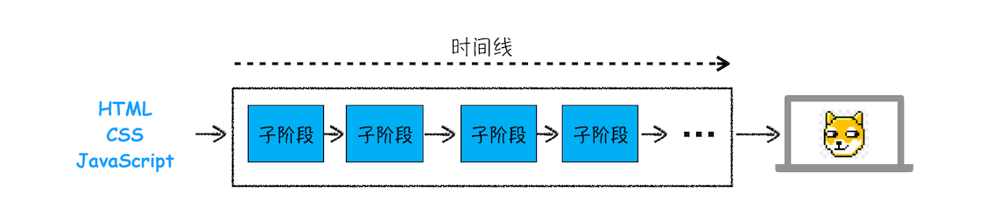

在[上一篇文章](./url-to-display.md)中我们介绍了导航相关的流程，那导航被提交后又会怎么样呢？就进入了渲染阶段。这个阶段很重要，了解其相关流程能让你“看透”页面是如何工作的，有了这些知识，你可以解决一系列相关的问题，比如能熟练使用开发者工具，因为能够理解开发者工具里面大部分项目的含义，能优化页面卡顿问题，使用 JavaScript 优化动画流程，通过优化样式表来防止强制同步布局，等等。

渲染模块就是我们今天要讨论的主题。为了能更好地理解下文，你可以先结合下图快速抓住 HTML、CSS 和 JavaScript 的含义：


从上图可以看出，**HTML 的内容是由标记和文本组成**。标记也称为**标签**，每个标签都有它自己的语义，浏览器会根据标签的语义来正确展示 HTML 内容。比如上面的
标签是告诉浏览器在这里的内容需要创建一个新段落，中间的文本就是段落中需要显示的内容。

如果需要改变 HTML 的字体颜色、大小等信息，就需要用到 CSS。CSS 又称为**层叠样式表，是由选择器和属性组成**，比如图中的 p 选择器，它会把 HTML 里面标签的内容选择出来，然后再把选择器的属性值应用到标签内容上。选择器里面有个 color 属性，它的值是 red，这是告诉渲染引擎把标签的内容显示为红色。

至于 JavaScript，**使用它可以使网页的内容“动”起来**，比如上图中，可以通过 JavaScript 来修改 CSS 样式值，从而达到修改文本颜色的目的。

搞清楚 HTML、CSS 和 JavaScript 的含义后，那么接下来我们就正式开始分析渲染模块了。

由于渲染机制过于复杂，所以渲染模块在执行过程中会被划分为很多子阶段，输入的 HTML 经过这些子阶段，最后输出像素。我们把这样的一个处理流程叫做**渲染流水线**，其大致流程如下图所示：



按照渲染的时间顺序，流水线可分为如下几个子阶段：构建 DOM 树、样式计算、布局阶段、分层、绘制、分块、光栅化和合成。内容比较多，我会用两篇文章来为你详细讲解这各个子阶段。接下来，在介绍每个阶段的过程中，你应该重点关注以下三点内容：

- 开始每个子阶段都有其**输入的内容**；
- 然后每个子阶段有其**处理过程**；
- 最终每个子阶段会**生成输出内容**。

理解了这三部分内容，能让你更加清晰地理解每个子阶段。

## 构建 DOM 树

为什么要构建 DOM 树呢？这是因为**浏览器无法直接理解和使用 HTML，所以需要将 HTML 转换为浏览器能够理解的结构——DOM 树**。


从图中可以看出，构建 DOM 树的输入内容是一个非常简单的 HTML 文件，然后经由 HTML 解析器解析，最终输出树状结构的 DOM。

为了更加直观地理解 DOM 树，你可以打开 Chrome 的“开发者工具”，选择“Console”标签来打开控制台，然后在控制台里面输入“document”后回车，这样你就能看到一个完整的 DOM 树结构，如下图所示：


图中的 document 就是 DOM 结构，你可以看到，DOM 和 HTML 内容几乎是一样的，但是和 HTML 不同的是，DOM 是保存在内存中树状结构，可以通过 JavaScript 来查询或修改其内容。

经生成 DOM 树了，但是 DOM 节点的样式我们依然不知道，要让 DOM 节点拥有正确的样式，这就需要样式计算了。

## 样式计算（Recalculate Style）

### 把 CSS 转换为浏览器能够理解的结构

那 CSS 样式的来源主要有哪些呢？你可以先参考下图：


从图中可以看出，CSS 样式来源主要有三种：

- 通过 link 引用的外部 CSS 文件
- \<style\> 标记内的 CSS
- 元素的 style 属性内嵌的 CSS

和 HTML 文件一样，浏览器也是无法直接理解这些纯文本的 CSS 样式，所以**当渲染引擎接收到 CSS 文本时，会执行一个转换操作，将 CSS 文本转换为浏览器可以理解的结构——styleSheets**。

为了加深理解，你可以在 Chrome 控制台中查看其结构，只需要在控制台中输入 document.styleSheets，然后就看到如下图所示的结构：


从图中可以看出，这个样式表包含了很多种样式，已经把那三种来源的样式都包含进去了。当然样式表的具体结构不是我们今天讨论的重点，你只需要知道渲染引擎会把获取到的 CSS 文本全部转换为 styleSheets 结构中的数据，并且该结构同时具备了查询和修改功能，这会为后面的样式操作提供基础。

### 转换样式表中的属性值，使其标准化

现在我们已经把现有的 CSS 文本转化为浏览器可以理解的结构了，那么接下来就要对其进**行属性值的标准化操作**。

要理解什么是属性值标准化，你可以看下面这样一段 CSS 文本：

```CSS
body { font-size: 2em }
p {color:blue;}
span  {display: none}
div {font-weight: bold}
div  p {color:green;}
div {color:red; }
```

可以看到上面的 CSS 文本中有很多属性值，如 2em、blue、bold，这些类型数值不容易被渲染引擎理解，所以需**要将所有值转换为渲染引擎容易理解的、标准化的计算值，这个过程就是属性值标准化**。

那标准化后的属性值是什么样子的？


从图中可以看到，2em 被解析成了 32px，red 被解析成了 rgb(255,0,0)，bold 被解析成了 700……

### 计算出 DOM 树中每个节点的具体样式

现在样式的属性已被标准化了，接下来就需要计算 DOM 树中每个节点的样式属性了，如何计算呢？

**这就涉及到 CSS 的继承规则和层叠规则了。**

首先是 CSS 继承。**CSS 继承就是每个 DOM 节点都包含有父节点的样式**。这么说可能有点抽象，我们可以结合具体例子，看下面这样一张样式表是如何应用到 DOM 节点上的。

以上面的为例 最终应用到 DOM 节点的效果如下图所示：


从图中可以看出，所有子节点都继承了父节点样式。比如 body 节点的 font-size 属性是 20，那 body 节点下面的所有节点的 font-size 都等于 20。

为了加深你对 CSS 继承的理解，你可以打开 Chrome 的“开发者工具”，选择第一个“element”标签，再选择“style”子标签，你会看到如下界面：


总之，样式计算阶段的目的是为了计算出 DOM 节点中每个元素的具体样式，在计算过程中需要遵守 CSS 的继承和层叠两个规则。这个阶段最终输出的内容是每个 DOM 节点的样式，并被保存在 ComputedStyle 的结构内。

## 布局阶段

现在，我们有 DOM 树和 DOM 树中元素的样式，但这还不足以显示页面，因为我们还不知道 DOM 元素的几何位置信息。**那么接下来就需要计算出 DOM 树中可见元素的几何位置，我们把这个计算过程叫做布局**。

Chrome 在布局阶段需要完成两个任务：创建布局树和布局计算。

### 创建布局树

你可能注意到了 DOM 树还含有很多不可见的元素，比如 head 标签，还有使用了 display:none 属性的元素。所以**在显示之前，我们还要额外地构建一棵只包含可见元素布局树**。

我们结合下图来看看布局树的构造过程：


从上图可以看出，DOM 树中所有不可见的节点都没有包含到布局树中。为了构建布局树，浏览器大体上完成了下面这些工作：

<blockquote class='box'>
1. 遍历 DOM 树中的所有可见节点，并把这些节点加到布局树中；
2. 而不可见的节点会被布局树忽略掉，如 head 标签下面的全部内容，再比如 body.p.span 这个元素，因为它的属性包含 dispaly:none，所以这个元素也没有被包进布局树。
</blockquote>

### 布局计算

现在我们有了一棵完整的布局树。那么接下来，就要计算布局树节点的坐标位置了。布局的计算过程非常复杂，我们这里先跳过不讲。

在执行布局操作的时候，会把布局运算的结果重新写回布局树中，所以布局树既是输入内容也是输出内容，这是布局阶段一个不合理的地方，因为在布局阶段并没有清晰地将输入内容和输出内容区分开来。针对这个问题，Chrome 团队正在重构布局代码，下一代布局系统叫 LayoutNG，试图更清晰地分离输入和输出，从而让新设计的布局算法更加简单。

## 总结


从图中可以看出，本节内容我们介绍了渲染流程的前三个阶段：DOM 生成、样式计算和布局。要点可大致总结为如下：

<blockquote class='box'>

- 浏览器不能直接理解 HTML 数据，所以第一步需要将其转换为浏览器能够理解的 DOM 树结构；
- 生成 DOM 树后，还需要根据 CSS 样式表，来计算出 DOM 树所有节点的样式
- 最后计算 DOM 元素的布局信息，使其都保存在布局树中。

</blockquote>
