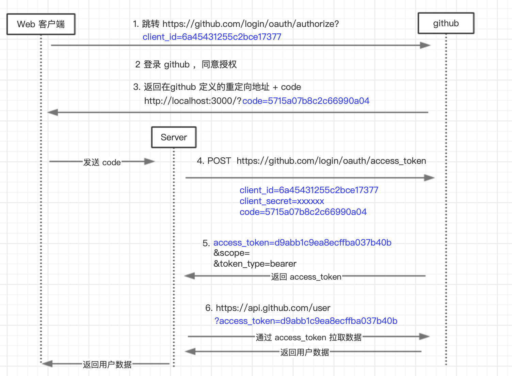

## oAuth 是什么

> oAuth 目前最流行的授权机制，用来**授权第三方应用**，获取用户数据。

简单说，OAuth 就是一种授权机制，主要给第三方应用颁发一个有**时效性的令牌 access_token**，第三方应用根据这个 `access_token` 就可以去获取用户的相关资源，如头像，昵称，email 这些信息。

常见的应用：QQ 登录、微信登录、github 授权登录等等。

## 令牌与密码

令牌的效果和密码一样，可以登录系统。但是有三点差异：

- **令牌是短期的，到期会自动失效，用户自己无法修改**。密码一般长期有效，用户不修改，就不会发生变化。
- **令牌可以被数据所有者撤销**，会立即失效。
- **令牌有权限范围（scope）**，比如我同意你登录，你获取的信息是有限制的，你只能拿到我给你开放的数据范围。

上面这些设计，保证了令牌既可以让第三方应用获得权限，同时又随时可控，不会危及系统安全。这就是 OAuth 2.0 的优点。

注意，只要知道了令牌，就能进入系统。系统一般不会再次确认身份，所以**令 | 必须保密，泄漏令牌与泄漏密码的后果是一样的**。 这也是为什么令牌的有效期，一般都设置得很短的原因。

OAuth 2.0 对于如何颁发令牌的细节，规定得非常详细。具体来说，一共分成四种授权类型（authorization grant），即四种颁发令牌的方式，适用于不同的互联网场景。

## 协议流程

在详细介绍 oAuth2 协议流程之前，先来简单了解几个角色，方便后续的理解。

- `Resource Owner`: 资源所有者，因为是请求用户的头像和昵称的一些信息，所以资源的所有者一般指用户自己。
- `Client`: 客户端，如 web 网站，app 等
- `Resource Server`: 资源服务器，托管受保护资源的服务器
- `Authorization Server`: 授权服务器，一般和资源服务器是同一家公司的应用，主要是用来处理授权，给客户端颁发令牌
- `User-agent`: 用户代理，一般为 web 浏览器，在手机上就是 app

```js
 +--------+                               +---------------+
 |        |--(A)- Authorization Request ->|   Resource    |
 |        |                               |     Owner     |
 |        |<-(B)-- Authorization Grant ---|               |
 |        |                               +---------------+
 |        |
 |        |                               +---------------+
 |        |--(C)-- Authorization Grant -->| Authorization |
 | Client |                               |     Server    |
 |        |<-(D)----- Access Token -------|               |
 |        |                               +---------------+
 |        |
 |        |                               +---------------+
 |        |--(E)----- Access Token ------>|    Resource   |
 |        |                               |     Server    |
 |        |<-(F)--- Protected Resource ---|               |
 +--------+                               +---------------+

```

(A). 用户打开客户端(Client)，客户端向授权服务器(Resource Owner)发送一个授权请求

(B). 用户同意给客户端(Client)授权

(C). 客户端使用刚才的授权去向认证服务器(Authorization Server)认证

(D). 认证服务器认证通过后，会给客户端发放令牌(Access Token)

(E). 客户端拿着令牌(Access Token)，去向资源服务器(Resource Server)申请获取资源

(F). 资源服务器确认令牌之后，给客户端返回受保护的资源(Protected Resource)

---

## 授权方式

OAuth 2.0 对于如何颁发令牌的细节，规定得非常详细。具体来说，一共分成四种授权类型（authorization grant），即四种颁发令牌的方式，适用于不同的互联网场景。

- `授权码模式(authorization code)`： 最常用的流程，安全性也最高，它适用于那些有后端的 Web 应用。授权码通过前端传送，令牌则是储存在后端，而且所有与资源服务器的通信都在后端完成。这样的前后端分离，可以避免令牌泄漏。
- `隐藏式(implicit)`：允许直接向前端颁发令牌。这种方式没有授权码这个中间步骤。适用于**纯前端**，无后端的的 web。
- `密码模式(resource owner password credentials)`：这种方式需要用户给出自己的用户名/密码，显然风险很大，因此只适用于其他授权方式都无法采用的情况，而且必须是用户高度信任的应用。
- `凭证式（client credentials）`：适用于没有前端的命令行应用，即在命令行下请求令牌。

### 授权码模式(authorization code) ✨

```js
 +----------+
 | Resource |
 |   Owner  |
 |          |
 +----------+
      ^
      |
     (B)
 +----|-----+          Client Identifier      +---------------+
 |         -+----(A)-- & Redirection URI ---->|               |
 |  User-   |                                 | Authorization |
 |  Agent  -+----(B)-- User authenticates --->|     Server    |
 |          |                                 |               |
 |         -+----(C)-- Authorization Code ---<|               |
 +-|----|---+                                 +---------------+
   |    |                                         ^      v
  (A)  (C)                                        |      |
   |    |                                         |      |
   ^    v                                         |      |
 +---------+                                      |      |
 |         |>---(D)-- Authorization Code ---------'      |
 |  Client |          & Redirection URI                  |
 |         |                                             |
 |         |<---(E)----- Access Token -------------------'
 +---------+       (w/ Optional Refresh Token)

```

以 `github` 登录为例：



(A). 用户在网站上使用 github 登录，首先会重定向到 github 的授权端点：

```bash
https://github.com/login/oauth/authorize?
response_type=code&
client_id=your_code&
redirect_uri=重定向的url&
scope=read&
state=uuid
```

| 字段          | 描述                                                                           |
| ------------- | ------------------------------------------------------------------------------ |
| response_type | 必须，在授权码模式中固定为 code                                                |
| client_id     | 必须，唯一标识了客户端，在 github 注册时获得的客户端 ID                        |
| redirect_url  | 客户端在 github 注册的重定向 url，用户同意或拒绝的时候都会跳转到这个重定向 url |
| scope         | 可选，请求资源范围，如有多项，使用多个空格隔开                                 |
| state         | 推荐，客户端生成的随机数，资源服务器会原样返回，防止 CSRF 的攻击               |

(B). 页面跳转后，github 会要求用户登录，然后询问是否给予客户端授权，用户点击同意。

(C). 然后 github 就会将授权码(Authorization Code)返回给 redirect_uri(重定向 uri)。

```bash
redirect_uri?code=xxxxxxx
```

| 字段  | 描述                 |
| ----- | -------------------- |
| code  | 必须，授权码         |
| state | 防止 CSRF 攻击的参数 |

(D). 客户端(Client)在通过在 URL 中取出授权码之后，就可以在后端向 github 请求令牌

相关链接

- [阮一峰 OAuth 2.0 的一个简单解释](http://www.ruanyifeng.com/blog/2019/04/oauth_design.html)
- [阮一峰 OAuth 2.0 的四种方式](http://www.ruanyifeng.com/blog/2019/04/oauth_design.html)
- [理解 OAuth2 协议](https://juejin.im/post/5dd34a47f265da0c091575e5)
