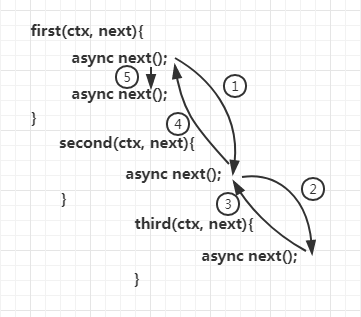

## 面向切面编程 (AOP)

[AOP（Aspect Oriented Programming）](https://blog.csdn.net/qq_42539533/article/details/90551738)，
即面向切面编程，可以说是 [OOP（Object Oriented Programming）](https://github.com/oakland/Vanilla-JS-Practice/blob/master/11-learnOOPfromCircles.js/0-%E5%BD%BB%E5%BA%95%E7%90%86%E8%A7%A3JS%E4%B8%AD%E9%9D%A2%E5%90%91%E5%AF%B9%E8%B1%A1%EF%BC%88%E5%89%8D%E8%A8%80%EF%BC%89.md)，面向对象编程的补充和完善。
面向切面编程是面向对象中的一种方式而已。在代码执行过程中，**动态嵌入其他代码**，叫做面向切面编程。常见的使用场景：
日志 \ 事物 \ 数据库操作

举个例子：
前端开发中, 产品会要求在代码中进行埋点, 需要知道这个按钮用户点击的频率是多少, 但是这样的上报代码其实与实际的业务代码并无强关联, 更不要说在实际上业务代码已经封装成一个通用的函数或组件,
所以, 如果想不侵入业务代码而又满足埋点, 中间件模型或许能够满足需求, 来看一看简单的代码:

```js
// 在原函数执行前执行 fn 函数
Function.prorotype.before = function(fn) {
  // 保存触发 before 的函数
  const self = this
  return function(...args) {
    let res = fn.call(this)
    // 如果上一个函数未返回值, 不执行下一个函数
    if (res) {
      self.apply(this, args)
    }
  }
}

// 在原函数执行后执行 fn 函数
Function.prototype.after = function(fn) {
  // 保存触发 after 的函数
  const self = this
  return function(...args) {
    let res = self.apply(this, args)
    // 如果上一个函数未返回值, 不执行下一个函数
    if (res) {
      fn.call(this)
    }
  }
}
```

上面这两个函数是通过在 `Function.prototype` 上添加两个函数: `before`, `after`. 两个函数的返回值都是一个函数, 这个函数会按照次序执行函数.
这样函数各自保持了他们的整洁性.但是这样的 `before` 与 `after` 函数的简单使用缺陷也是很明显的, 他们并不支持异步的函数, 而日常开发中异步的场景有非常多, 所以这样的代码还是只能在 `demo` 中使用,
不适合生产环境中使用.所以我们来看一下 `koa` 框架是怎么做的.

## Koa 的中间件

### 简介

`Koa` 是一个中间件框架，本身没有捆绑任何中间件。本身支持的功能并不多，功能都可以通过中间件拓展实现。通过添加不同的中间件，实现不同的需求，从而构建一个 `Koa` 应用。

`Koa` 的中间件就是函数，可以是 `async` 函数，或是普通函数。下面是[中间件的 demo](https://github.com/koajs/koa)

```js
app.use(async (ctx, next) => {
  const start = Date.now()
  await next()
  const ms = Date.now() - start
  console.log(`${ctx.method} ${ctx.url} - ${ms}ms`)
})

app.use((ctx, next) => {
  const start = Date.now()
  return next().then(() => {
    const ms = Date.now() - start
    console.log(`${ctx.method} ${ctx.url} - ${ms}ms`)
  })
})
```

### compose 函数实现

`koa` 是 `nodejs` 中非常精简的框架, 其中的精粹思想就是洋葱模型(中间件模型), 它实现的核心就是借助 `compose` 这个库来实现的

对于 `compose` 也就是 `koa` 的核心思想就是像下面这个图:


```js
function compose(middleware) {
  // 传入的 middleware 参数必须是数组
  if (!Array.isArray(middleware)) throw new TypeError('Middleware stack must be an array!')
  // middleware 数组的元素必须是函数
  for (const fn of middleware) {
    if (typeof fn !== 'function') throw new TypeError('Middleware must be composed of functions!')
  }

  // 返回一个函数闭包, 保持对 middleware 的引用
  return function(context, next) {
    // 这里的 context 参数是作为一个全局的设置, 所有中间件的第一个参数就是传入的 context, 这样可以
    // 在 context 中对某个值或者某些值做"洋葱处理"

    // 解释一下传入的 next, 这个传入的 next 函数是在所有中间件执行后的"最后"一个函数, 这里的"最后"并不是真正的最后,
    // 而是像上面那个图中的圆心, 执行完圆心之后, 会返回去执行上一个中间件函数(middleware[length - 1])剩下的逻辑

    // index 是用来记录中间件函数运行到了哪一个函数
    let index = -1
    // 执行第一个中间件函数
    return dispatch(0)

    function dispatch(i) {
      // i 是洋葱模型的记录已经运行的函数中间件的下标, 如果一个中间件里面运行两次 next, 那么 i 是会比 index 小的.
      // 如果对这个地方不清楚可以查看下面的图
      if (i <= index) return Promise.reject(new Error('next() called multiple times'))
      index = i
      let fn = middleware[i]
      if (i === middleware.length) {
        // 这里的 next 就是一开始 compose 传入的 next, 意味着当中间件函数数列执行完后, 执行这个 next 函数, 即圆心
        fn = next
      }
      // 如果没有函数, 直接返回空值的 Promise
      if (!fn) return Promise.resolve()
      try {
        // 为什么这里要包一层 Promise?
        // 因为 async 需要后面是 Promise, 然后 next 函数返回值就是 dispatch 函数的返回值, 所以运行 async next(); 需要 next 包一层 Promise
        // next 函数是固定的, 可以执行下一个函数
        return Promise.resolve(
          fn(context, function next() {
            return dispatch(i + 1)
          })
        )
      } catch (err) {
        return Promise.reject(err)
      }
    }
  }
}
```

至于在一个中间件函数中两次调用 next 函数导致出错, 我这里提供一个简单的例子供大家参考:

```js
async function first(ctx, next) {
  console.log('1')
  // async 与 co + yield 的模型不同, await 是需要后面是 promise 的函数, 并且自己执行一次, 而 co 是自己拿到 value 然后帮你自动执行.
  await next()
  await next() // 两次调用 next
  console.log(ctx)
}

async function second(ctx, next) {
  console.log('2')
  await next()
}

async function third(ctx, next) {
  console.log('3')
  await next()
  console.log('4')
}

const middleware = [first, second, third]

const com = compose(middleware)

com('ctx', function() {
  console.log('hey')
})
```

如果第一个中间件中没有两次调用 next 函数, 那么正确的结果为 1 2 3 'hey' 4 'ctx'. 对于出错的真正原因是如下图:



在第 5 步中, 传入的 i 值为 1, 因为还是在第一个中间件函数内部, 但是 compose 内部的 index 已经是 3 了, 所以 i < 3, 所以报错了, 可知在一个中间件函数内部不允许多次调用 next 函数.

> 中间件模型非常好用并且简洁, 甚至在 koa 框架上大放异彩, 但是也有自身的缺陷, 也就是一旦中间件数组过于庞大, 性能会有所下降, 因此我们需要结合自身的情况与业务场景作出最合适的选择.

## 参考链接

[理解 Koa 的中间件机制](https://github.com/zhangxiang958/zhangxiang958.github.io/issues/34)
