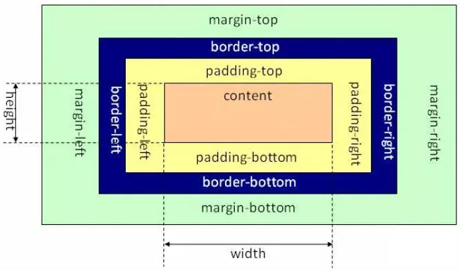
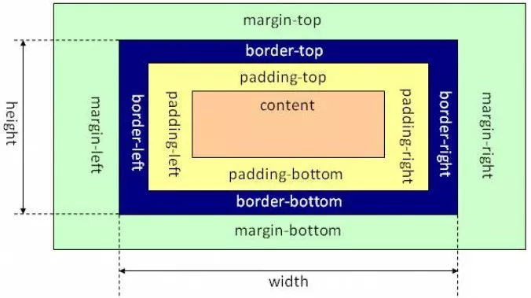

本文主题：

- 基本概念： 标准模型 + IE 模型
- 基本模型和 IE 模型的区别：计算宽度和高度的不同
- CSS 如何设置这两种模型（由理论转为运用）
- JS 如何设置、获取盒模型对应的宽和高
- 实例题（根据盒模型解释边距重叠问题） **拔高性的延伸**
- BFC （边距重叠解决方案）**面试常考，也容易混淆的题目**

## 盒模型

基本概念

什么是 CSS 盒模型？相信大部分人都能答出这个问题来，那就是 标准模型 + IE 模型

### 标准模型

### IE 模型

