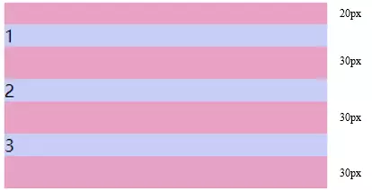

本文主题：

- 基本概念： 标准模型 + IE 模型
- 基本模型和 IE 模型的区别：计算宽度和高度的不同
- CSS 如何设置这两种模型（由理论转为运用）
- JS 如何设置、获取盒模型对应的宽和高
- 实例题（根据盒模型解释边距重叠问题） **拔高性的延伸**
- BFC （边距重叠解决方案）**面试常考，也容易混淆的题目**

## 盒模型

基本概念

什么是 CSS 盒模型？相信大部分人都能答出这个问题来，那就是 标准模型 + IE 模型

### 标准模型


### IE 模型


## 边距重叠

什么是边距重叠呢?

边界重叠是指两个或多个盒子(可能相邻也可能嵌套)的相邻边界(其间没有任何非空内容、补白、边框)重合在一起而形成一个单一边界。

### 父子元素的边界重叠

```html {8}
<style>
  .parent {
    background: #e7a1c5;
  }
  .parent .child {
    background: #c8cdf5;
    height: 100px;
    margin-top: 10px;
  }
</style>
<section class="parent">
  <article class="child"></article>
</section>
```

效果：


在这里父元素的高度不是 110px，而是 100px，在这里发生了**高度坍塌**。

原因是如果块元素的 `margin-top` 与它的第一个子元素的 `margin-top` 之间没有 `border`、`padding`、`inline content`、 `clearance` 来分隔，
或者块元素的`margin-bottom` 与它的最后一个子元素的`margin-bottom` 之间没有 `border`、`padding`、`inline content`、`height`、`min-height`、 `max-height` 分隔那么外边距会塌陷。子元素多余的外边距会被父元素的外边距截断。

### 兄弟元素的边界重叠

```html
<style>
  #margin {
    background: #e7a1c5;
    overflow: hidden;
    width: 300px;
  }
  #margin > p {
    background: #c8cdf5;
    margin: 20px auto 30px;
  }
</style>
<section id="margin">
  <p>1</p>
  <p>2</p>
  <p>3</p>
</section
```



可以看到 1 和 2,2 和 3 之间的间距不是 50px，发生了**边距重叠是取了它们之间的最大值** 30px。

### 空元素的边界重叠

```html {8}
<style>
  p:nth-child(1),
  p:nth-child(3) {
    height: 20px;
    background-color: #c8cdf5;
  }
  p:nth-child(2) {
    margin: 20px 0 30px 0;
  }
</style>
<p>1</p>
<p></p>
<p>3</p>
```


## BFC

解决上述问题的其中一个办法就是创建 `BFC`。`BFC` 的全称为 `Block Formatting Context`，即块级格式化上下文。

**块格式上下文是页面 CSS 视觉渲染的一部分，用于决定块盒子的布局及浮动相互影响范围的一个区域。**

### BFC 的创建方法

1. 根元素或其它包含它的元素；
2. 浮动 (元素的 `float` 不为 none)；
3. 绝对定位元素 (元素的 `position` 为 `absolute` 或 `fixed)`；
4. 行内块 `inline-blocks`(元素的 `display: inline-block`)；
5. 表格单元格(元素的 display: table-cell，HTML 表格单元格默认属性)；
6. `overflow` 的值不为 `visible` 的元素；
7. 弹性盒 flex boxes (元素的 `display: flex` 或 `inline-flex`)；

但其中，最常见的就是 `overflow:hidden`、`float:left/right`、`position:absolute`。也就是说，每次看到这些属性的时候，就代表了该元素以及创建了一个 `BFC` 了。
