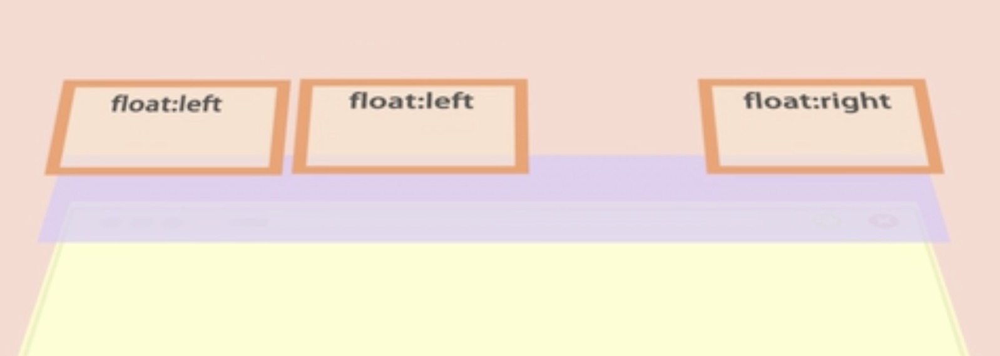

## 盒子模型

### 标准模型

```css
box-sizing: content-box; /* width = content  */
```

:::details 点击查看图片

:::

### IE 模型

```css
box-sizing: border-box; /* width = content + padding + border */
```

:::details 点击查看图片

:::

### JS 如何设置盒模型对应的宽和高

1. `dom.style.width/height = '20px'`

   - 这种方式只能对有内联样式且设置了宽高的元素有效，例如
   - ```html
     <div style="width: 120px; height: 20px;">123</div>
     ```

2. `dom.currentStyle.width/height`, 这种方法获取的是浏览器渲染以后的元素的宽和高。**只有 IE 支持**
3. _**`window.getComputedStyle(dom).width/height` 这种兼容性更好**_
4. `dom.getBoundingClientRect().width/height` 计算一个元素的绝对位置（相对于视窗左上角），它能拿到元素的 left、top、width、height 4 个属性。

## 浮动布局

```css
float: left; /* right */
```

浮动元素是脱离文档流的，但不脱离文本流。效果如下：



浮动元素在上，普通元素在下，形成两层叠放在父级容器中。并且，浮动元素会挡住普通元素，不过普通文档流的文本会识别浮动在头顶的浮动元素，表示坚决不能去屈居其下，会纷纷绕开，形成图文混排的需求。

如下


