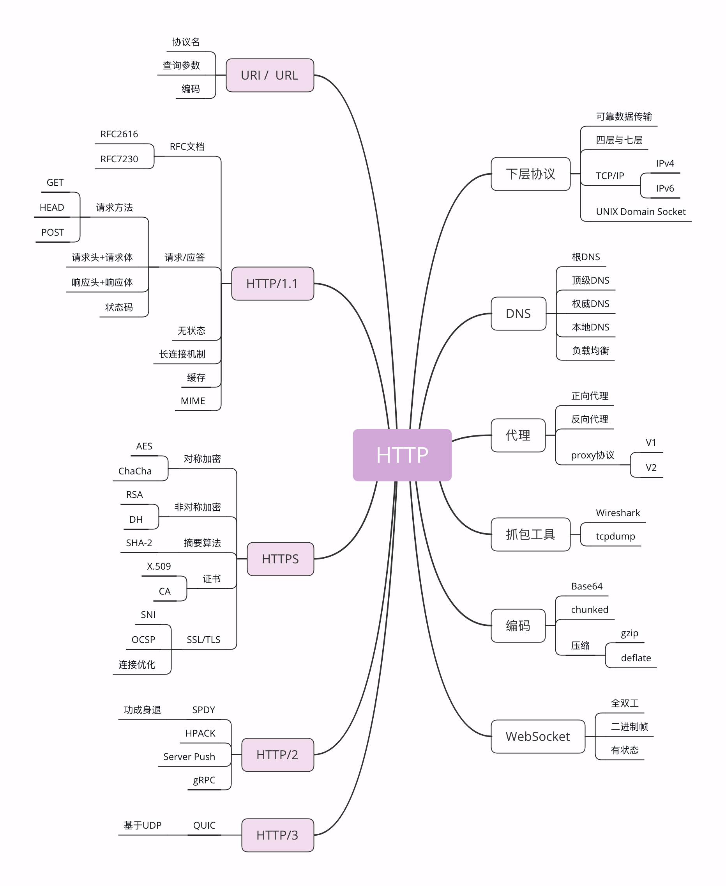

在上一讲中，我介绍了与 HTTP 相关的浏览器、服务器、CDN、网络爬虫等应用技术。

今天要讲的则是比较偏向于理论的各种 HTTP 相关协议，重点是 TCP/IP、DNS、URI、HTTPS 等，希望能够帮你理清楚它们与 HTTP 的关系。

## TCP/IP

TCP/IP 协议是目前网络世界“事实上”的标准通信协议，即使你没有用过也一定听说过，因为它太著名了。

TCP/IP 协议实际上是一系列网络通信协议的统称，其中最核心的两个协议是 **TCP** 和 **IP**，其他的还有 UDP、ICMP、ARP 等等，共同构成了一个复杂但有层次的协议栈。

这个协议栈有四层，最上层是“应用层”，最下层是“链接层”，TCP 和 IP 则在中间：**TCP 属于“传输层”**，**IP 属于“网际层”**。协议的层级关系模型非常重要，我会在下一讲中再专门讲解，这里先暂时放一放。

**IP 协议** 是“Internet Protocol”的缩写，主要目的是解决寻址和路由问题，以及如何在两点间传送数据包。IP 协议使用 “IP 地址” 的概念来定位互联网上的每一台计算机。可以对比一下现实中的电话系统，你拿着的手机相当于互联网上的计算机，而要打电话就必须接入电话网，由通信公司给你分配一个号码，这个号码就相当于 IP 地址。

现在我们使用的 IP 协议大多数是 v4 版，地址是四个用“.”分隔的数字，例如“192.168.0.1”，总共有 2^32，大约 42 亿个可以分配的地址。看上去好像很多，但互联网的快速发展让地址的分配管理很快就“捉襟见肘”。所以，就又出现了 v6 版，使用 8 组“:”分隔的数字作为地址，容量扩大了很多，有 2^128 个，在未来的几十年里应该是足够用了。

**TCP 协议** 是“Transmission Control Protocol”的缩写，意思是“传输控制协议”，它位于 IP 协议之上，基于 IP 协议提供可靠的、字节流形式的通信，是 HTTP 协议得以实现的基础。

“可靠”是指保证数据不丢失，“字节流”是指保证数据完整，所以在 TCP 协议的两端可以如同操作文件一样访问传输的数据，就像是读写在一个密闭的管道里“流动”的字节。

在 [HTTP 是什么](./2.md#传输) 中我们讲了 HTTP 是一个"传输协议"，但它不关心寻址、路由、数据完整性等传输细节，而要求这些工作都由下层来处理。因为互联网上最流行的是 TCP/IP 协议，而它刚好满足 HTTP 的要求，所以互联网上的 HTTP 协议就运行在了 TCP/IP 上，HTTP 也就可以更准确地称为“**HTTP over TCP/IP**”。

---

参考自 [透视 HTTP 协议](https://time.geekbang.org/column/intro/189?utm_source=pinpaizhuanqu&utm_medium=geektime&utm_campaign=guanwang&utm_term=guanwang&utm_content=0511)
