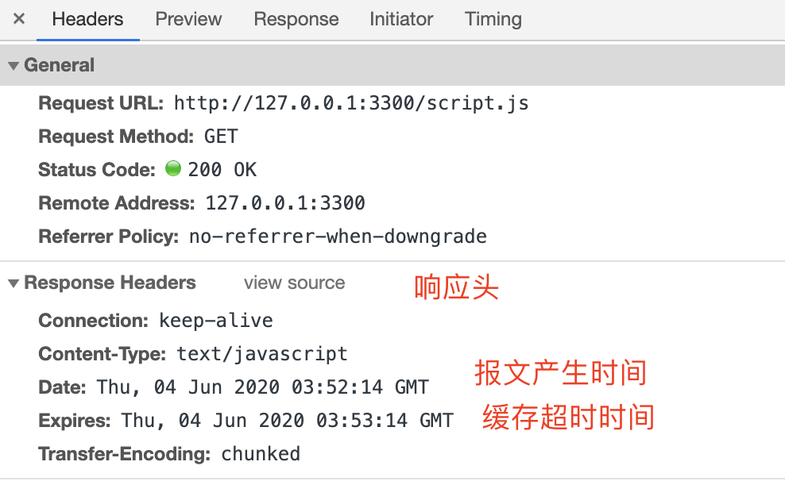
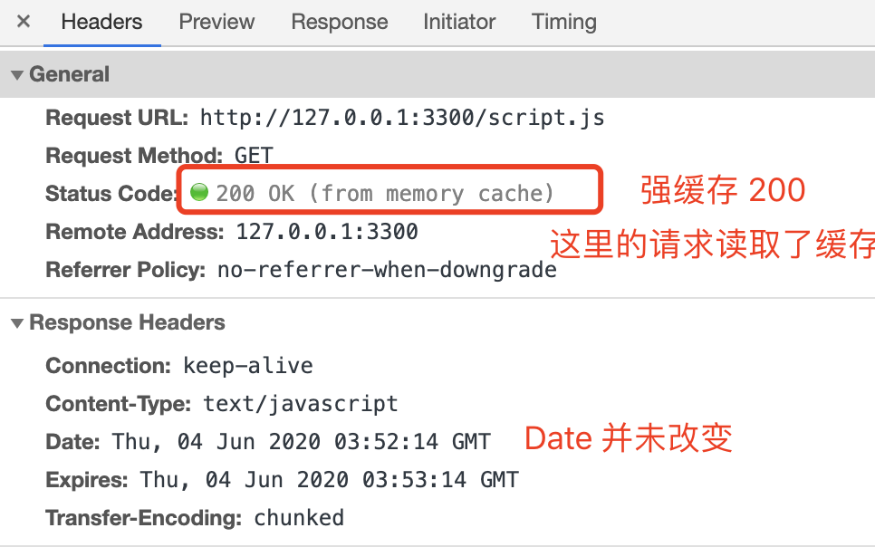

缓存（Cache）是计算机领域里的一个重要概念，是优化系统性能的利器。

由于链路漫长，网络时延不可控，浏览器使用 HTTP 获取资源的成本较高。所以，非常有必要把“来之不易”的数据缓存起来，下次再请求的时候尽可能地复用。这样，就可以避免多次请求 - 应答的通信成本，节约网络带宽，也可以加快响应速度。

试想一下，如果有几十 K 甚至几十 M 的数据，不是从网络而是从本地磁盘获取，那将是多么大的一笔节省，免去多少等待的时间。

实际上，HTTP 传输的每一个环节基本上都会有缓存，非常复杂。

HTTP Cache 是我们开发中接触最多的缓存，它分为强缓存和协商缓存。

- 强缓存：直接从本地副本比对读取，不去请求服务器，返回的状态码是 `200`。
- 协商缓存：会去服务器比对，若没改变才直接读取本地缓存，返回的状态码是 `304`。

## 强缓存

### Expires(HTTP/1.0)

当我们请求一个资源，服务器返回时，可以在 `Response Headers` 中增加 expires 字段表示资源的过期时间。是一个绝对时间。

> 示例: `Expires: Wed, 21 Oct 2015 07:28:00 GMT`

我们用 `Expires` 做一个 demo:

```js
const http = require('http')

http
  .createServer(function(request, response) {
    console.log(request.url)
    if (request.url === '/') {
      // 返回内容的 MIME 类型
      //  指定 html 不然不识别为 html；指定编码 utf-8 不然中文乱码
      response.writeHead(200, { 'Content-Type': 'text/html;charset=utf-8' })
      response.end(`<h2>强缓存</h2><script src="/script.js"></script>`)
    }

    if (request.url === '/script.js') {
      const now = new Date()
      now.setSeconds(now.getSeconds() + 60) // 获取当前时间的 60 秒后

      response.writeHead(200, {
        'Content-Type': 'text/javascript',
        Expires: now.toGMTString()
      })
      response.end("console.log('script loaded')")
    }
  })
  .listen(3300)

console.log('http://127.0.0.1:3300')
```

这里定义了访问主页返回 html，html 中请求了 `script.js` 文件，这个 `script.js` 就是我们用来验证缓存的请求文件。这里我设置了访问时间的 60 秒后缓存失效。

node 跑这个文件，打开页面，60 秒内刷新一次。则得到如下结果（查看 `network` 面板找到请求 `script.js` 的一行）

<div class='flex-img'>




</div>

在 60 秒内修改返回值 `response.end("console.log('script loaded xxxx')")`，可以看到浏览器输出的仍然是 `script loaded` 说明浏览器并没有请求新的文件而是读取本地缓存。

### Cache-Control(HTTP/1.1)

回忆之前学过的 [HTTP 头部字段](./http-message.md), HTTP 缓存相关的头部

| 响应头部字段 Cache-Control | 说明                                                                                                                                     |
| -------------------------- | ---------------------------------------------------------------------------------------------------------------------------------------- |
| public                     | 表明响应可以被任何对象（包括：发送请求的客户端，代理服务器，等等）缓存                                                                   |
| private                    | 用户的本地浏览器才可以缓存                                                                                                               |
| no-store                   | `不允许缓存`，用于某些变化非常频繁的数据，例如秒杀页面； 浏览器和中间代理服务器都不能缓存资源。                                          |
| no-cache                   | 它的字面含义容易与 no-store 搞混，实际的意思并不是不允许缓存，而是`可以缓存`，但在使用之前必须要去服务器验证是否过期，是否有最新的版本； |
| must-revalidate            | 又是一个和 no-cache 相似的词，它的意思是如果缓存不过期就可以继续使用，但过期了如果还想用就必须去服务器验证。                             |
| max-age=[seconds]          | 单位秒，值为多少秒就缓存多久                                                                                                             |
| s-maxage=[seconds]         | 覆盖 max-age 或者 Expires 头，但是仅适用于共享缓存(比如各个代理)，私有缓存会忽略它。                                                     |
| ...                        | ...                                                                                                                                      |

## 协商缓存

### Last-Modified/If-Modified-Since

### Etag

:::tip 关于浏览器的缓存，有了 Etag，last-Modified 还有必要存在吗???

Etag 比 lastModified 更加严谨，如果资源发生变化，Etag 就会发生变化，就会把最新的资源给客户端返回去，而 lastModified 不识别 s（秒）单位里的修改，所以如果资源在 s（秒）单位里发生了修改，那 lastModified 也不会发生改变，这样如果只用了 lastModified，<span class='orange'>客户端得到的资源就不是最新的</span>；但是设定了 Etag 之后，每次客户端发出请求，服务端都会根据资源重新生成一个 Etag，对性能有影响

:::
