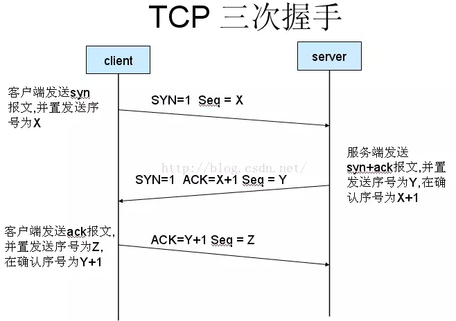
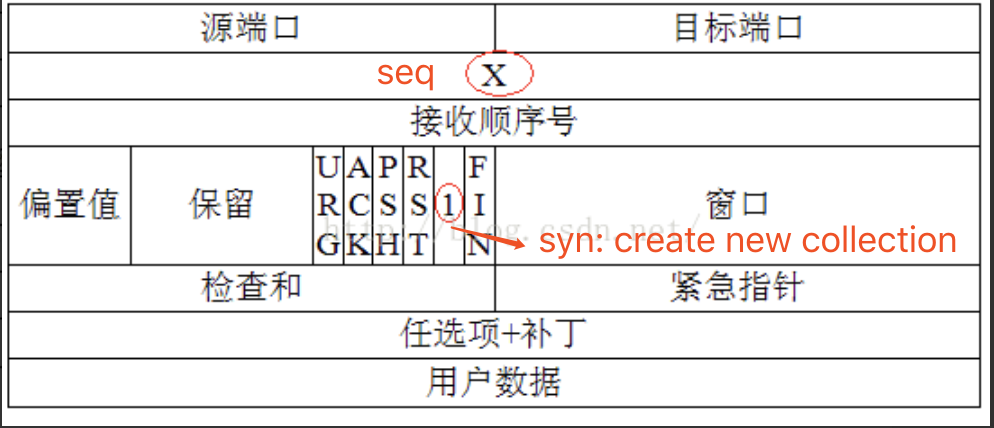
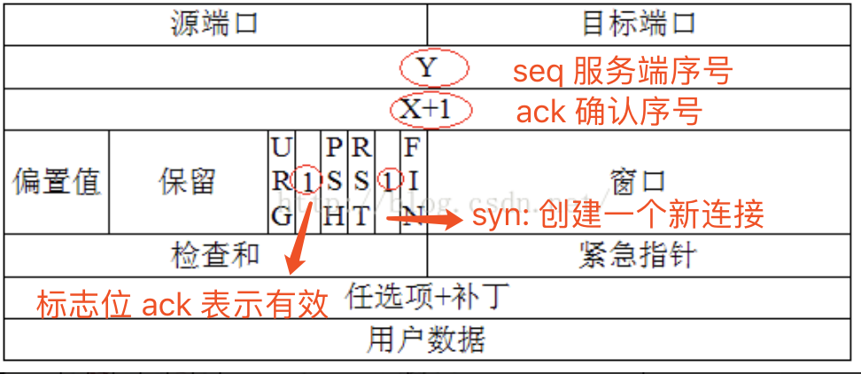
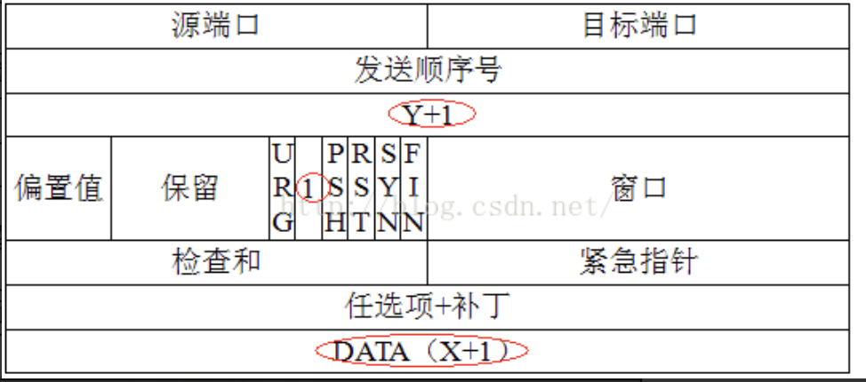

## TCP 三次握手动画图

:::details 点击查看动画图

:::

在学习之前，我们先捋一捋 HTTP 请求与 TCP 链接之间的关系。

在客户端向服务端请求和返回的过程中，是需要去创建一个 `TCP connection`，**因为 HTTP 是不存在链接这样一个概念的，它只有请求和响应这样一个概念**，请求和响应都是一个数据包，中间要通过一个传输通道，这个传输通道就是在 TCP 里面创建了一个从客户端发起和服务端接收的一个链接，TCP 链接在创建的时候是有一个三次握手(三次网络传输)这样一个消耗在的。

所谓三次握手(`Three-way Handshake`)，是指建立一个 `TCP` 连接时，需要客户端和服务器总共发送 3 个包。

## TCP 报文

TCP 报文是 TCP 层传输的数据单元，也叫报文段。

1. 序号（`sequence number）`: Seq 序号，占 32 位，用来标识从 TCP 源端向目的端发送的字节流，发起方发送数据时对此进行标记。
2. 确认号（`acknowledgement number`）：Ack 序号，占 32 位，只有 ACK 标志位为 1 时，确认序号字段才有效，`Ack=Seq+1`。
3. 标志位：共 6 个，即 URG、ACK、PSH、RST、SYN、FIN 等，具体含义如下
   - `URG`：紧急指针（urgent pointer）有效。
   - `ACK`：确认序号有效。
   - `PSH`：接收方应该尽快将这个报文交给应用层。
   - `RST`：重置连接。
   - `SYN`：发起一个新连接。
   - `FIN`：释放一个连接。

::: warning 需要注意的是

1. 不要将确认序号 Ack 与标志位中的 ACK 搞混了。
2. 确认方 Ack=发起方 Req+1，两端配对。

:::

## 三次握手

三次握手的目的是连接服务器指定端口，建立 TCP 连接,并同步连接双方的序列号和确认号并交换 TCP 窗口大小信息.

### 第一次握手:建立连接，等待服务器确认

**客户端创建一个新连接 `SYN = 1` 且 `Seq = X`>> 服务端**

- `Seq = X`: X 即客户端的序列
- `SYN = 1`

### 第二次握手:服务器收到请求后确认联机

**服务端发回确认包 客户端创建一个新连接 `SYN = 1` 且 `Seq = Y` 且 `ACK = X + 1` >> 客户端**

### 第三次握手:检查 ACK 是否正确, 若正确则建立连接。

**客户端发回确认包 客户端创建一个新连接 `SYN = 0` 且 `Seq = Z` 且 `ACK = Y + 1` >> 服务端**

1. `SYN = 0`: 这不再是一个新的连接
2. `ACK = Y + 1`: 确认服务器给我发的序号
3. `标志位 ack = 1`: 确认有效
