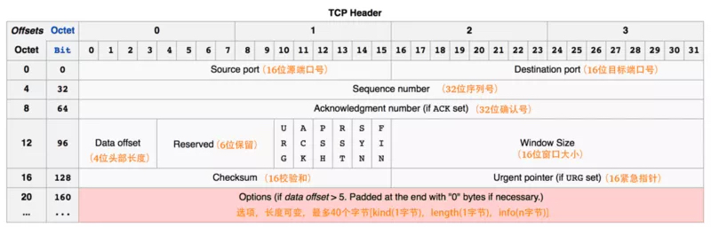
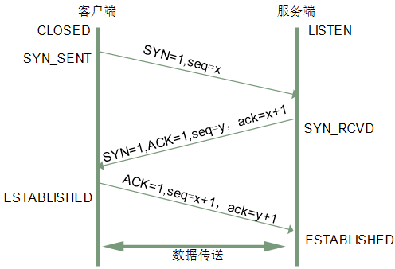
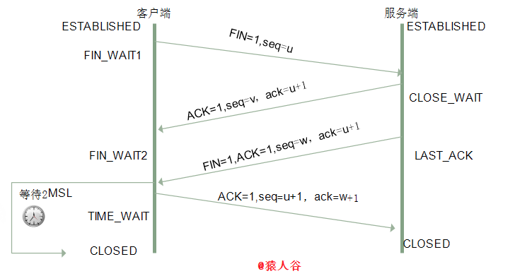

## 前言

三次握手 🤝 是比较经典的面试题。

1. 面试官:man_pilot:：请介绍下三次握手
2. 求职者:raised_hands:：第一次握手就是客户端给服务器端发送一个报文，第二次就是服务器收到报文之后，会应答一个报文给客户端，第三次握手就是客户端收到报文后再给服务器发送一个报文，三次握手就成功了。
3. 面试官:man_pilot:：**然后呢？out....**
4. 求职者:raised_hands:：emmm....

本文仅绕着下面几个点讲解

- 请画出三次握手和四次挥手的示意图
- [为什么连接的时候是三次握手？](#为什么需要三次握手，两次不行吗？)
- [什么是半连接队列？](#什么是半连接队列？)
- [ISN(Initial Sequence Number) 是固定的吗？即 seq](#isn-initial-sequence-number-是固定的吗？)
- [三次握手过程中可以携带数据吗？](#三次握手过程中可以携带数据吗？)
- [如果第三次握手丢失了，客户端服务端会如何处理？](#syn-攻击是什么？)
- [SYN 攻击是什么？](#syn-攻击是什么？)
- [挥手为什么需要四次？](#挥手为什么需要四次？)
- [四次挥手释放连接时，等待 2MSL 的意义?](#为什么-time-wait-状态需要经过-2msl-才能返回到-close-状态？)

## TCP 协议简述

TCP 提供面向有连接的通信传输，面向有连接是指在传送数据之前必须先建立连接，数据传送完成后要释放连接。
无论哪一方向另一方发送数据之前，都必须先在双方之间建立一条连接。在 TCP/IP 协议中，TCP 协议提供可靠的连接服务，连接是通过[三次握手](#三次握手)进行初始化的。

同时由于 TCP 协议是一种面向连接的、可靠的、基于字节流的运输层通信协议，**TCP 是全双工模式**，所以需要[四次挥手](#四次挥手)关闭连接。

## TCP 报文

**TCP 报文是 TCP 层传输的数据单元，也叫报文段。**



1. 序号（`sequence number）`: Seq 序号，占 32 位，用来标识从 TCP 源端向目的端发送的字节流，发起方发送数据时对此进行标记。
2. 确认号（`acknowledgement number`）：Ack 序号，占 32 位，只有 ACK 标志位为 1 时，确认序号字段才有效，`Ack=Seq+1`。
3. 标志位：共 6 个，即 URG、ACK、PSH、RST、SYN、FIN 等，具体含义如下
   - `URG`：紧急指针（urgent pointer）有效。
   - `ACK`：确认序号有效。
   - `PSH`：接收方应该尽快将这个报文交给应用层。
   - `RST`：重置连接。
   - `SYN`：发起一个新连接。
   - `FIN`：释放一个连接。

::: warning 需要注意的是

1. 不要将确认序号 ack 与标志位中的 ACK 搞混了。【本文以全大写 ACK 泛指标志位 ACK】
2. 确认方 ack=发起方 req+1，两端配对。

:::

## 三次握手

三次握手（`Three-way Handshake`）其实就是指建立一个 TCP 连接时，需要客户端和服务器总共发送 3 个包。进行三次握手的主要作用就是为了确认双方的接收能力和发送能力是否正常、指定自己的初始化序列号为后面的可靠性传送做准备。实质上其实就是连接服务器指定端口，建立 TCP 连接，并同步连接双方的序列号和确认号，交换 `TCP 窗口大小`信息。

:::details 展开查看动画

:::

> TCP 三次握手跟现实生活中的人与人打电话是很类似的
>
> **客户端**：“喂，你听得到吗？” >> 确认服务端是否有接收能力。
>
> **服务端**: "我听得到呀，你听得到我吗？" >> 服务端收得到，确认客户端是否接收到通知
>
> **客户端**： “我能听到你，今天 balabala……” >> 客户端确认服务端收到了，开始发送数据把...：

刚开始客户端处于 `Closed` 的状态，服务端处于 `Listen` 状态。 进行三次握手：

:one: 第一次握手：客户端给服务端发一个 SYN 报文，并指明客户端的初始化序列号 ISN(c)。此时客户端处于 `SYN_SEND` 状态。

- 首部的同步位 `SYN=1`，初始序号 `seq=x`，SYN=1 的报文段不能携带数据，但要消耗掉一个序号。
- 注：`syn = 1` `>>` 发起一个新连接。

2️⃣ 第二次握手：服务器收到客户端的 `SYN` 报文之后，会以自己的 `SYN` 报文作为应答，并且也是指定了自己的初始化序列号 `ISN(s)`。同时会把客户端的 ISN + 1 作为 ACK 的值，表示自己已经收到了客户端的 SYN，此时服务器处于 `SYN_REVD` 的状态。

- 在确认报文中， `SYN=1`, 标志位 `ACK = 1`, 确认序号 `ack = X + 1`， 初始序号 `seq=y`。

3️⃣ 第三次握手：客户端收到 SYN 报文之后，会发送一个 ACK 报文，当然，也是一样把服务器的 ISN + 1 作为 ACK 的值，表示已经收到了服务端的 SYN 报文，此时客户端处于 `ESTABLISHED` 状态。服务器收到 ACK 报文之后，也处于 `ESTABLISHED` 状态，此时，双方已建立起了连接。

- 确认报文段, 标志位 `ACK = 1`, 序号 `seq=x+1` 确认序号`ack = Y + 1`
- 初始为 seq=x，第二个报文段所以要+1
- ACK 报文段可以携带数据，不携带数据则不消耗序号。



### 为什么需要三次握手，两次不行吗？

弄清这个问题，我们需要先弄明白三次握手的目的是什么，能不能只用两次握手来达到同样的目的。

- 第一次握手：客户端发送网络包，服务端收到了。 这样服务端就能得出结论：`客户端的发送能力、服务端的接收能力是正常的。`
- 第二次握手：服务端发包，客户端收到了。 这样客户端就能得出结论：`服务端的接收、发送能力，客户端的接收、发送能力是正常的。不过此时服务器并不能确认客户端的接收能力是否正常。`
- 第三次握手：客户端发包，服务端收到了。 这样服务端就能得出结论：`客户端的接收、发送能力正常，服务器自己的发送、接收能力也正常。`

**因此，需要三次握手才能确认双方的接收与发送能力是否正常。**

试想如果是用两次握手，则会出现下面这种情况：

1. 如客户端发出连接请求，但因连接请求报文丢失而未收到确认，于是客户端再重传一次连接请求。后来收到了确认，建立了连接。
2. 数据传输完毕后，就释放了连接，客户端共发出了两个连接请求报文段，其中第一个丢失，第二个到达了服务端，但是**第一个丢失的报文段只是在某些网络结点长时间滞留了，延误到连接释放以后的某个时间才到达服务端**，此时服务端误认为客户端又发出一次新的连接请求，于是就向客户端发出确认报文段，同意建立连接
3. 不采用三次握手，只要服务端发出确认，就建立新的连接了，此时客户端忽略服务端发来的确认，也不发送数据，则**服务端一致等待客户端发送数据，浪费资源**。

### 什么是半连接队列？

> 服务器第一次收到客户端的 `SYN` 之后，就会处于 `SYN_RCVD` 状态，此时双方还没有完全建立其连接，服务器会把此种状态下请求连接放在一个队列里，我们把这种队列称之为半连接队列。

当然还有一个全连接队列，就是已经完成三次握手，建立起连接的就会放在全连接队列中。如果队列满了就有可能会出现丢包现象。

这里在补充一点关于 **SYN-ACK 重传次数**的问题：
服务器发送完 `SYN-ACK` 包，如果未收到客户确认包，服务器进行首次重传，等待一段时间仍未收到客户确认包，进行第二次重传。如果重传次数超过系统规定的最大重传次数，系统将该连接信息从半连接队列中删除。
注意，每次重传等待的时间不一定相同，一般会是指数增长，例如间隔时间为 1s，2s，4s，8s......

### ISN(Initial Sequence Number)是固定的吗？

当一端为建立连接而发送它的 SYN 时，它为连接选择一个初始序号。ISN 随时间而变化，因此每个连接都将具有不同的 ISN。ISN 可以看作是一个 32 比特的计数器，每 4ms 加 1 。这样选择序号的目的在于防止在网络中被延迟的分组在以后又被传送，而导致某个连接的一方对它做错误的解释。

> 三次握手的其中一个重要功能是客户端和服务端交换 ISN(Initial Sequence Number)，以便让对方知道接下来接收数据的时候如何按序列号组装数据。如果 ISN 是固定的，攻击者很容易猜出后续的确认号，因此 ISN 是动态生成的。

### 三次握手过程中可以携带数据吗？

其实第三次握手的时候，是可以携带数据的。但是，**第一次、第二次握手不可以携带数据**

为什么这样呢?

假如第一次握手可以携带数据的话，如果有人要恶意攻击服务器，那他每次都在第一次握手中的 `SYN 报文`中放入大量的数据。

因为攻击者根本就不理服务器的接收、发送能力是否正常，然后疯狂着重复发 SYN 报文的话，这会让服务器花费很多时间、内存空间来接收这些报文。

也就是说，**第一次握手不可以放数据，其中一个简单的原因就是会让服务器更加容易受到攻击了。而对于第三次的话，此时客户端已经处于 ESTABLISHED 状态。对于客户端来说，他已经建立起连接了，并且也已经知道服务器的接收、发送能力是正常的了，所以能携带数据也没啥毛病。**

### SYN 攻击是什么？

服务器端的资源分配是在二次握手时分配的，而客户端的资源是在完成三次握手时分配的，所以服务器容易受到 `SYN 洪泛攻击`。

:::tip SYN 攻击是一种典型的 DoS/DDoS 攻击。
SYN 攻击就是 Client 在短时间内伪造大量不存在的 IP 地址，并向 Server 不断地发送 SYN 包，Server 则回复确认包，并等待 Client 确认，由于源地址不存在，因此 Server 需要不断重发直至超时，这些伪造的 SYN 包将长时间占用未连接队列，导致正常的 SYN 请求因为队列满而被丢弃，从而引起网络拥塞甚至系统瘫痪。
:::

检测 SYN 攻击非常的方便，当你在服务器上看到大量的半连接状态时，特别是源 IP 地址是随机的，基本上可以断定这是一次 SYN 攻击。在 `Linux/Unix` 上可以使用系统自带的 `netstats` 命令来检测 SYN 攻击。

```bash
netstat -n -p TCP | grep SYN_RECV
```

常见的防御 SYN 攻击的方法有如下几种：

- 缩短超时（SYN Timeout）时间
- 增加最大半连接数
- 过滤网关防护
- SYN cookies 技术

## 四次挥手

**四次挥手即终止 TCP 连接，就是指断开一个 TCP 连接时，需要客户端和服务端总共发送 4 个包以确认连接的断开。**

> 在 socket 编程中，这一过程由客户端或服务端任一方执行 close 来触发。由于 TCP 连接是全双工的，因此，每个方向都必须要单独进行关闭，这一原则是当一方完成数据发送任务后，发送一个 FIN 来终止这一方向的连接，收到一个 FIN 只是意味着这一方向上没有数据流动了，即不会再收到数据了，但是在这个 TCP 连接上仍然能够发送数据，直到这一方向也发送了 FIN。首先进行关闭的一方将执行主动关闭，而另一方则执行被动关闭。

:::details 展开查看动画

:::

刚开始双方都处于 `ESTABLISHED` 状态，假如是客户端先发起关闭请求。四次挥手的过程如下：

1️⃣ 第一次挥手：Client >> Server `[请求关闭连接]FIN=1，[序号]seq=u`

> :full_moon_with_face:Client 端进入 `FIN_WAIT_1` 状态，**这表示 Client 端没有数据要发送给 Server 端了**。

2️⃣ 第二次挥手：Server >> Client `[确认收到]ACK=1， [确认序号] ack=u+1， [序号]seq=u`

Server 收到 FIN 之后，会发送报文到客户端。此时的 `TCP` 处于**半关闭状态**。

> :earth_americas:Server 处于 `CLOSE_WAIT` 状态， 这表示 **Server 端告诉 Client 端，我确认并同意你的关闭请求**。
>
> :full_moon_with_face:Client 收到服务端的确认后，进入 `FIN_WAIT2`（终止等待 2）状态，等待 Server 发出的连接释放报文段。

3️⃣ 第三次挥手：Server >> Client `[请求关闭连接]FIN = 1, [确认关闭]ACK = 1, [序号]seq=w, [确认序号]ack = u+1`，

如果服务端也想断开连接了，和客户端的第一次挥手一样，发给 FIN 报文，且指定一个序列号。

> :earth_americas:Server 进入 `KLAST_AC`（最后确认）状态，等待客户端的确认。
>
> :full_moon_with_face:Client 端进入 `LAST_ACK` 状态。

4️⃣ 第四次挥手：Client >> Server `[确认关闭]ACK = 1, [序号]seq=u+1, [确认序号]ack = w+1`

> :full_moon_with_face:Client 进入 `TIME_WAIT` (时间等待）状态。此时 TCP 未释放掉，需要经过时间等待计时器设置的时间 `2MSL` 后，客户端才进入 `CLOSED` 状态。
>
> :earth_americas:Server 收到 ACK 报文之后，就处于关闭连接了，处于 `CLOSED` 状态

收到一个 FIN 只意味着在这一方向上没有数据流动。**客户端执行主动关闭并进入 `TIME_WAIT` 是正常的，服务端通常执行被动关闭，不会进入 `TIME_WAIT` 状态。**



### 挥手为什么需要四次？

由于 TCP 协议是一种面向连接的、可靠的、基于字节流的运输层通信协议，TCP 是**全双工模式**。

这就意味着，关闭连接时，当 Client 端发出 FIN 报文段时，只是表示 Client 端告诉 Server 端数据已经发送完毕了。

当 Server 端收到 FIN 报文并返回 ACK 报文段，表示它已经知道 Client 端没有数据发送了，但是 Server 端还是可以发送数据到 Client 端的，所以 Server 很可能并不会立即关闭 SOCKET，直到 Server 端把数据也发送完毕。

当 Server 端也发送了 FIN 报文段时，这个时候就表示 Server 端也没有数据要发送了，就会告诉 Client 端，我也没有数据要发送了，之后彼此就会愉快的中断这次 TCP 连接。

### 2MSL 等待状态

MSL：报文段最大生存时间，它是任何报文段被丢弃前在网络内的最长时间。这个时间是有限的，因为 TCP 报文段以 IP 数据报在网络内传输，而 IP 数据报则有限制其生存时间的 TTL 字段。

对一个具体实现所给定的 MSL 值，处理的原则是：当 TCP 执行一个主动关闭，并发回最后一个 ACK，该连接必须在 `TIME_WAIT` 状态停留的时间为 2 倍的 MSL。

这样可让 TCP 再次发送最后的 ACK 以防这个 ACK 丢失（另一端超时并重发最后的 FIN）。

这种 2MSL 等待的另一个结果是这个 TCP 连接在 2MSL 等待期间，定义这个连接的插口（客户的 IP 地址和端口号，服务器的 IP 地址和端口号）不能再被使用。这个连接只能在 2MSL 结束后才能再被使用。

### 四次挥手释放连接时，等待 2MSL 的意义?

1. **保证 TCP 协议的全双工连接能够可靠关闭**

- 由于 IP 协议的不可靠性或者是其它网络原因，导致了 Server 端没有收到 Client 端的 ACK 报文，那么 Server 端就会在超时之后重新发送 FIN，如果此时 Client 端的连接已经关闭处于 CLOESD 状态，那么重发的 FIN 就找不到对应的连接了，从而导致连接错乱，
- 所以，Client 端发送完最后的 ACK 不能直接进入 `CLOSED` 状态，而要保持 TIME_WAIT，当再次收到 FIN 的收，能够保证对方收到 ACK，最后正确关闭连接。

2. **保证这次连接的重复数据段从网络中消失**

- 如果 Client 端发送最后的 ACK 直接进入 CLOSED 状态，然后又再向 Server 端发起一个新连接，这时不能保证新连接的与刚关闭的连接的端口号是不同的，也就是新连接和老连接的端口号可能一样了，那么就可能出现问题：如果前一次的连接某些数据滞留在网络中，这些延迟数据在建立新连接后到达 Client 端，由于新老连接的端口号和 IP 都一样，TCP 协议就认为延迟数据是属于新连接的，新连接就会接收到脏数据，这样就会**导致数据包混乱**。所以 TCP 连接需要在 `TIME_WAIT` 状态等待 2 倍 MSL，才能保证本次连接的所有数据在网络中消失。

### 为什么 TIME_WAIT 状态需要经过 2MSL 才能返回到 CLOSE 状态？

理论上，四个报文都发送完毕，就可以直接进入 CLOSE 状态了，但是可能网络是不可靠的，有可能最后一个 ACK 丢失。所以 **TIME_WAIT 状态就是用来重发可能丢失的 ACK 报文。**

## 文末

参考 [面试官，不要再问我三次握手和四次挥手](https://juejin.im/post/5d9c284b518825095879e7a5)
