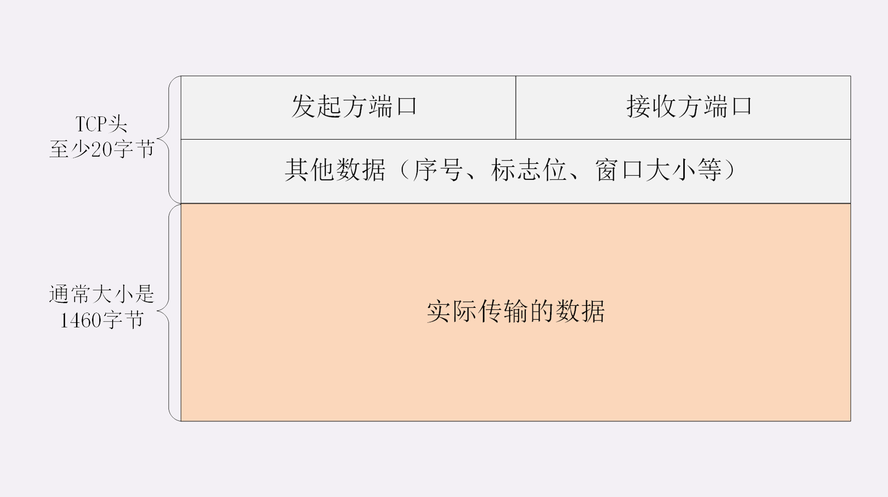
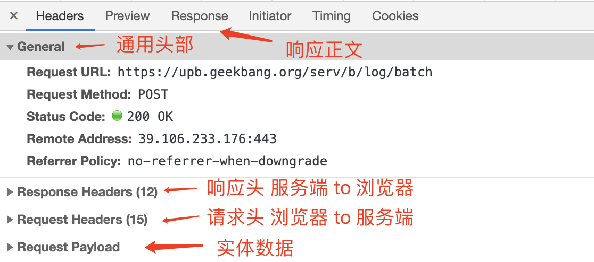

HTTP 协议基本工作流程，也就是“请求 - 应答”“一发一收”的模式。我们可以通过 通过 Wireshark 抓包就可以了解整个过程。

可以看到，HTTP 的工作模式是非常简单的，由于 TCP/IP 协议负责底层的具体传输工作，HTTP 协议基本上不用在这方面操心太多。单从这一点上来看，所谓的“超文本传输协议”其实并不怎么管“传输”的事情，有点“名不副实”。

那么 HTTP 协议的核心部分是什么呢？

答案就是它传输的报文内容。

HTTP 协议在规范文档里详细定义了报文的格式，规定了组成部分，解析规则，还有处理策略，所以可以在 TCP/IP 层之上实现更灵活丰富的功能，例如连接控制，缓存管理、数据编码、内容协商等等。

## 报文结构

你也许对 TCP/UDP 的报文格式有所了解，拿 TCP 报文来举例，它在实际要传输的数据之前附加了一个 20 字节的头部数据，存储 TCP 协议必须的额外信息，例如发送方的端口号、接收方的端口号、包序号、标志位等等。

有了这个附加的 TCP 头，数据包才能够正确传输，到了目的地后把头部去掉，就可以拿到真正的数据。



HTTP 协议也是与 TCP/UDP 类似，同样也需要在实际传输的数据前附加一些头数据，不过与 TCP/UDP 不同的是，它是一个“**纯文本**”的协议，所以头数据都是 ASCII 码的文本，可以很容易地用肉眼阅读，不用借助程序解析也能够看懂。

HTTP 协议的请求报文和响应报文的结构基本相同，由三大部分组成：

1. 起始行（start line）：描述请求或响应的基本信息；
2. 头部字段集合（header）：使用 key-value 形式更详细地说明报文；
3. 消息正文（entity）：实际传输的数据，它不一定是纯文本，可以是图片、视频等二进制数据。

这其中前两部分起始行和头部字段经常又合称为“**请求头**”或“**响应头**”，消息正文又称为“**实体**”，但与“header”对应，很多时候就直接称为“body”。

HTTP 协议规定报文必须有 header，但可以没有 body，而且在 header 之后必须要有一个“空行”，也就是“CRLF”，十六进制的“0D0A”。

所以，一个完整的 HTTP 报文就像是下图的这个样子，注意在 header 和 body 之间有一个“空行”。


## 请求行

了解了 HTTP 报文的基本结构后，我们来看看请求报文里的起始行也就是**请求行**（request line），它简要地描述了**客户端想要如何操作服务器端的资源**。

看一下我们之前用 Wireshark 抓的包


在这个浏览器发出的请求报文里，第一行“GET / HTTP/1.1”就是请求行，而后面的“Host”“Connection”等等都属于 header，报文的最后是一个空白行结束，没有 body。

请求行由三部分构成：

- 请求方法：是一个动词，如 GET/POST，表示对资源的操作；
- 请求目标：通常是一个 URI，标记了请求方法要操作的资源；
- 版本号：表示报文使用的 HTTP 协议版本。


还是用 Wireshark 抓包的数据来举例：

```yml
GET / HTTP/1.1
# 请求方法 GET 请求目标 / 请求协议 HTTP/1.1
```

## 状态行

看完了请求行，我们再看响应报文里的起始行，在这里它不叫“响应行”，而是叫“**状态行**”（status line），意思是**服务器响应的状态**。

比起请求行来说，状态行要简单一些，同样也是由三部分构成：

- 版本号：表示报文使用的 HTTP 协议版本；
- 状态码：一个三位数，用代码的形式表示处理的结果，比如 200 是成功，500 是服务器错误；
- 原因：作为数字状态码补充，是更详细的解释文字，帮助人理解原因。


看一下上一讲里 Wireshark 抓包里的响应报文，状态行是：

```yml
HTTP/1.1 200 OK
```

意思就是：“浏览器你好，我已经处理完了你的请求，这个报文使用的协议版本号是 1.1，状态码是 200，一切 OK。”

而另一个“GET /favicon.ico HTTP/1.1”的响应报文状态行是：

```yml
HTTP/1.1 404 Not Found
```

## 头部字段

请求行或状态行再加上头部字段集合就构成了 HTTP 报文里完整的请求头或响应头:

<div class='flex-img'>


</div>

请求头和响应头的结构是基本一样的，唯一的区别是起始行，所以我把请求头和响应头里的字段放在一起介绍。



### 通用头部

| 首部字段名        | 说明                       |
| ----------------- | -------------------------- |
| Cache-Control     | 控制缓存行为               |
| Connection        | 逐跳首部、连接的管理       |
| Date              | 创建报文的日期时间         |
| Pragma            | 报文指令                   |
| Transfer-Encoding | 指定报文传输主体的编码方式 |
| Upgrade           | 升级为其他协议             |
| Via               | 代理服务器的相关信息       |
| Warning           | 错误通知                   |

### 请求首部字段

| 首部字段名        | 示例                                              | 说明                                                                                           |
| ----------------- | ------------------------------------------------- | ---------------------------------------------------------------------------------------------- |
| Accept            | text/plain, text/html                             | 指定客户端能够接收的内容类型                                                                   |
| Accept-Language   | en,zh                                             | 浏览器可接受的语言                                                                             |
| Accept-Encoding   | compress, gzip                                    | 指定浏览器可以支持的 web 服务器返回内容压缩编码类型。                                          |
| Accept-Language   | zh-CN,zh;q=0.9                                    | 浏览器可接受的语言                                                                             |
| Connection        | keep-alive                                        | 表示是否需要持久连接。（HTTP 1.1 默认进行持久连接）                                            |
| Content-Type      | application/x-www-form-urlencoded                 | 请求的与实体对应的 MIME 信息                                                                   |
| Content-Length    | Content-Length: 348                               | 请求的内容长度                                                                                 |
| Host              | http://www.baidu.com                              | 指定请求的服务器的域名和端口                                                                   |
| User-Agent        | User-Agent: Mozilla/5.0 (Linux; X11)              | 浏览器端浏览器型号和版本                                                                       |
| Accept-Ranges     | Accept-Ranges: bytes                              | 可以请求网页实体的一个或者多个子范围字段                                                       |
| Range             | Range: bytes=500-999                              | 只请求实体的一部分，指定范围                                                                   |
| Referer           | http://www.baidu.com                              | 先前网页的地址，当前请求网页紧随其后,即来路                                                    |
| If-Match          | If-Match: “737060cd8c284d8af7ad3082f209582d”      | 只有请求内容与实体相匹配才有效                                                                 |
| If-Modified-Since | If-Modified-Since: Sat, 29 Oct 2010 19:43:31 GMT  | 如果请求的部分在指定时间之后被修改则请求成功，未被修改则返回 304 代码                          |
| If-None-Match     | If-None-Match: “737060cd8c284d8af7ad3082f209582d” | 如果内容未改变返回 304 代码，参数为服务器先前发送的 Etag，与服务器回应的 Etag 比较判断是否改变 |
| Cache-Control     | no-cache                                          | 告诉所有的缓存机制是否可以缓存及哪种类型                                                       |
| ...               | ...                                               | ...                                                                                            |

<!-- | 缓存相关字段 Cache-Control | 说明                                                                    |
| -------------------------- | ----------------------------------------------------------------------- |
| no-cache                   | 告诉（代理）服务器不直接使用缓存，要求向原服务器发起请求                |
| no-store                   | 所有内容都不会被保存到缓存或者 Internet 临时文件中                      |
| max-age=delta-seconds      | 告知服务器希望接收一个存在时间(Age)不大于 delta-seconds 秒的资源        |
| min-fresh=delta-seconds    | 告知(代理)服务器客户端希望接一个在小于 delta-seconds 秒内被更新过的资源 |
| no-transform               | 告知(代理)服务器客户端希望获取实体数据没有被转换(比如压缩)过的资源      |
| only-if-cached             | 告知(代理)服务器客户端希望获取缓存的内容,而不用向原服务器发去请求       |
| cache-extension            | 自定义扩展值,若服务器不识别该值将被忽略掉                               | -->

### 响应头部字段

| 首部字段名         | 说明                                                                                  | 示例                                            |
| ------------------ | ------------------------------------------------------------------------------------- | ----------------------------------------------- |
| Accept-Ranges      | 表明服务器是否支持指定范围请求及哪种类型的分段请求                                    | Accept-Ranges: bytes                            |
| Age                | 从原始服务器到代理缓存形成的估算时间（以秒计，非负）                                  | Age: 12                                         |
| Allow              | 对某网络资源的有效的请求行为，不允许则返回 405                                        | Allow: GET, HEAD                                |
| Cache-Control      | 告诉所有的缓存机制是否可以缓存及哪种类型                                              | Cache-Control: no-cache                         |
| Content-Encoding   | web 服务器支持的返回内容压缩编码类型。                                                | Content-Encoding: gzip                          |
| Content-Language   | 响应体的语言                                                                          | Content-Language: en,zh                         |
| Content-Length     | 响应体的长度                                                                          | Content-Length: 348                             |
| Content-Location   | 请求资源可替代的备用的另一地址                                                        | Content-Location: /index.htm                    |
| Content-MD5        | 返回资源的 MD5 校验值                                                                 | Content-MD5: Q2hlY2sgSW50ZWdyaXR5IQ==           |
| Content-Range      | 在整个返回体中本部分的字节位置                                                        | Content-Range: bytes 21010-47021/47022          |
| Content-Type       | 返回内容的 MIME 类型                                                                  | Content-Type: text/html; charset=utf-8          |
| Date               | 原始服务器消息发出的时间                                                              | Date: Tue, 15 Nov 2010 08:12:31 GMT             |
| ETag               | 请求变量的实体标签的当前值                                                            | ETag: “737060cd8c284d8af7ad3082f209582d”        |
| Expires            | 响应过期的日期和时间                                                                  | Expires: Thu, 01 Dec 2010 16:00:00 GMT          |
| Last-Modified      | 请求资源的最后修改时间                                                                | Last-Modified: Tue, 15 Nov 2010 12:45:26 GMT    |
| Location           | 用来重定向接收方到非请求 URL 的位置来完成请求或标识新的资源                           | Location: http://www.zcmhi.com/archives/94.html |
| Pragma             | 包括实现特定的指令，它可应用到响应链上的任何接收方                                    | Pragma: no-cache                                |
| Proxy-Authenticate | 它指出认证方案和可应用到代理的该 URL 上的参数                                         | Proxy-Authenticate: Basic                       |
| refresh            | 应用于重定向或一个新的资源被创造，在 5 秒之后重定向（由网景提出，被大部分浏览器支持） |
| ...                | ...                                                                                   | ...                                             |
