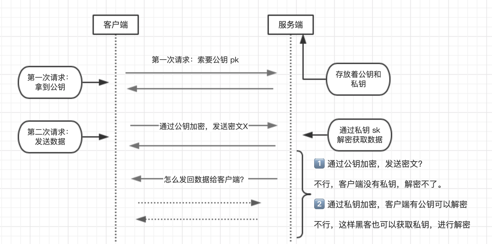
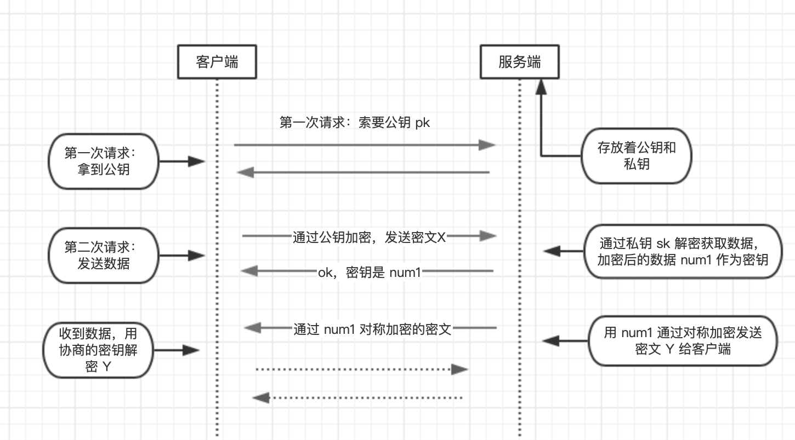
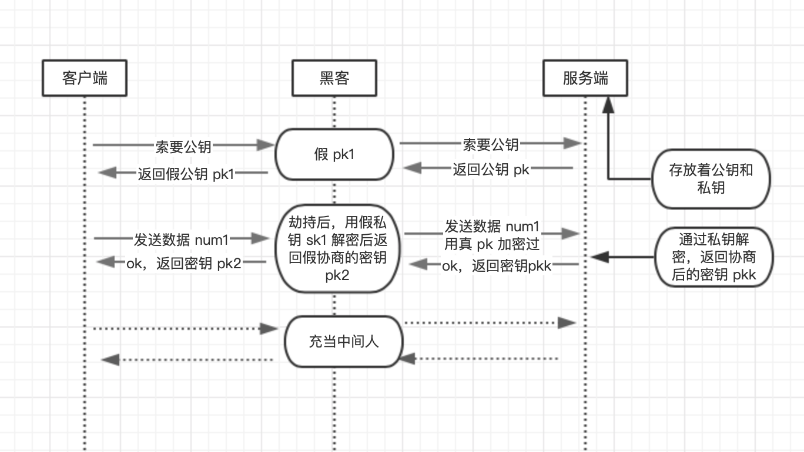
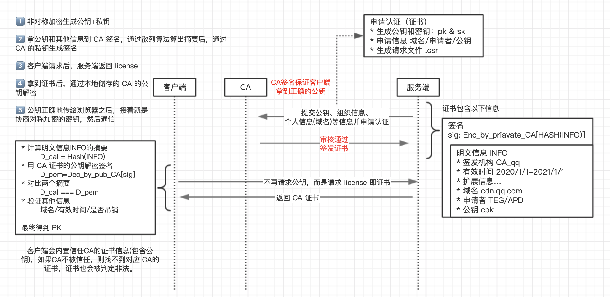
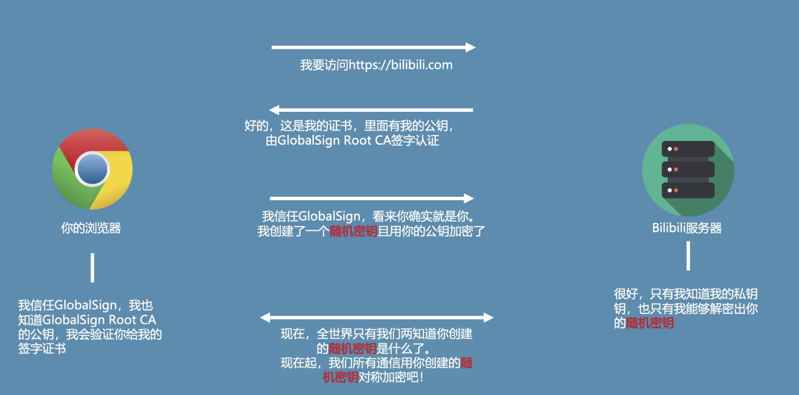
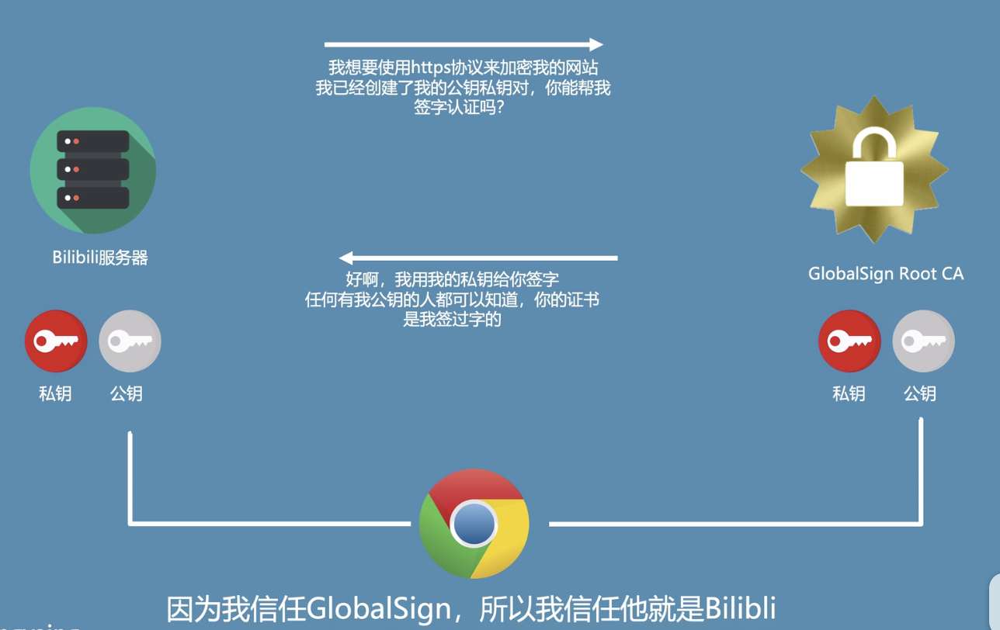

由于 `HTTP` 是明文传输，很容易被窃听和篡改数据，所以才有了 `HTTPS`，而 HTTPS 则是比 HTTP 多了一层 `SSL/TSL` 协议，位于 `TCP/IP` 之上。

`SSL/TSL` 的功能实现主要依赖于三类基本算法：散列函数 、对称加密 和 非对称加密，

## 对称加密

对称加密就是我有个加密算法 F1，还有一个加密的密钥 K，数据为 data。经过运算后得到一个密文 X。

对应的解密算法 F2，相同的密钥 K，通过运算后解密获得数据。下面是一段伪代码：

```js
F1(k, data) = x // 加密获得密文

F2(k, x) = data // 解密获得数据
```

比如客户端给服务端发送数据给服务端 -> 使用 <span class='orange'>密钥加密</span> 发送密文给服务端 -> 服务端拿到密文后使用 <span class='orange'>相同的密钥解密</span> 获取数据

弊端：密钥相同，黑客拿到密钥后两边都可以解密，窃取数据等。

## 非对称加密

特点：

- 任何经过 A 的公钥进行加密的信息，只有 A 的私钥才能解密
- 任何有公钥的人可以确认对方发送的消息是被私钥加密过的
- 非对称加密解密计算开销远远大于对称加密

伪代码如下

```js
// f 常见 RSA 算法
// 第一步客户端发送请求，索要公钥，将公钥要回来
f(publicKey, data) = Y // 通过公钥加密
f(privateKey, Y) = data // 通过私钥解密

// 反过来
f(privateKey, data) = Y // 通过私钥加密
f(publicKey, Y) = data // 通过公钥解密
```



比如 客户端给服务端发送数据

1. 通过公钥加密得到密文 Y，发送数据给服务端
2. 服务端既有公钥也有私钥，这时候可以通过私钥进行解密得到数据。

这样即使黑客截获了密文 Y，也无法进行解密。**那么服务端返回数据给客户端怎么做呢？**

通过公钥加密的密文发送给客户端，然而客户端没有密钥，解密不出来。上面的伪代码也写了，也可以通过私钥加密，公钥解密，问题来了，黑客也可以截取这次通过私钥加密的密文，黑客也可以通过公钥进行解密获取 data。显然，非对称加密的方法也不是完美的

## 对称加密和非对称加密结合

- 对称加密：密钥 k 只有一个，被截胡了就完蛋了。
- 非对称加密：客户端发送数据给服务端是安全的，服务端给客户端发送数据的时候是不安全的。

所以需要结合两个算法的优点进行制定新的加密方案：

1. 先利用非对称加密的方式在服务端和客户端之间达成协商，协商出一个临时的 k。
2. 再利用这个 k 进行对称加密，进行数据的交互。那么每个服务端对客户端的 k 都不同。

伪代码：

```TS
f(publicKey, num1) = X // 客户端通过公钥加密发送数据给服务端

f(privateKey, X) = num1 // 服务端用私钥进行解密，拿到 num1，然后呢 num1 就被作为对称加密的密钥

// 这过程服务端经过摘要算法（散列）得到一个无法解密的随机数，在通知客户端。

f(num1, data) = Y // 服务端发送数据给客户端
f(num1, Y) = data // 客户端解密 获得数据
```



由于黑客不知道后面的密钥是 num1，所以也解密不出来后面的请求。 ps 协商的方法是通过散列算法得到一个唯一值。

看似完美，然而黑客也不是盖的。



混合加密面临着中间人的问题，还是不够安全。客户端以为黑客是服务端，服务端又以为黑客是客户端。一开始客户端请求公钥的时候，就被李代桃僵了。针对这个问题如何解决呢？

我们引入 CA，一个权威的机构。因为上面的问题在于我们不知道拿到的公钥是好是坏，通过权威的机构认证。

## CA

解决上述身份验证问题的关键是确保获取的公钥途径是合法的，能够验证服务器的身份信息，为此需要引入权威的第三方机构 CA。

CA 负责核实公钥的拥有者的信息，并颁发认证"证书"，同时能够为使用者提供证书验证服务，即 PKI 体系(PKI 基础知识)。



1. 服务方 S 向第三方机构 CA 提交公钥、组织信息、个人信息(域名)等信息并申请认证;
2. CA 通过线上、线下等多种手段验证申请者提供信息的真实性，如组织是否存在、企业是否合法，是否拥有域名的所有权等;
3. 如信息审核通过，CA 会向申请者签发认证文件-证书。

   - 客户端 C 向服务器 S 发出请求时，S 返回证书文件;- 证书包含以下信息：申请者公钥、申请者的组织信息和个人信息、签发机构 CA 的信息、有效时间、证书序列号等信息的明文，同时包含一个签名;
   - 签名的产生算法：首先，使用散列函数计算公开的明文信息的信息摘要，然后，采用 CA 的私钥对信息摘要进行加密，密文即签名;

4. 客户端 C 向服务器 S 发出请求时，S 返回证书文件;
5. 客户端 C 读取证书中的相关的明文信息，采用相同的散列函数计算得到信息摘要，然后，利用对应 CA 的公钥解密签名数据，对比证书的信息摘要，如果一致，则可以确认证书的合法性，即公钥合法;
6. 客户端然后验证证书相关的域名信息、有效时间等信息;
7. 客户端会内置信任 CA 的证书信息(包含公钥)，如果 CA 不被信任，则找不到对应 CA 的证书，证书也会被判定非法。

在这个过程注意几点：

1. 申请证书不需要提供私钥，确保私钥永远只能服务器掌握;
2. 证书的合法性仍然依赖于非对称加密算法，证书主要是增加了服务器信息以及签名;
3. 内置 CA 对应的证书称为根证书，颁发者和使用者相同，自己为自己签名，即自签名证书（为什么说"部署自签 SSL 证书非常不安全"）
4. 证书=公钥+申请者与颁发者信息+签名;

这里还是很模糊的话，请阅读以下流程





---

参考

- [【web 安全 3】【硬核】HTTPS 原理全解析](https://www.bilibili.com/video/BV1w4411m7GL?from=search&seid=6498490351720700214)
- [HTTPS 是如何工作的？3 分钟介绍 HTTPS](https://www.bilibili.com/video/BV1j7411H7vV?from=search&seid=12290617391056969724)
- [HTTP 和 HTTPS 详解](https://juejin.im/post/5af557a3f265da0b9265a498#heading-32)
