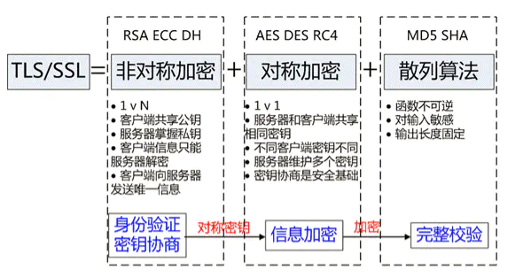

## HTTP 存在的问题

- 1️⃣ **可能被窃听**
  - HTTP 本身不具备加密的功能,HTTP 报文使用明文方式发送
  - 由于互联网是由联通世界各个地方的网络设施组成,所有发送和接收经过某些设备的数据都可能被截获或窥视。(例如大家都熟悉的抓包工具:`Wireshark`)
- 2️⃣ **认证问题**
  - 无法确认你发送到的服务器就是真正的目标服务器(可能服务器是伪装的)
  - 无法确定返回的客户端是否是按照真实意图接收的客户端(可能是伪装的客户端)
  - 无法确定正在通信的对方是否具备访问权限，Web 服务器上某些重要的信息，只想发给特定用户即使是无意义的请求也会照单全收。无法阻止海量请求下的 DoS 攻击（Denial of Service，拒绝服务攻击）。
- 3️⃣ **可能被篡改**
  - 请求或响应在传输途中，遭攻击者拦截并篡改内容的攻击被称为中间人攻击（Man-in-the-Middle attack，MITM）。

## HTTPS

> 超文本传输安全协议, 默认端口号 `443`。是一种通过计算机网络进行安全通信的传输协议。HTTPS 经由 HTTP 进行通信，但利用 `SSL/TLS` 来加密数据包。HTTPS 开发的主要目的，是提供对网站服务器的身份认证，保护交换数据的隐私与完整性。

`HTTPS` 把 HTTP 下层的传输协议由 `TCP/IP` 换成了 `SSL/TLS`，由“HTTP over TCP/IP”变成了“HTTP over SSL/TLS”，让 HTTP 运行在了安全的 SSL/TLS 协议上。

## SSL/TLS

SSL 即安全套接层（Secure Sockets Layer），在 OSI 模型中处于第 5 层（会话层），由网景公司于 1994 年发明，有 v2 和 v3 两个版本，而 v1 因为有严重的缺陷从未公开过。

SL 发展到 v3 时已经证明了它自身是一个非常好的安全通信协议，于是互联网工程组 IETF 在 1999 年把它改名为 TLS（传输层安全，Transport Layer Security），正式标准化，版本号从 1.0 重新算起，所以 TLS1.0 实际上就是 SSLv3.1。

TLS 由记录协议、握手协议、警告协议、变更密码规范协议、扩展协议等几个子协议组成，综合使用了对称加密、非对称加密、身份认证等许多密码学前沿技术。

HTTPS 协议的主要功能基本都依赖于 TLS/SSL 协议，TLS/SSL 的功能实现主要依赖于三类基本算法：散列函数 、对称加密 和 非对称加密，其利用非对称加密实现身份认证和密钥协商，对称加密算法采用协商的密钥对数据加密，基于散列函数验证信息的完整性。

### 对称加密

我们知道 HTTPS 的安全性是由 TLS 来保证的。你一定很好奇，它是怎么为 HTTP 增加了机密性、完整性，身份认证和不可否认等特性的呢？

实现机密性最常用的手段是“**加密**”（encrypt），就是把消息用某种方式转换成谁也看不懂的乱码，只有掌握特殊“钥匙”的人才能再转换出原始文本。

“对称加密”很好理解，就是指加密和解密时使用的密钥都是同一个，是“对称”的。只要保证了密钥的安全，那整个通信过程就可以说具有了机密性。

TLS 里有非常多的对称加密算法可供选择，比如 RC4、DES、3DES、AES、ChaCha20 等，但前三种算法都被认为是不安全的，通常都禁止使用，目前常用的只有 AES 和 ChaCha20。

`AES` 的意思是“高级加密标准”（Advanced Encryption Standard），密钥长度可以是 128、192 或 256。它是 DES 算法的替代者，安全强度很高，性能也很好，而且有的硬件还会做特殊优化，所以非常流行，是应用最广泛的对称加密算法。

### 非对称加密

对称加密看上去好像完美地实现了机密性，但其中有一个很大的问题：如何把密钥安全地传递给对方，术语叫“**密钥交换**”。

因为**在对称加密算法中只要持有密钥就可以解密**。如果你和网站约定的密钥在传递途中被黑客窃取，那他就可以在之后随意解密收发的数据，通信过程也就没有机密性可言了。

你或许会说：“把密钥再加密一下发过去就好了”，但传输“加密密钥的密钥”又成了新问题。这就像是“鸡生蛋、蛋生鸡”，可以无限递归下去。只用对称加密算法，是绝对无法解决密钥交换的问题的。

所以，就出现了`非对称加密`（也叫公钥加密算法）。

它有两个密钥，一个叫“`公钥`”（public key），一个叫“`私钥`”（private key）。两个密钥是不同的，“不对称”，公钥可以公开给任何人使用，而私钥必须严格保密。

非对称加密可以解决“密钥交换”的问题。网站秘密保管私钥，在网上任意分发公钥，你想要登录网站只要用公钥加密就行了，密文只能由私钥持有者才能解密。而黑客因为没有私钥，所以就无法破解密文。

非对称加密算法的设计要比对称算法难得多，在 TLS 里只有很少的几种，比如 DH、DSA、RSA、ECC 等。

`RSA` 可能是其中最著名的一个，几乎可以说是非对称加密的代名词，它的安全性基于“**整数分解**”的数学难题，使用两个超大素数的乘积作为生成密钥的材料，想要从公钥推算出私钥是非常困难的。

ECC（Elliptic Curve Cryptography）是非对称加密里的“后起之秀”，它基于“**椭圆曲线离散对数**”的数学难题，使用特定的曲线方程和基点生成公钥和私钥，子算法 ECDHE 用于密钥交换，ECDSA 用于数字签名。

---

**混合加密**

看到这里，你是不是认为可以抛弃对称加密，只用非对称加密来实现机密性呢？

很遗憾，虽然非对称加密没有“密钥交换”的问题，但因为它们都是基于复杂的数学难题，运算速度很慢，即使是 ECC 也要比 AES 差上好几个数量级。如果仅用非对称加密，虽然保证了安全，但通信速度有如乌龟、蜗牛，实用性就变成了零。

那么，是不是能够把对称加密和非对称加密结合起来呢，两者互相取长补短，即能高效地加密解密，又能安全地密钥交换。

这就是现在 `TLS` 里使用的`混合加密`方式，其实说穿了也很简单：

在通信刚开始的时候使用非对称算法，比如 RSA、ECDHE，首先解决密钥交换的问题。

然后用随机数产生对称算法使用的“会话密钥”（session key），再用公钥加密。因为会话密钥很短，通常只有 16 字节或 32 字节，所以慢一点也无所谓。

对方拿到密文后用私钥解密，取出会话密钥。这样，双方就实现了对称密钥的安全交换，后续就不再使用非对称加密，全都使用对称加密。

### 散列函数

请看下一节 [数字签名与证书](./certificate.md)

参考

- [分分钟让你理解 HTTPS](https://juejin.im/post/5ad6ad575188255c272273c4)
- [阮一峰 SSL/TLS 协议运行机制的概述](https://ruanyifeng.com/blog/2014/02/ssl_tls.html)
- [阮一峰 RSA 算法原理（一）](https://www.ruanyifeng.com/blog/2013/06/rsa_algorithm_part_one.html)
- [阮一峰 RSA 算法原理（二）](https://www.ruanyifeng.com/blog/2013/07/rsa_algorithm_part_two.html)
