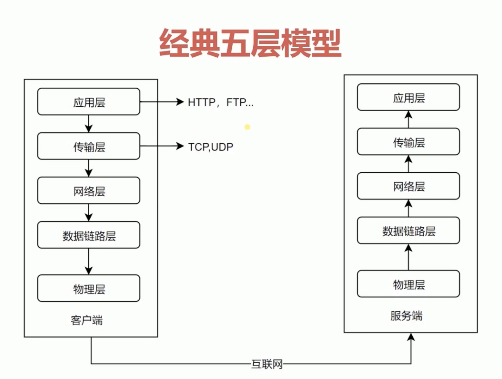
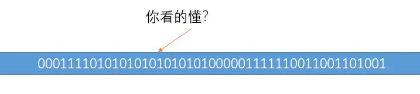
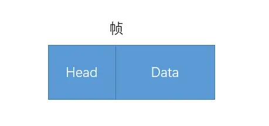

在每一台电脑，每个服务器都有这这几个网络模型层级来维护整个网络数据传输过程。

## 物理层

> 将信息编码成电流脉冲或其它信号用于网上传输；（电线、光缆等）

一台计算机与另一台计算机要进行通信，第一件要做的事是什么？当然是要把这台计算机与另外的其他计算机连起来啊，这样，我们才能把数据传输过去。例如可以通过光纤啊，电缆啊，双绞线啊等介质把他们连接起来，然后才能进行通信。

也就是说，物理层负责把两台计算机连起来，然后在计算机之间通过高低电频来传送 0,1 这样的电信号。

## 数据链路层

> 物理寻址，同时将原始比特流变成逻辑传输电路

前面说了，物理层它只是单纯着负责把计算机连接起来，并且在计算机之间传输 0，1 这样的电信号。如果这些 0，1 组合的传送毫无规则的话，计算机是解读不了的。一大堆 0，1 谁知道是什么鬼啊。

因此，我们需要制定一套规则来进行 0，1 的传送。例如多少个电信号为一组啊，每一组信号应该如何标识才能让计算机读懂啊等等。

数据链路层的主要协议有：

1. 点对点协议（Point-to-Point Protocol);
2. 以太网（Ethernet);
3. 高级数据链路协议(High-Level Data Link Protocol);
4. 帧中继（Frame Relay);
5. 异步传输模式(Asynchronous Transfer Mode);

### 以太网协议

以太网协议规定，一组电信号构成一个数据包，我们把这个数据包称之为**帧**。每一个桢由标头(Head)和数据(Data)两部分组成。

帧的大小一般为 64 - 1518 个字节。假如需要传送的数据很大的话，就分成多个桢来进行传送。

标头部分主要是一些说明数据，例如发送者，接收者等信息。而数据部分则是这个数据包具体的，想给接守者的内容。

一个桢的长度是 64~1518 个字节，也就是说桢的长度不是固定的，标头部分的字节是固定的，并且固定为 18 个字节。

把一台计算的的数据通过物理层和链路层发送给另一台计算机，究竟是谁发给谁的，计算机与计算机之间如何区分，，你总得给他们一个唯一的标识吧？

于是，MAC 地址出现了。

#### MAC 地址

连入网络的每一个计算机都会有网卡接口，每一个网卡都会有一个唯一的地址，这个地址就叫做 MAC 地址。计算机之间的数据传送，就是通过 MAC 地址来唯一寻找、传送的。

MAC 地址 由 48 个字节所构成，在网卡生产时就被唯一标识了。
