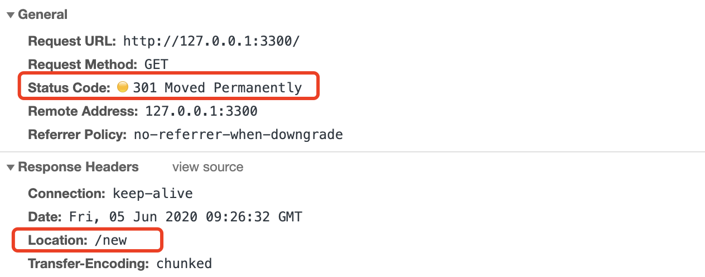

“`Location`”字段属于响应字段，必须出现在响应报文里。但只有配合 `301/302` 状态码才有意义，它标记了服务器要求重定向的 `URI`

```TS {7}
const http = require('http')

http
  .createServer(function(request, response) {
    if (request.url === '/') {
      response.writeHead(301, { // 301 使用请慎重，通常用 302
        Location: '/new'
      })
      response.end()
    }

    if (request.url === '/new') {
      response.writeHead(200, { 'Content-Type': 'text/html;charset=utf-8' })
      response.end('<h2>new Page!</h2>')
    }
  })
  .listen(3300)

console.log('http://127.0.0.1:3300')
```



`301` 俗称“<span class='orange'>永久重定向</span>”（Moved Permanently），意思是原 URI 已经“永久”性地不存在了，今后的所有请求都必须改用新的 URI。

`302` 俗称“<span class='orange'>临时重定向</span>”（“Moved Temporarily”），意思是原 URI 处于“临时维护”状态，新的 URI 是起“顶包”作用的“临时工”。

301/302 是最常用的重定向状态码，在 3×× 里剩下的几个还有：

- `303 See Other`：类似 302，但要求重定向后的请求改为 GET 方法，访问一个结果页面，避免 POST/PUT 重复操作；
- `307 Temporary Redirect`：类似 302，但重定向后请求里的方法和实体不允许变动，含义比 302 更明确；
- `308 Permanent Redirect`：类似 307，不允许重定向后的请求变动，但它是 301“永久重定向”的含义。
