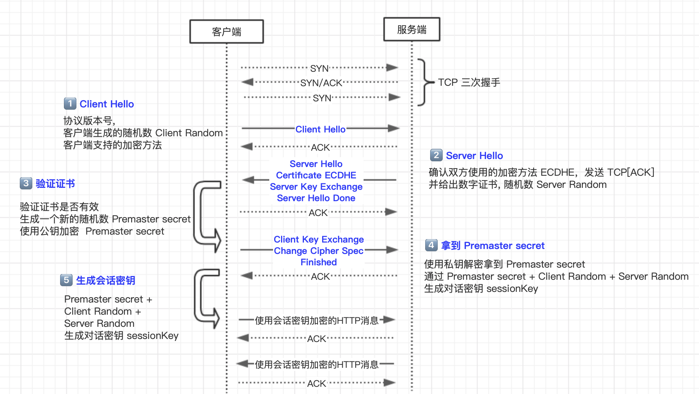

开始加密通信之前，客户端和服务器首先必须建立连接和交换参数，这个过程叫做握手（handshake）。

握手阶段分成五步。

<blockquote class='box'>

第一步，客户端给出协议版本号、一个客户端生成的随机数（Client random），以及客户端支持的加密方法。

第二步，服务端确认双方使用的加密方法，并给出数字证书、以及一个服务器生成的随机数（Server random）。

第三步，客户端确认数字证书有效，然后生成一个新的随机数（Premaster secret），并使用数字证书中的公钥，加密这个随机数，发给服务端。

第四步，服务端使用自己的私钥，获取客户端发来的随机数（即 Premaster secret）。

第五步，客户端和服务端根据约定的加密方法，使用前面的三个随机数，生成"对话密钥"（session key），用来加密接下来的整个对话过程。

</blockquote>

如图：

1. HTTPS 协议会先与服务器执行 TCP 握手，然后执行 TLS 握手，才能建立安全连接；
2. 握手的目标是安全地交换对称密钥，需要三个随机数，第三个随机数“Pre-Master”必须加密传输，绝对不能让黑客破解；
3. “Hello”消息交换随机数，“Key Exchange”消息交换“Pre-Master”；

[SSL/TLS 握手过程详解](https://juejin.im/post/584b76d3a22b9d0058d5036)
