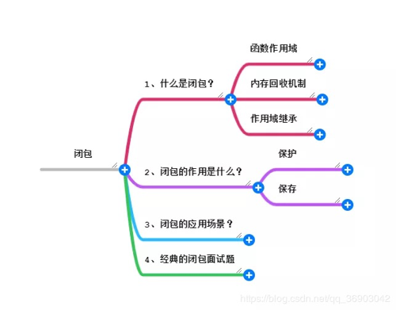
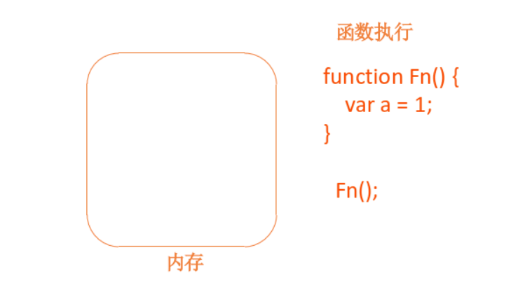
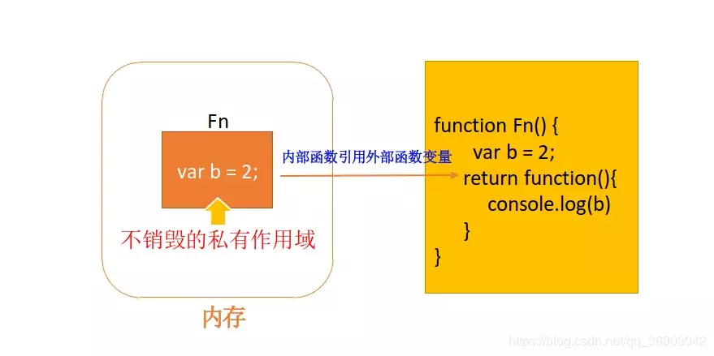
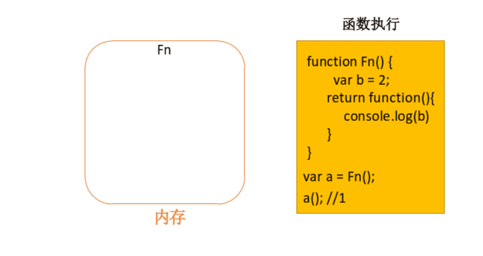

## 写在前面



## 什么是闭包？

MDN 对闭包的定义为：**闭包是指那些能够访问自由变量的函数。**

那什么是自由变量呢？

> 自由变量是指在函数中使用的，但既不是函数参数也不是函数的局部变量的变量。

由此，我们可以看出闭包共有两部分组成：

```js
var a = 1

function foo() {
  console.log(a)
}

foo()
```

foo 函数可以访问变量 a，但是 a 既不是 foo 函数的局部变量，也不是 foo 函数的参数，所以 a 就是自由变量。

那么，函数 foo + foo 函数访问的自由变量 a 不就是构成了一个闭包嘛……

---

要想完全掌握闭包，一定要清楚函数作用域、内存回收机制、作用域继承。我们就简单讲一下这几个概念。

### 函数作用域

作用域的概念，形象描述的话，可以认为它是一个封闭的空间，只允许在这个封闭的空间内进行一些操作，也将这个封闭空间称为私有作用域。在 JS 中，一个函数的执行就会在内存中创建一个私有作用域——封闭的空间

```js
function Fn() {
  var a = 1
}
```



比如在函数中定义一个变量，只能在函数这个私有作用域中使用（也就是封闭空间）。只要超出了这个作用域，就找不到该变量了。

而且函数执行完成后，这个私有作用域（封闭的空间）就会销毁。有一种情况它是不会销毁的，那就是“闭包”，后边会讲到。

### 内存回收机制

内存回收机制就是不在用到的内存，我们系统就自动进行回收从而清理出空间供其他程序使用。那回收的规则是什么？



内部函数引用着外部的函数的变量，外部的函数尽管执行完毕，作用域也不会销毁。从而形成了一种不销毁的私有作用域。

某一变量或者对象被引用着，因此在回收的时候不会释放它，因为被引用代表着被使用，回收器不会对正在引用的变量或对象回收的。

### 作用域继承

```js
function Fn() {
  var a = 1
  return function() {
    console.log(a)
  }
}
```

在 JS 中，道理是一样的，在一个函数里边我们再声明一个函数，内部函数可以访问外部函数作用域的变量，而外部的函数不能获取到内部函数的作用域变量。

函数执行，形成一个私有的作用域，保护里边的私有变量不受外界的干扰，除了保护私有变量外，还可以存储一些内容，这样的模式叫做闭包。

动画实现：



## 闭包的应用

应用闭包的主要场合是：设计私有的方法和变量。

我们将操作函数暴露给外部，而细节隐藏在模块内部

例如

```js
var singleton = (function() {
  // 私有变量
  var age = 22
  var speak = function() {
    console.log('speaking!!!')
  }

  // 特权（或公有）属性和方法
  return {
    name: 'percy',
    getAge: function() {
      return age
    }
  }
})()

// 计数器
var countNumber = (function() {
  var num = 0
  return function() {
    return ++num
  }
})()
```

匿名函数最大的用途是创建闭包，并且还可以构建命名空间，以减少全局变量的使用。从而使用闭包模块化代码，减少全局变量的污染。

## 闭包的缺陷

- 闭包的缺点就是常驻内存会增大内存使用量，并且使用不当很容易造成内存泄露。
- 如果不是因为某些特殊任务而需要闭包，在没有必要的情况下，在其它函数中创建函数是不明智的，因为闭包对脚本性能具有负面影响，包括处理速度和内存消耗。

## 经典题目

```js
var data = []

for (var i = 0; i < 3; i++) {
  data[i] = function() {
    console.log(i)
  }
}

data[0]()
data[1]()
data[2]()
```

答案是都是 3

解决方法: 闭包的方式。闭包终于排上用场了，用来保存私有的变量。

```js
for (var i = 0; i < 3; i++) {
  ;(function(j) {
    data[j] = function() {
      console.log(j)
    }
  })(i)
}
```

参考 [动画：什么是闭包？](https://juejin.im/post/5dc6449ae51d452bd321252c)
