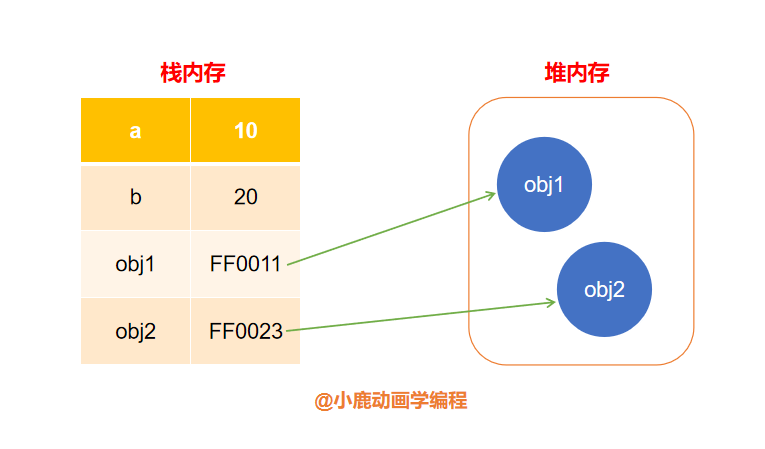
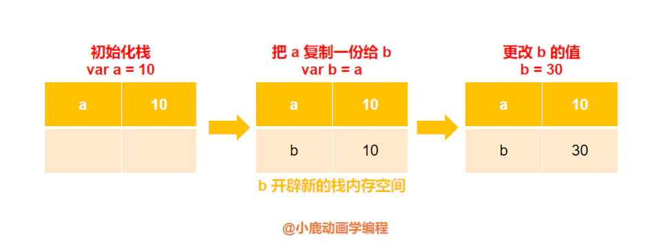
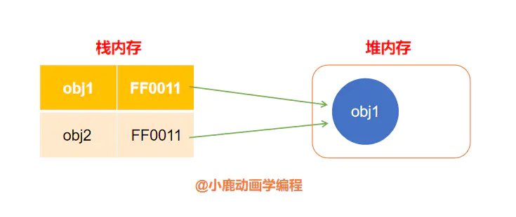

> 面试官：说说 `JavaScript` 中的基本类型有哪些？以及各个数据类型是如何存储的？

`JavaScript` 的数据类型包括`原始类型`和`引用类型(对象类型)`。

最基本常用到原始类型包括以下 6 个：

- `String`
- `Number`
- `Boolean`
- `null`
- `undefined`
- `Symbol`

引用类型统称为 `Object` 类型，如果细分的话，分为以下 5 个：

- `Object`
- `Array`
- `Date`
- `RegExp`
- `Function`

## 数据类型的存储形式

栈（`Stack`）和堆（`Heap`），是两种基本的数据结构。

- `Stack` 在内存中自动分配内存空间的；
- `Heap` 在内存中动态分配内存空间的，不一定会自动释放。一般我们在项目中将对象类型手动置为 `null` 原因，减少无用内存消耗。

原始类型（存在栈内存中）和对象类型（存在堆内存中）分别在内存中的存在形式如下图示：



原始类型是按值形式存放在栈中的数据段，内存空间可以自由分配，同时可以按值直接访问。

```js
var a = 10
var b = a
b = 30
console.log(a) // 10值
console.log(b) // 30值
```

过程图示：



引用类型是存放在**堆**内存中，每个对象在堆内存中有一个引用地址，就像是每个房间都有一个房间号一样。引用类型在栈中保存的就是这个对象在堆内存的引用地址，我们所说的“房间号”。通过“房间号”可以快速查找到保存在堆内存的对象。

```js
var obj1 = new Object()
var obj2 = obj1
obj2.name = '小鹿'
console.log(obj1.name) // 小鹿
```

过程图示：



## Null

### typeof null 等于 Object?

> 面试官：为什么 typeof null 等于 Object?

不同的对象在底层原理的存储是用二进制表示的，在 `javaScript` 中，如果二进制的前三位都为 0 的话，系统会判定为是 `Object` 类型。null 的存储二进制是 `000`，也是前三位，所以系统判定 `null` 为 `Object` 类型。

### Null 和 undefined 的区别

```js
console.log(null == undefined) // true
console.log(null === undefined) // false
```

**null 表示"没有对象"，即该处不应该有值**。典型用法是：

```js
1. 作为函数的参数，表示该函数的参数不是对象。
2. 作为对象原型链的终点。

Object.getPrototypeOf(Object.prototype) // null
```

**undefined 表示"缺少值"，就是此处应该有一个值，但是还没有定义**。典型用法是：

```js
1. 变量被声明了，但没有赋值时，就等于 undefined。
2. 调用函数时，应该提供的参数没有提供，该参数等于 undefined。
3. 对象没有赋值的属性，该属性的值为 undefined。
4. 函数没有返回值时，默认返回 undefined。
```

```js
var i;
i // undefined

function f(x){console.log(x)}
f() // undefined

var  o = new Object();
o.p // undefined

var x = f();
x // undefined
。
```

[阮一峰 undefined 与 null 的区别](http://www.ruanyifeng.com/blog/2014/03/undefined-vs-null.html)

## typeof 与 instanceof 有什么区别？

`typeof` 是一元运算符，同样返回一个字符串类型。一般用来判断一个变量是否为空或者是什么类型。

除了 `null` 类型以及 `Object` 类型不能准确判断外，其他数据类型都可能返回正确的类型。

```js
typeof undefined // 'undefined'
typeof '10'      // 'String'
typeof 10        // 'Number'
typeof false     // 'Boolean'
typeof Symbol()  // 'Symbol'
typeof Function  // ‘function'
typeof null		 // ‘Object’
typeof []        // 'Object'
typeof {}    .   // 'Object'
```

既然 `typeof` 对对象类型都返回 `Object` 类型情况的局限性，我们可以使用 `instanceof` 来进行**判断某个对象是不是另一个对象的实例**。返回值的是一个布尔类型。

```js
var a = []
console.log(a instanceof Array) // true
```

`instanceof` 运算符用来测试一个对象在其原型链中是否存在一个构造函数的 `prototype` 属性，

我们再测一下 ES6 中的 `class` 语法糖是什么类型。

```js
class A {}
console.log(A instanceof Function) // true
```

假设现在有 `a instanceof b` 一条语句，则其 `instanceof` 内部实际做了如下判断：

```js
while (a.__proto__ !== null) {
  if (a.__proto__ === b.prototype) {
    return true
  }
  a.__proto__ = a.__proto__.proto__
}
if (a.__proto__ == null) {
  return false
}
```

a 会一直沿着隐式原型链 `__proto__` `向上查找直到a.__proto__.__proto__ ...... === b.prototype`为止，如果找到则返回 `true`，也就是 `a` 为 `b` 的一个实例。否则返回 `false`，`x` 不是 `b`的实例。

:::warning 注意
原型链中的 prototype 随时可以被改动的，改变后的值可能不存在于 object 的原型链上，instanceof 返回的值可能就返回 false。
:::

## 类型转换

`javaScript` 是一种弱类型语言，变量不受类型限制，所以在特定情况下我们需要对类型进行转换。

「类型转换」分为`显式类型转换`和`隐式类型转换`。每种转换又分为`原始类型转换`和`对象类型转换`。

显式类型转换就是我们所说强制类型转换。

### 转化为 String

| 数据类型  | String 类型              |
| --------- | ------------------------ |
| 数字      | 转化为数字对应的字符串   |
| true      | 转化为字符串 "true"      |
| null      | 转化为字符串 "null"      |
| undefined | 转化为字符串 “undefined” |
| Object    | 转化为 "[object Object]" |

```js
String(123) // "123"
String(true) // "true"
String(null) // "null"
String(undefined) // "undefined"
String([1, 2, 3]) // "1,2,3"
String({}) // "[object Object]"
```

### 转化为 Boolean 过滤假值

```js
var result = ['', undefined, null, NaN, false, 0].filter(Boolean) // []
```

`Boolean` 方法可以用来过滤假值，如上 `''`, `undefined`, `null`, `NaN`, `false`, `0` 转化为 `Boolean` 为 `false`

```js
Boolean('')         // false
Boolean(undefined)  // false
Boolean(null)       // false
Boolean(NaN)        // false
Boolean(false)      // false
Boolean(0)          // false
Boolean({})		    // true
Boolean([])		  。// true
```

### 转化为 Number

| 数据类型  | 数字类型                                                                  |
| --------- | ------------------------------------------------------------------------- |
| 字符串    | 1. 数字转化为对应的数字 2) 其他转化为 NaN                                 |
| 布尔类型  | 1. true 转化为 12) false 转化为 0                                         |
| null      | 0                                                                         |
| undefined | NaN                                                                       |
| 数组      | 1. 数组为空转化为 0；2) 数组只有一个元素转化为对应元素；3) 其他转化为 NaN |
| 空字符串  | 0                                                                         |

```js
Number(10) // 10
Number('10') // 10
Number(null) // 0
Number('') // 0
Number(true) // 1
Number(false) // 0
Number([]) // 0
Number([1, 2]) // NaN
Number('10a') // NaN
Number(undefined) // NaN
```

参考自 [🔥 动画：《大前端吊打面试官系列》 之原生 JavaScript 精华篇](https://juejin.im/post/5e34d19de51d4558864b1d1f)
