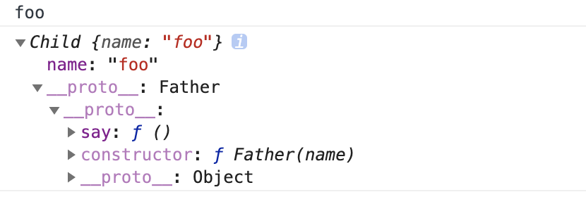

JavaScript 没有类，原型链来实现继承。

继承就是子类可以使用父类的所有功能，并且对这些功能进行扩展。例如

```js
class Animal {
  constructor(name) {
    this.name = name
  }
  say() {
    console.log(this.name)
  }
}

class Dog extends Animal {}

var dog = new Dog('foo')

dog.say() // 调用继承 Animal 的方法
```

## 原型链继承 <Badge text="Child.prototype = new Father()" />

这种方式关键在于: **子类型的原型为父类型的一个实例对象。**

```js {11}
function Father() {
  this.arr = [1, 2, 3]
}

Father.prototype.say = function() {
  console.log(this.arr.join(', '))
}

function Child() {}

Child.prototype = new Father() // 子类型的原型为父类型的一个实例对象

var c1 = new Child()
c1.say()
```

我们可以看到子类的实例 `c1.__proto` 可以访问到父类原型上的方法。



**子类继承父类的属性和方法是将父类的私有属性和公有方法都作为自己的公有属性和方法，**

```js {5}
var c1 = new Child()
var c2 = new Child()

c2.say() // 1, 2, 3
c1.arr.push(4)
c2.say() // 1, 2, 3, 4
```

这就表示，原型链继承里面，使用的都是同一个内存里的值，这样修改该内存里的值，其他继承的子类实例里的值都会变化。

---

- 特点
  - 父类新增原型方法/原型属性，子类都能访问到
  - 简单，易于实现
- 缺点：
  - 无法实现多继承
  - 来自原型对象的所有属性被所有实例共享
  - 创建子类实例时，无法向父类构造函数传参
  - 要想为子类新增属性和方法，必须要在 `Child.prototype = new Father()` 之后执行，不能放到构造器中

## 借用构造函数继承 <Badge text="Father.call(this, ...)"/>

这种方式关键在于: **在子类型构造函数中通用 call()调用父类型构造函数**

```js {6}
function Father(name) {
  this.arr = [1, 2, 3]
}

function Child(name) {
  Father.call(this, name)
}

var c1 = new Child('foo')
var c2 = new Child('bar')

c1.arr.push(4)
console.log(c2.arr) // [1, 2, 3]
```

---

- 特点：
  - 解决了原型链继承中子类实例共享父类引用属性的问题
  - 创建子类实例时，可以向父类传递参数
  - 可以实现多继承(call 多个父类对象)
- 缺点：
  - 实例并不是父类的实例，只是子类的实例
  - 只能继承父类的实例属性和方法，不能继承原型属性和方法
  - 无法实现函数复用，每个子类都有父类实例函数的副本，影响性能

## 组合继承

这种方式关键在于: **通过调用父类构造，继承父类的属性并保留传参的优点，然后通过将父类实例作为子类原型，实现函数复用。**

我们发现，
通过原型链实现的继承，都是复用同一个属性和方法；
通过构造函数实现的继承，都是独立的属性和方法。于是我们大打算利用这一点，将两种方式组合起来：通过在原型上定义方法实现对**函数的复用**，通过构造函数的方式保证每个实例都有它**自己的属性**。

```js {10,13}
function Father(name) {
  this.arr = [1, 2, 3]
}

Father.prototype.say = function() {
  console.log(this.arr.join(', '))
}

function Child(name) {
  Father.call(this, name)
}

Child.prototype = new Father()
Child.prototype.constructor = Child

var c1 = new Child('foo')
var c2 = new Child('bar')

c1.arr.push(4)
c1.say()
c2.say()
```

- 优点：
  - 可以继承实例属性/方法，也可以继承原型属性/方法
  - 不存在引用属性共享问题
  - 可传参
  - 函数可复用
- 缺点：
  - 调用了两次父类构造函数，生成了两份实例

## 寄生组合继承 <Badge text="Child.prototype = Object.create(Father.prototype)" />

刚刚我们提了**组合继承**的缺点无非就是：

1. 父类构造函数会被调用两次
2. 生成了两个实例，在父类实例上产生了无用废弃的属性

那么有没有一种方式让我们直接跳过父类实例上的属性，而让我直接就能继承父类原型链上的属性呢？

也就是说，我们需要一个`干净的实例对象`，来作为子类的原型。并且这个`干净的实例对象`还得能继承父类原型对象里的属性。

咦～说到`干净的对象`，我就想到了一个方法：`Object.create()`。

```js
Object.create(proto, propertiesObject)
```

- 参数一，需要指定的原型对象
- 参数二，可选参数，给新对象自身添加新属性以及描述器

在这里我们主要讲解一下第一个参数 `proto`

就好比，我们使用 `var c1 = new Father()`创建了一个对象`c1`，那`c1.__proto__` 就是 `Father.prototype`。

使用`var obj = new Object()`创建了一个对象`obj`，那`obj.__proto__`就是 `Object.prototype`。

而这个 `Object.create()`屌了，它现在能指定你新建对象的 `__proto__`。

```js {12,13}
function Father(name) {
  this.arr = [1, 2, 3]
}

Father.prototype.say = function() {
  console.log(this.arr.join(', '))
}

function Child(name) {
  Father.call(this, name)
}
Child.prototype = Object.create(Father.prototype)
Child.prototype.constructor = Child
// Child.prototype = new Father()

var c1 = new Child('foo')
var c2 = new Child('bar')

c1.arr.push(4)
c1.say()
c2.say()
```

但这种方式没办法辨别是对象是子类还是父类实例化

```js
console.log(c1 instanceof Child, c1 instanceof Father) //true true
console.log(c1.constructor) // Father
```

- 优点：
  - 不会初始化两次实例方法/属性，避免的组合继承的缺点
- 缺点：
  - 没办法辨别是实例是子类还是父类创造的，子类和父类的构造函数指向是同一个。

---

- [JavaScript 对象封装、多态、继承](https://juejin.im/post/5e75e22951882549027687f9)
- [隔壁小孩也能看懂的 7 种 JavaScript 继承实现](https://juejin.im/post/5ceb468af265da1bd1463585)
- [JavaScript 常见的六种继承方式](https://segmentfault.com/a/1190000016708006)
- [💦【何不三连】做完这 48 道题彻底弄懂 JS 继承(1.7w 字含辛整理-返璞归真)](https://juejin.im/post/5e75e22951882549027687f9)
