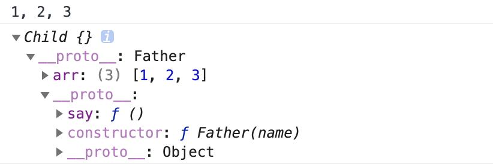
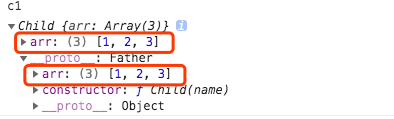

> JavaScript 没有类，原型链来实现继承

| 方式                 | 关键代码                                                                                                          | 优点                                                                                                            | 缺点                                                                                                                         |
| -------------------- | ----------------------------------------------------------------------------------------------------------------- | --------------------------------------------------------------------------------------------------------------- | ---------------------------------------------------------------------------------------------------------------------------- |
| **原型链继承**       | `Child.prototype = new Father()`                                                                                  | 可以访问的父类的原型方法和属性                                                                                  | 1️⃣ 引用类型的属性被所有实例共享 <br /> <br />2️⃣ 创建子类实例时，无法向父类构造函数传参                                       |
| **借用构造函数继承** | 在 `Child` 构造函数中执行`Father.call(this)`                                                                      | 1️⃣ 避免了引用类型的属性被所有实例共享 <br /> 2️⃣ 可以在 `Child` 中向 `Father` 传参                               | 1️⃣ 方法都在构造函数中定义，每次创建实例都会创建一遍方法 <br /> <br />2️⃣ 只能继承父类的实例属性和方法，不能继承原型属性和方法 |
| **组合继承**         | 1️⃣ 在 `Child` 函数中执行`Father.call(this)` <br /> 2️⃣ `Child.prototype = new Father()`                            | 1️⃣ 可以继承实例属性/方法，也可以继承原型属性/方法 <br /> 2️⃣ 不存在引用属性共享问题 <br /> 3️⃣ 可传参、函数可复用 | 调用了两次父类构造函数，生成了两份实例                                                                                       |
| **原型式继承**       | `function createObj(o) { function F() {} F.prototype = o return new F() }`                                        | 同原型链继承一样                                                                                                | 包含引用类型的属性值始终都会共享相应的值                                                                                     |
| **寄生式继承**       | `function createObj(o) { var clone = Object.create(o) clone.say = function() { console.log('hi') } return clone}` |                                                                                                                 | 每次创建对象都会创建一遍方法                                                                                                 |
| **寄生组合式继承**   | `var F = function() {} F.prototype = Father.prototype Child.prototype = new F()`                                  | 在组合继承的基础上 避免调用了两次父类构造函数，生成了两份实例                                                   |

## 原型链继承 <Badge text="Child.prototype = new Father()" />

这种方式关键在于: **子类型的原型为父类型的一个实例对象。**

```js {11}
function Father() {
  this.arr = [1, 2, 3]
}

Father.prototype.say = function() {
  console.log(this.arr.join(', '))
}

function Child() {}

Child.prototype = new Father() // 子类型的原型为父类型的一个实例对象
Child.prototype.constructor = Child

var c1 = new Child()
c1.say()
```

我们可以看到子类的实例 `c1.__proto` 可以访问到父类原型上的方法。



:::warning 缺点

1. **引用类型的属性被所有实例共享**，举个例子：

```js
var c1 = new Child()
var c2 = new Child()

c2.say() // 1, 2, 3
c1.arr.push(4)
c2.say() // 1, 2, 3, 4
```

修改了实例 `c1.arr`, `c2.arr` 也受了影响。

2️⃣ **在创建 `Child` 的实例时，不能向 `Father` 传参**
:::

## 借用构造函数继承 <Badge text="Father.call(this, ...)"/>

这种方式关键在于: **在子类型构造函数中通用 call()调用父类型构造函数**

```js {6}
function Father(name) {
  this.arr = [1, 2, 3]
}

function Child(name) {
  Father.call(this, name)
}

var c1 = new Child('foo')
var c2 = new Child('bar')

c1.arr.push(4)
console.log(c2.arr) // [1, 2, 3]
```

优点：

- 1️⃣ 避免了引用类型的属性被所有实例共享
- 2️⃣ 可以在 `Child` 中向 `Father` 传参

:::details demo

```js
function Father(name) {
  this.name = name
}

function Child(name) {
  Father.call(this, name)
}

var c1 = new Child('foo')

console.log(c1.name)
```

:::

:::warning 缺点

1. **方法都在构造函数中定义，每次创建实例都会创建一遍方法。**
2. **只能继承父类的实例属性和方法，不能继承原型属性和方法**

:::

## 组合继承

这种方式关键在于: **通过调用父类构造，继承父类的属性并保留传参的优点，然后通过将父类实例作为子类原型，实现函数复用。**

```js {10,13}
function Father(name) {
  this.arr = [1, 2, 3]
}

Father.prototype.say = function() {
  console.log(this.arr.join(', '))
}

function Child(name) {
  Father.call(this, name)
}

Child.prototype = new Father()
Child.prototype.constructor = Child

var c1 = new Child('foo')
var c2 = new Child('bar')

c1.arr.push(4)
c1.say() // 1, 2, 3, 4
c2.say() // 1, 2, 3
```

融合原型链继承和构造函数的优点，是 `JavaScript` 中最常用的继承模式。

- 优点：
  - 可以继承实例属性/方法，也可以继承原型属性/方法
  - 不存在引用属性共享问题
  - 可传参
  - 函数可复用

:::warning 缺点
**调用了两次父类构造函数，生成了两份实例**

- 一次是设置子类型实例的原型的时候： `Child.prototype = new Father()`
- 一次在创建子类型实例的时候： `var c1 = new Child('foo')`
- 回想下 `new` 的模拟实现，其实在这句中，我们会执行： `Father.call(this, name)`

打印实例 `c1`:



我们发现 `Child.prototype` 和 `c1` 都有一个熟悉 `arr`, 这就造成重复调用了。

:::

## 原型式继承 <Badge text="Object.create" />

这种继承的思想是将传入的对象作为创建的对象的原型。

```js
function createObj(o) {
  function F() {}
  F.prototype = o
  return new F()
}
```

就是 ES5 `Object.create` 的模拟实现，将传入的对象作为创建的对象的原型。

:::warning 缺点
**包含引用类型的属性值始终都会共享相应的值，** 这点跟原型链继承一样。

```js
var p1 = createObj(person)
var p2 = createObj(person)

p1.list.push(4)
console.log(p2.list) // [1, 2, 3, 4]
```

:::

## 寄生式继承

创建一个仅用于封装继承过程的函数，该函数在内部以某种形式来做增强对象，最后返回对象。

```js
function createObj(o) {
  var clone = Object.create(o)
  clone.say = function() {
    console.log('hi')
  }
  return clone
}

var person = { name: 'foo' }

var p1 = createObj(person)

p1.say()
```

:::warning 缺点
跟借用构造函数模式一样，**每次创建对象都会创建一遍方法**。
:::

## 寄生组合继承 <Badge text="Child.prototype = Object.create(Father.prototype)" />

刚刚我们提了**组合继承**的缺点无非就是：

1. 父类构造函数会被调用两次
2. 生成了两个实例，在父类实例上产生了无用废弃的属性

```js
function Father(name) {
  this.arr = [1, 2, 3]
}

Father.prototype.say = function() {
  console.log(this.arr.join(', '))
}

function Child(name) {
  Father.call(this, name)
}

Child.prototype = new Father()
Child.prototype.constructor = Child
```

如果我们不使用 `Child.prototype = new Father()` ，而是间接的让 `Child.prototype` 访问到 `Father.prototype` 呢？

看看如何实现：

```js
function Father(name) {
  this.name = name
  this.arr = [1, 2, 3]
}

Father.prototype.say = function() {
  console.log(this.name, this.arr)
}

function Child(name, age) {
  Father.call(this, name)
  this.age = age
}

// 关键的三步

var F = function() {}

F.prototype = Father.prototype

Child.prototype = new F()

var c1 = new Child('foo', 18)

c1.say() // foo [ 1, 2, 3 ]
```

最后我们封装一下这个继承方法：

```js
function object(o) {
  function F() {}
  F.prototype = o
  return new F()
}

function prototype(Child, Parent) {
  var prototype = object(Parent.prototype) // new F()
  prototype.constructor = Child // c1.constructor = Child
  Child.prototype = prototype // Child.prototype = new F()
}

// 当我们使用的时候：
prototype(Child, Father)
```

这种方式的高效率体现它只调用了一次 `Father` 构造函数，并且因此避免了在 `Father.prototype` 上面创建不必要的、多余的属性。与此同时，原型链还能保持不变；因此，还能够正常使用 `instanceof` 和 `isPrototypeOf`。开发人员普遍认为寄生组合式继承是引用类型最理想的继承范式。

---

参考自 [JavaScript 深入之继承的多种方式和优缺点](https://github.com/mqyqingfeng/Blog/issues/16)
