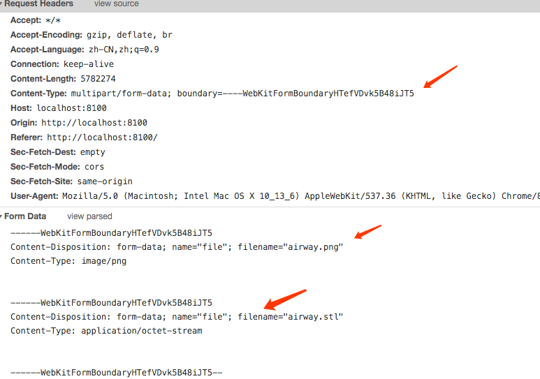

## 前置知识

原理很简单，就是根据 `http` 协议的规范和定义，完成请求消息体的封装和消息体的解析，然后将二进制内容保存到文件。

我们都知道如果要上传一个文件，需要把 `form` 标签的 `enctype` 设置为 `multipart/form-data`,同时 `method` 必须为 `post` 方法。

```html
<form action="" enctype="multipart/form-data" method="post">...</form>
```

### 什么是 multipart/form-data?

> `multipart` 互联网上的混合资源，就是资源由多种元素组成，[form-data](https://developer.mozilla.org/zh-CN/docs/Web/API/FormData) 表示可以使用 `HTML Forms` 和 `POST` 方法上传文件，具体的定义可以参考 RFC 7578。

### 请求体

看下 `http` 请求的消息体



#### `Request Headers`

```yml
Content-Type: multipart/form-data; boundary=----WebKitFormBoundaryHTefVDvk5B48iJT5
```

上面的字段表示本次请求要上传文件， 其中 `boundary` 表示分隔符，如果要上传多个表单项，就要使用 `boundary` 分割，每个表单项由`———XXX` 开始，以`———XXX` 结尾。

#### 消息体 - `Form Data` 部分

每一个表单项又由 `Content-Type` 和 `Content-Disposition` 组成。

- `Content-Disposition`: `form-data` 为固定值，表示一个表单元素，`name` 表示表单元素的 名称，回车换行后面就是 `name` 的值，如果是上传文件就是文件的二进制内容。
- `Content-Type`：表示当前的内容的 `MIME` 类型，是图片还是文本还是二进制数据。

## 代码

```html
<input type="file" multiple id="input-upload" />
<button id="btn-submit">上传</button>

<script>
  const input = document.getElementById('input-upload')
  const button = document.getElementById('btn-submit')

  button.onclick = function() {
    const fileList = input.files
    const formData = new FormData()
    for (let i = 0; i < fileList.length; i++) {
      const file = fileList[i]
      formData.append('file', file)
    }
    const xhr = new XMLHttpRequest()
    xhr.open('POST', 'http://localhost:8100/upload', true)
    xhr.send(formData)
    xhr.onreadystatechange = function() {
      if (xhr.readyState == 4 && xhr.status == 200) {
        const text = JSON.parse(xhr.responseText) //返回值
        alert(`成功上传, ${text.filter(Boolean).join(', ')}`)
      }
    }
  }
</script>
```

```js
const Koa = require('koa')
const koaBody = require('koa-body')
const Router = require('koa-router')
const koaStatic = require('koa-static')

const fs = require('fs')
const path = require('path')

const PORT = 8100
const uploadDir = path.resolve(__dirname, './static/uploads')

const app = new Koa()
const router = new Router()

app.use(
  koaBody({
    multipart: true, // 开启文件上传，默认是关闭
    formidable: {
      keepExtensions: true, //保留原始的文件后缀
      maxFileSize: 2000 * 1024 * 1024 // 设置上传文件大小最大限制，默认20M
    }
  })
)

app.use(router.routes()).use(router.allowedMethods())

//开启静态文件访问
app.use(koaStatic(path.resolve(__dirname, './static')))

router.post('/upload', async ctx => {
  !fs.existsSync(uploadDir) && fs.mkdirSync(uploadDir)
  const file = ctx.request.files.file // 获取上传文件

  const saveFile = file => {
    return new Promise((resolve, reject) => {
      try {
        const reader = fs.createReadStream(file.path) // 创建可读流
        const fileName = file.name
        const filePath = `${uploadDir}/${fileName}`
        const upStream = fs.createWriteStream(filePath)
        reader.pipe(upStream)
        reader.on('end', () => {
          resolve(fileName) // 上传成功
        })
      } catch (error) {
        reject(error)
      }
    })
  }
  const fileList = Array.isArray(file) ? file : [file]
  const uploadList = await Promise.all(fileList.map(saveFile))
  ctx.body = uploadList
})

app.listen(PORT, () => {
  console.log(`server listen on: http://localhost:${PORT}`)
})
```

## 参考文章

- [写给新手前端的各种文件上传攻略，从小图片到大文件断点续传](https://juejin.im/post/5da14778f265da5bb628e590)
- [前端大文件上传](https://juejin.im/post/5cf765275188257c6b51775f)
- [字节跳动面试官，我也实现了大文件上传和断点续传](https://juejin.im/post/5e367f6951882520ea398ef6)
