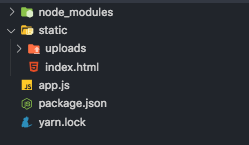

## 整体思路

如果太大的文件，比如一个视频 1g 2g 或者更大， 直接上传的方式可能会出现**链接超时**的情况，而且也会**超过服务端允许上传文件的大小限制**，所以解决这个问题我们可以将文件进行分片上传，每次只上传很小的一部分 比如 `2M`。

<Badge text="前端" type="success"/>

---

切片上传大文件的核心则是利用 [Blob.prototype.slice](./blob.md#blob-prototype-slice), 和数组的 `slice` 方法相似，调用的 `slice` 方法可以返回`原文件的某个切片`

这样我们就可以根据预先设置好的切片最大数量将文件切分为一个个切片，然后借助 `http` 的可并发性，同时上传多个切片，这样从原本传一个大文件，变成了同时传多个小的文件切片，可以大大减少上传时间

另外由于是并发，传输到服务端的顺序可能会发生变化，所以我们还需要给每个切片记录顺序

<Badge text="服务端" type="warning"/>

---

服务端需要负责接受这些切片，并在接收到所有切片后`合并切片`

这里又引伸出两个问题

1. 何时合并切片，即切片什么时候传输完成
2. 如何合并切片

第一个问题需要前端进行配合，前端在每个切片中都携带切片最大数量的信息，当服务端接受到这个数量的切片时自动合并，也可以额外发一个请求主动通知服务端进行切片的合并

第二个问题，具体如何合并切片呢？这里可以使用 `nodejs` 的 读写流（`readStream/writeStream`），将所有切片的流传输到最终文件的流里

## 大文件上传 - 前端部分

由于演示这里还是使用原生的 html 而不使用用框架。

首先创建选择文件的控件，点击上传按钮触发上传的请求。

```html
<input type="file" id="input-upload" />
<button id="btn-submit">上传</button>

<script>
  const input = document.getElementById('input-upload')
  const button = document.getElementById('btn-submit')
  button.onclick = function() {
    const file = input.files[0]
    const chunkList = createFileChunk(file) // 创建切片数组
    uploadChunks(file, chunkList) // 上传分片数据
  }
</script>
```

:::details 文件结构

:::

### 封装请求

这里没有用第三方的请求库，而是用原生 `XMLHttpRequest` 做一层简单的封装来发请求

```js
function ajax({ url, data, method = 'POST', headers = {} }) {
  return new Promise(resolve => {
    const xhr = new XMLHttpRequest()
    xhr.open(method, url, true)
    Object.keys(headers).forEach(key => xhr.setRequestHeader(key, headers[key]))
    xhr.send(data)

    // 监听请求成功事件，触发后执行事件函数
    xhr.onload = function(e) {
      resolve(e.target.response)
    }
  })
}
```

### 上传切片

接着实现比较重要的上传功能，上传需要做两件事

1. 对文件进行切片
2. 将切片传输给服务端

```js
const SIZE = 10 * 1024 * 1024 // 切片 10M

function createFileChunk(file, piece = SIZE) {
  const chunkList = []
  let cur = 0
  while (cur < file.size) {
    const blob = file.slice(cur, cur + piece)
    chunkList.push(blob)
    cur += piece
  }
  return chunkList
}

function uploadChunks(file, chunkList) {
  Promise.all(
    chunkList.map((chunk, index) => {
      const formData = new FormData()
      formData.append('chunk', chunk)
      formData.append('filename', file.name)
      formData.append('hash', index)
      return ajax({ url: '/uploadChunk', data: formData })
    })
  )
}
```

当点击上传按钮时，调用 `createFileChunk` 将文件切片，切片数量通过文件大小控制，这里设置 10MB，也就是说 100 MB 的文件会被分成 10 个切片.

在生成文件切片时，需要给每个切片一个标识作为 `hash`，这里暂时使用`文件名 + 下标`，这样后端可以知道当前切片是第几个切片，用于之后的合并切片

随后调用 `uploadChunks` 上传所有的文件切片，将文件切片，切片 `hash`，以及文件名放入 `FormData` 中，再调用上一步的 `ajax` 函数返回一个 `proimise`，最后调用 `Promise.all` 并发上传所有的切片

### 发送合并请求

这里使用整体思路中提到的第二种合并切片的方式，即前端主动通知服务端进行合并，所以前端还需要额外发请求，服务端接受到这个请求时主动合并切片

```jsx
function uploadChunks(file, chunkList) {
  Promise.all(
    chunkList.map((chunk, index) => {
      //...
    })
  ).then(res => {
    ajax({
      url: '/merge',
      headers: { 'content-type': 'application/json' },
      data: JSON.stringify({ filename: file.name, size: SIZE })
    })
  })
}
```

:::details 此时整个 html 代码

```html
<input type="file" id="input-upload" />
<button id="btn-submit">上传</button>

<script>
  const SIZE = 2 * 1024 * 1024 // 切片 2M

  /**
   * ajax 请求
   */
  function ajax({ url, data, method = 'POST', headers = {} }) {
    return new Promise(resolve => {
      const xhr = new XMLHttpRequest()
      xhr.open(method, url, true)
      Object.keys(headers).forEach(key => xhr.setRequestHeader(key, headers[key]))
      xhr.send(data)

      // 监听请求成功事件，触发后执行事件函数
      xhr.onload = function(e) {
        resolve(e.target.response)
      }
    })
  }

  /**
   * 生成文件切片
   */
  function createFileChunk(file, piece = SIZE) {
    const chunkList = []
    let cur = 0
    while (cur < file.size) {
      const blob = file.slice(cur, cur + piece)
      chunkList.push(blob)
      cur += piece
    }
    return chunkList
  }

  /**
   * 上传切片
   */
  function uploadChunks(file, chunkList) {
    Promise.all(
      chunkList.map((chunk, index) => {
        const formData = new FormData()
        formData.append('chunk', chunk)
        formData.append('filename', file.name)
        formData.append('hash', index)

        return ajax({ url: '/uploadChunk', data: formData })
      })
    ).then(res => {
      ajax({
        url: '/merge',
        headers: { 'content-type': 'application/json' },
        data: JSON.stringify({ filename: file.name, size: SIZE })
      })
    })
  }

  const input = document.getElementById('input-upload')
  const button = document.getElementById('btn-submit')

  button.onclick = function() {
    const file = input.files[0]
    const chunkList = createFileChunk(file)
    uploadChunks(file, chunkList)
  }
</script>
```

:::

## 大文件上传 - 服务端部分

这里用了 `koa` 搭建服务端

:::details 基础代码

```js
const Koa = require('koa')
const koaBody = require('koa-body')
const Router = require('koa-router')
const koaStatic = require('koa-static')

const fs = require('fs')
const path = require('path')

const PORT = 8100
const uploadDir = path.resolve(__dirname, './static/uploads')
!fs.existsSync(uploadDir) && fs.mkdirSync(uploadDir)

const app = new Koa()
const router = new Router()

app.use(
  koaBody({
    multipart: true, // 开启文件上传，默认是关闭
    formidable: {
      keepExtensions: true, //保留原始的文件后缀
      maxFileSize: 2000 * 1024 * 1024 // 设置上传文件大小最大限制，默认20M
    }
  })
)

app.use(router.routes()).use(router.allowedMethods())

//开启静态文件访问
app.use(koaStatic(path.resolve(__dirname, './static')))

router.post('/uploadChunk', async ctx => {
  // ...
})

router.post('/merge', async ctx => {
  // ...
})

app.listen(PORT, () => {
  console.log(`server listen on: http://localhost:${PORT}`)
})
```

:::

### 接受切片

```js
router.post('/uploadChunk', async ctx => {
  const { filename, hash } = ctx.request.body
  const chunk = ctx.request.files.chunk

  const chunkDir = `${uploadDir}/${filename}`
  !fs.existsSync(chunkDir) && fs.mkdirSync(chunkDir)

  const saveChunk = (chunk, filename, hash) => {
    return new Promise((resolve, reject) => {
      try {
        const reader = fs.createReadStream(chunk.path) // 创建可读流
        const chunkName = `${filename}-hash-${hash}`
        const chunkPath = `${chunkDir}/${chunkName}`
        const writeStream = fs.createWriteStream(chunkPath)
        reader.pipe(writeStream)
        reader.on('end', () => {
          resolve(chunkName) // 上传成功
        })
      } catch (error) {
        reject(error)
      }
    })
  }
  const chunkName = await saveChunk(chunk, filename, hash)
  ctx.body = chunkName
})
```

## 参考文章

- [字节跳动面试官：请你实现一个大文件上传和断点续传](https://juejin.im/post/5dff8a26e51d4558105420ed)
- [写给新手前端的各种文件上传攻略，从小图片到大文件断点续传](https://juejin.im/post/5da14778f265da5bb628e590)
- [字节跳动面试官，我也实现了大文件上传和断点续传](https://juejin.im/post/5e367f6951882520ea398ef6)
