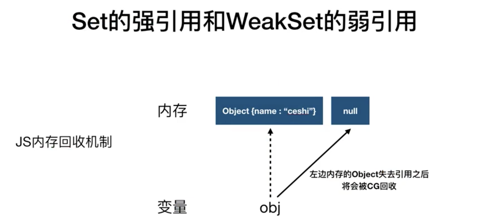
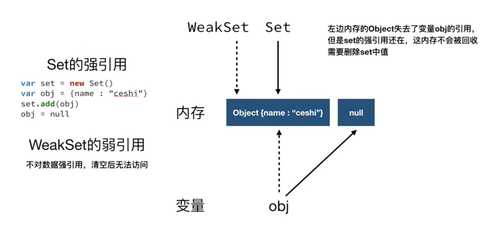

建议先阅读 [阮一峰 Set 和 Map 数据结构](https://es6.ruanyifeng.com/#docs/set-map)

## Set 集合

- 实例的属性和方法
  - `add`: 添加元素
  - `delete`: 删除某个值，返回一个布尔值，表示删除是否成功
  - `has`: 返回一个布尔值，表示该值是否为 Set 的成员
  - `size`: 返回 `Set` 实例的成员总数
  - `clear`: 清除所有成员，没有返回值
- 遍历方法
  - `values`: 返回键值的遍历器
  - `keys`: 返回键名的遍历器
  - `entries`: [返回键值对的遍历器](https://es6.ruanyifeng.com/#docs/iterator)
  - `forEach`: 使用回调函数遍历每个成员


```js
let s = new Set()

s.add(1).add(2).add(2).add(3) // Set(3) { 1, 2, 3 }

s.forEach((key, value, set) => {
  console.log(`key: ${key}, value: ${value}`, set)
})
// result >> 键值对相等
// key 1 value 1 Set(3) { 1, 2, 3 }
// key 2 value 2 Set(3) { 1, 2, 3 }
// key 3 value 3 Set(3) { 1, 2, 3 }

let interator = s.entries() // SetIterator {1 => 1, 2 => 2, 3 => 3}
interator.next() // { value: [ 1, 1 ], done: false }
interator.next() // { value: [ 2, 2 ], done: false }
interator.next() // { value: [ 3, 3 ], done: false }
interator.next() // { value: undefined, done: true }
```

Set 常用的方法

```js
let arr = [... new Set([1, 2, 3, 3])] // 去重

let a = new Set([1, 2, 3])
let b = new Set([4, 3, 2]) 

let union = new Set([...a, ...b]) // 并集
let intersect = new Set([...a].filter(x => b.has(x))) // 交集
let difference = new Set([...a].filter(x => !b.has(x))) // 差集
```

## WeakSet <Badge text="弱集合" type="warning"/>

`WeakSet` 结构与 `Set` 类似，也是不重复的值的集合。但是，它与 Set 有两个区别

首先只有 3 个方法

- `add`: 添加元素
- `delete`: 删除某个值，返回一个布尔值，表示删除是否成功
- `has`: 返回一个布尔值，表示该值是否为 Set 的成员

首先 `WeakSet` 的成员只能是对象，而不能是其他类型的值。

```js
var ws = new WeakSet()

ws.add(1) // TypeError: Invalid value used in weak set
```

### WeakSet 是弱引用

```js
var obj = { name: 'guodada' }
var c = obj
obj = null
console.log(c) // { name: 'guodada' }
```

我们把程序分为两部分，一部分称之为内存，一部分称之为变量。任何东西要在内存中常驻，应该有个引用。

而 `obj = null` 应该会触发内存回收，而上式却没有触发，是因为 obj 对象被 c 所引用了

---

`WeakSet` 中的对象都是弱引用，即`垃圾回收机制`不考虑 `WeakSet` 对该对象的引用，也就是说，如果其他对象都不再引用该对象，那么垃圾回收机制会自动回收该对象所占用的内存，不考虑该对象还存在于 `WeakSet` 之中。

这是因为垃圾回收机制依赖引用计数，如果一个值的引用次数不为 0，垃圾回收机制就不会释放这块内存。结束使用该值之后，有时会忘记取消引用，导致内存无法释放，进而可能会引发内存泄漏。`WeakSet` 里面的引用，都不计入垃圾回收机制，所以就不存在这个问题。因此，`WeakSet` 适合临时存放一组对象，以及存放跟对象绑定的信息。只要这些对象在外部消失，它在 `WeakSet` 里面的引用就会自动消失。

### Set 和 WeakSet 区别



`WeakSet` 的成员是不适合引用的，因为它会随时消失。另外，由于 `WeakSet` 内部有多少个成员，取决于垃圾回收机制有没有运行，运行前后很可能成员个数是不一样的，而垃圾回收机制何时运行是不可预测的，因此 ES6 规定 `WeakSet` 不可遍历。



参考 [Set 和 Map 数据结构](https://es6.ruanyifeng.com/#docs/set-map)
