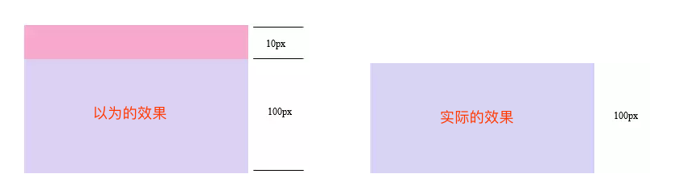
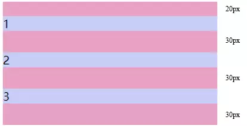
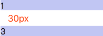
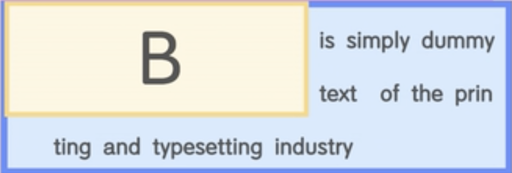

## 边距重叠

什么是边距重叠呢?

边界重叠是指两个或多个盒子(可能相邻也可能嵌套)的相邻边界(其间没有任何非空内容、补白、边框)重合在一起而形成一个单一边界。

### 父子元素边界重叠 [高度坍塌]

```html {8}
<style>
  .parent {
    background: #e7a1c5;
  }
  .parent .child {
    background: #c8cdf5;
    height: 100px;
    margin-top: 10px;
  }
</style>
<div class="parent">
  <div class="child"></div>
</div>
```

效果：



在这里父元素的高度不是 110px，而是 100px，在这里发生了**高度坍塌**。


### 兄弟元素边界重叠 [取最大边距]

```html
<style>
  #margin {
    background: #e7a1c5;
    overflow: hidden;
    width: 300px;
  }
  #margin > p {
    background: #c8cdf5;
    margin: 20px auto 30px;
  }
</style>
<section id="margin">
  <p>1</p>
  <p>2</p>
  <p>3</p>
</section
```



可以看到 1 和 2,2 和 3 之间的间距不是 50px，发生了**边距重叠是取了它们之间的最大值** 30px。

### 空元素边界重叠 [取空元素最大边距]

```html {8}
<style>
  p:nth-child(1),
  p:nth-child(3) {
    height: 20px;
    background-color: #c8cdf5;
  }
  p:nth-child(2) {
    margin: 20px 0 30px 0;
  }
</style>
<p>1</p>
<p></p>
<p>3</p>
```



## BFC

在进行 css 布局时我们总会遇到各种问题。比如，明明说好每个元素都是一个打包盒，那在打包盒元素外的元素应该不会受到打包盒内的元素影响。

理论上讲被包涵在父元素里的子元素是不会影响到父元素旁边的元素，但实际上并不总是如此，比如上面提到的边距重叠问题。那有没有什么办法能**让里面的元素和外部真正隔离开**呢。

BFC 就是用来解决这个问题的。解决上述问题的其中一个办法就是创建 `BFC`。`BFC` 的全称为 `Block Formatting Context`，即块级格式化上下文。

:::tip BFC 的目的
**形成一个完全独立的空间，让空间中的子元素不会影响到外面的布局。**
:::

### BFC 的创建方法

通过为元素设置一些 CSS 属性就能创建 BFC，而最常用的触发规则有 4 种。

1. `float` 不为 `none`
2. `position` 不为 `relative` 和 `static`
3. overflow 为 `auto`、 `scroll` 和 `hidden`
4. `display` 为 `table-cell` 或 `inline-block`

### 解决高度坍塌问题

第一种可以解决浮动元素令父元素高度坍塌问题。假设页面有一个父元素和几个子元素，这几个子元素都设置为浮动时，就会产生高度坍塌的现象，这是因为浮动的子元素脱离了文档流。

:::details 示例

```html
<div class="box">
  <div class="d1"></div>
  <div class="d2"></div>
  <div class="d3"></div>
</div>

<style>
  .box {
    width: 500px;
    background-color: #e7a1c5;
  }
  .box div {
    width: 100px;
    height: 100px;
  }
  .box div.d1 {
    float: left;
    background-color: #c8cdf5;
  }
  .box div.d2 {
    float: left;
    background-color: green;
  }
  .box div.d3 {
    float: right;
    background-color: red;
  }
</style>
```



**解决方案**

```css
overflow: auto; /* hidden、scroll */
display: table-cell; /* inline-block table*/ /* ⚠️ flex 布局会让浮动失效 */
position: fixed; /* absolute */
```

:::

触发了 BFC 的容器就是页面上的一个完全独立隔离开的容器，容器中的子元素不会影响到容器外的元素。为了保证这个规则，触发了 `BFC` 的父元素在计算高度时，不得不让浮动的子元素参与进来，变相得实现清除内部浮动的目的。

### 清除内部浮动

```html
<style>
  #float {
    background: #fec68b;
  }
  #float .float {
    float: left;
  }
</style>
<section id="float">
  <div class="float">我是浮动元素</div>
</section>
```

父元素`#float` 的高度为 0，解决方案为为父元素`#float` 创建 BFC，这样浮动子元素的高度也会参与到父元素的高度计算：

```css
#float {
  background: #fec68b;
  overflow: hidden; /*这里也可以用float:left*/
}
```


### 自适应两栏布局

```html
<section id="layout">
  <style>
    #layout {
      background: red;
    }
    #layout .left {
      float: left;
      width: 100px;
      height: 100px;
      background: pink;
    }
    #layout .right {
      height: 110px;
      background: #ccc;
    }
  </style>
  <!--左边宽度固定，右边自适应-->
  <div class="left">左</div>
  <div class="right">右</div>
</section>
```

在这里设置右边的高度高于左边，可以看到左边超出的部分跑到右边去了，这是由于由于浮动框不在文档的普通流中，所以文档的普通流中的块框表现得就像浮动框不存在一样导致的。


解决方案为给右侧元素创建一个 BFC，原理是 BFC 不会与 float 元素发生重叠。

```css
#layout .right {
  height: 110px;
  background: #ccc;
  overflow: auto;
}
```


参考 [边距重叠与 BFC](https://segmentfault.com/a/1190000012265930)