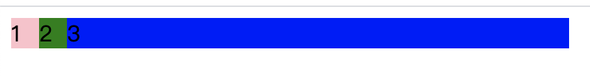
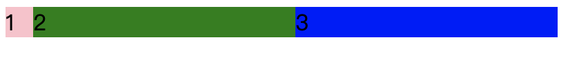

```css
.box {
  /* 项目的排列方向 默认 row */
  flex-direction: row | row-reverse | column | column-reverse;

  /* 换行方式：默认不换行 */
  flex-wrap: nowrap | wrap | wrap-reverse;

  /* flex-direction属性和flex-wrap属性的简写形式，默认值为row nowrap。 */
  flex-flow: <flex-direction> || <flex-wrap>;

  /* 项目在主轴上的对齐方式 默认 flex-start */
  justify-content: flex-start | flex-end | center | space-between | space-around;

  /* 项目在交叉轴上如何对齐 默认 flex-start */
  align-items: flex-start | flex-end | center | baseline | stretch;

  /* 多根轴线的对齐方式。如果项目只有一根轴线，该属性不起作用 */
  align-content: flex-start | flex-end | center | space-between | space-around | stretch;
}
```

## 父容器

### justify-content


具体对齐方式与轴的方向有关。下面假设主轴为从左到右

- flex-start（默认值）：左对齐
- flex-end：右对齐
- center： 居中
- `space-between`：两端对齐，项目之间的间隔都相等。
- `space-around`：每个项目两侧的间隔相等。所以，项目之间的间隔比项目与边框的间隔大一倍。

### align-items


它可能取 5 个值。具体的对齐方式与交叉轴的方向有关，下面假设交叉轴从上到下。

- flex-start：交叉轴的起点对齐。
- flex-end：交叉轴的终点对齐。
- center：交叉轴的中点对齐。
- baseline: 项目的第一行文字的基线对齐。
- stretch（默认值）：如果项目未设置高度或设为 auto，将占满整个容器的高度。

### align-content


## 设置项目

推荐

- [深入理解 flex-grow、flex-shrink、flex-basis](https://juejin.im/post/5dedb28ef265da33b12e98cd)

### order [项目排列顺序]

order 属性定义项目的排列顺序。数值越小，排列越靠前，默认为 0。

```css
.item {
  order: <integer>;
}
```

### flex-grow [剩余空间放大比例]

flex-grow 属性定义项目的放大比例，默认为 0，即如果存在剩余空间，也不放大。


假设默认三个项目中前两个个项目都是 0，最后一个是 1，最后的项目会沾满剩余所有空间。

```html {23}
<div class="box">
  <div>1</div>
  <div>2</div>
  <div>3</div>
</div>

<style>
  .box {
    width: 400px;
    background-color: #ccc;
    display: flex;
  }
  .box div {
    width: 20px;
  }
  .box div:nth-child(1) {
    background-color: pink;
  }
  .box div:nth-child(2) {
    background-color: green;
  }
  .box div:nth-child(3) {
    flex-grow: 1;
    background-color: blue;
  }
</style>
```



假设只有第一个项目默认为 0，后面两个项目 flex-grow 均为 1，那么后两个项目平分剩余空间。

```css {2}
.box div:nth-child(2) {
  flex-grow: 1;
  background-color: green;
}
```



同理。。。

### flex-shrink [不足空间缩小比例]

用于决定项目在空间不足时是否缩小，默认项目都是 1，即**空间不足**时大家一起等比缩小；

```css
.item {
  flex-shrink: <number>; /* default 1 */
}
```


但如果某个项目 flex-shrink 设置为 0，则即便空间不够，自身也不缩小。


### flex-basis [设置项目宽度]

取值：默认 auto，用于设置项目宽度，默认 auto 时，项目会保持默认宽度，或者以 width 为自身的宽度，但`如果设置了 flex-basis，权重会 width 属性高，因此会覆盖 widtn 属性`。


上图中先设置了 flex-basis 属性，后设置了 width 属性，但宽度依旧以 flex-basis 属性为准。

### flex [grow, shrink, basis] ✨

取值：默认 `0 1 auto`，flex 属性是 flex-grow，flex-shrink 与 flex-basis 三个属性的简写，用于定义项目放大，缩小与宽度。

```CSS
.item {flex: 2333 3222 234px;}
.item {
  flex-grow: 2333;
  flex-shrink: 3222;
  flex-basis: 234px;
}
```

当 flex 取值为 `none`，则计算值为 0 0 auto，如下是等同的：

```CSS
.item {flex: none;}
.item {
  flex-grow: 0;
  flex-shrink: 0;
  flex-basis: auto;
}

```

> `flex:1` 到底代表什么?

### align-self

取值：auto(默认) | flex-start | flex-end | center | baseline | stretch，表示继承父容器的 align-items 属性。如果没父元素，则默认 stretch。


---

参考

- [Flex 布局教程：语法篇](http://www.ruanyifeng.com/blog/2015/07/flex-grammar.html)
- [一篇文章弄懂 flex 布局](https://www.cnblogs.com/echolun/p/11299460.html)
- [深入理解 flex-grow、flex-shrink、flex-basis](https://juejin.im/post/5dedb28ef265da33b12e98cd)
- [flex 实战](./flex-examples.md)
