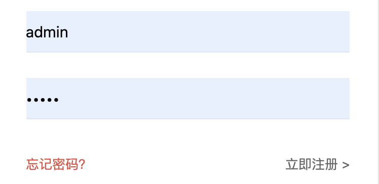
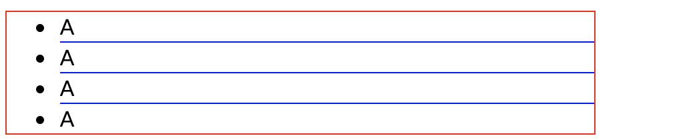
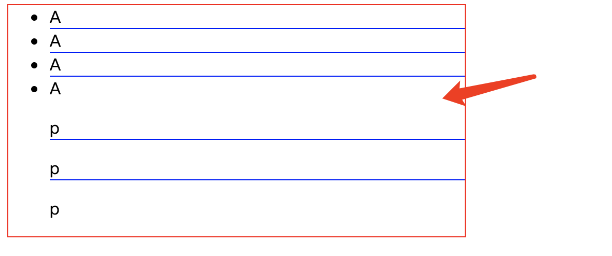
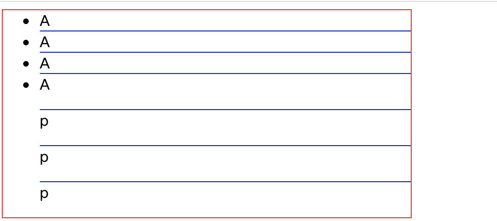

## last-child 和 last-of-type 的区别

`last-child`：一群兄弟元素中的最后一个元素，**且最后的这个元素必须是所声明的指定元素**

示例代码：

```html {5}
<ul>
  <li>A</li>
  <li>A</li>
  <li>A</li>
  <li>最后一个元素</li>
</ul>

<style>
  li:last-child {
    background-color: #abefa8;
  }
</style>
```

最后一个元素选中。和 `last-of-type` 不同的是：**且最后的这个元素必须是所声明的指定元素**

li 尾部跟随着不为 p 标签

```html
<ul>
  <li>A</li>
  <li>A</li>
  <li>A</li>
  <li>最后一个元素</li>
  <div>干扰元素</div>
</ul>
```

如果是 `last-of-type` 忽略这个干扰元素，照样选中最后一个 `li`，一般情况使用 `last-of-type`

## div 内置 img 元素，底部总有间距

```html
<div class="box">
  
  hhhh
</div>
<style>
  img {
    width: 200px;
    height: 200px;
  }
  .box {
    background-color: red;
  }
</style>
```


这种现象产生的原因是 img 是行内元素，浏览器为下行字符（如：g、y、j、p、q）留下的一些空间，这些字符是会比其他字符多占据底部一些空间（具体以当前字体大小有关），这种规则会影响行内元素 img 标签（其默认垂直对齐方式是依照基线来的，即 vertical-align: baseline），

解决办法 img：`vertical-align: bottom;` 或者 `middle`

## 自动填充密码会有背景色



即当浏览器（chrome）给输入框自动填充内容后，也会自动给输入框带上背景（黄或灰蓝），该问题是由于 chrome 会默认给自动填充的 `input`、`select`、`textarea` 等加上:`-webkit-autofill` 私有伪属性造成的，比较好的解决方案就是做样式覆盖，代码如下：

```css
input:-webkit-autofill {
  box-shadow: 0 0 0px 1000px white inset;
}
select:-webkit-autofill {
  box-shadow: 0 0 0px 1000px white inset;
}
textarea:-webkit-autofill {
  box-shadow: 0 0 0px 1000px white inset;
}
```

## 相邻兄弟选择器的妙用

```html
<ul>
  <li>A</li>
  <li>A</li>
  <li>A</li>
  <li>A</li>
</ul>

<style>
  ul {
    width: 400px;
    border: 1px solid red;
  }
  ul > li + li {
    border-top: 1px solid blue;
  }
</style>
```



虽然可以通过 `:not` + `:last-of-type` 实现同样的效果

```css
li:not(:last-of-type) {
  border-bottom: 1px solid blue;
}
```

但是我们改一下代码：

```html
<ul>
  <li class="item">A</li>
  <li class="item">A</li>
  <li class="item">A</li>
  <li class="item">A</li>
  <p class="item">p</p>
  <p class="item">p</p>
  <p class="item">p</p>
</ul>

<style>
  ul {
    width: 400px;
    border: 1px solid red;
  }
  .item:not(:last-of-type) {
    border-bottom: 1px solid blue;
  }
</style>
```

这里混入了 `p` 标签，用类选择，看看效果：



可以看到 `li` 和 `p` 标签直接并没有 `border` 效果。使用兄弟选择器：

```css
.item + .item {
  border-top: 1px solid blue;
}
```

最终效果：



## 收藏

- [CSS 专业技巧](https://github.com/AllThingsSmitty/css-protips/tree/master/translations/zh-CN)
- [我写 CSS 的常用套路](https://juejin.im/post/5e070cd9f265da33f8653f00):动画效果的实现
- [老姚：你未必知道的 49 个 CSS 知识点](https://juejin.im/post/5d3eca78e51d4561cb5dde12)
- [灵活运用 CSS 开发技巧](https://juejin.im/post/5d4d0ec651882549594e7293)
- [sunshine 小小倩: CSS 常见布局方式](https://juejin.im/post/599970f4518825243a78b9d5)
- [前端基础篇之 CSS 世界](https://juejin.im/post/5ce607a7e51d454f6f16eb3d): 基础
