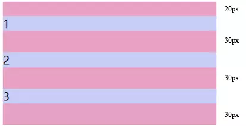
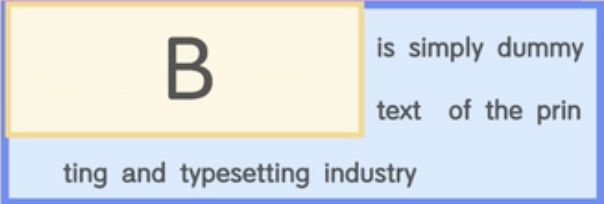

1. 为什么会有 BFC
2. BFC 是什么
3. 如何触发 BFC
4. BFC 可以解决什么问题
5. 这些问题还有其他解决方案吗

## 边距重叠

什么是边距重叠呢?

边界重叠是指两个或多个盒子(可能相邻也可能嵌套)的相邻边界(其间没有任何非空内容、补白、边框)重合在一起而形成一个单一边界。

### 父子元素的边界重叠

```html {8}
<style>
  .parent {
    background: #e7a1c5;
  }
  .parent .child {
    background: #c8cdf5;
    height: 100px;
    margin-top: 10px;
  }
</style>
<section class="parent">
  <article class="child"></article>
</section>
```

效果：


在这里父元素的高度不是 110px，而是 100px，在这里发生了**高度坍塌**。

原因是如果块元素的 `margin-top` 与它的第一个子元素的 `margin-top` 之间没有 `border`、`padding`、`inline content`、 `clearance` 来分隔，
或者块元素的`margin-bottom` 与它的最后一个子元素的`margin-bottom` 之间没有 `border`、`padding`、`inline content`、`height`、`min-height`、 `max-height` 分隔那么外边距会塌陷。子元素多余的外边距会被父元素的外边距截断。

### 兄弟元素的边界重叠

```html
<style>
  #margin {
    background: #e7a1c5;
    overflow: hidden;
    width: 300px;
  }
  #margin > p {
    background: #c8cdf5;
    margin: 20px auto 30px;
  }
</style>
<section id="margin">
  <p>1</p>
  <p>2</p>
  <p>3</p>
</section
```



可以看到 1 和 2,2 和 3 之间的间距不是 50px，发生了**边距重叠是取了它们之间的最大值** 30px。

### 空元素的边界重叠

```html {8}
<style>
  p:nth-child(1),
  p:nth-child(3) {
    height: 20px;
    background-color: #c8cdf5;
  }
  p:nth-child(2) {
    margin: 20px 0 30px 0;
  }
</style>
<p>1</p>
<p></p>
<p>3</p>
```


## BFC

在进行 css 布局时我们总会遇到各种问题。比如，明明说好每个元素都是一个打包盒，那在打包盒元素外的元素应该不会受到打包盒内的元素影响。

理论上讲被包涵在父元素里的子元素是不会影响到父元素旁边的元素，但实际上并不总是如此，比如上面提到的边距重叠问题。那有没有什么办法能**让里面的元素和外部真正隔离开**呢。

BFC 就是用来解决这个问题的。解决上述问题的其中一个办法就是创建 `BFC`。`BFC` 的全称为 `Block Formatting Context`，即块级格式化上下文。

:::tip BFC 的目的
**形成一个完全独立的空间，让空间中的子元素不会影响到外面的布局。**
:::

### BFC 的创建方法

通过为元素设置一些 CSS 属性就能创建 BFC，而最常用的触发规则有 4 种。

1. `float` 不为 `none`
2. `position` 不为 `relative` 和 `static`
3. overflow 为 `auto`、 `scroll` 和 `hidden`
4. `display` 为 `table-cell` 或 `inline-block`

### 解决高度坍塌问题

第一种可以解决浮动元素令父元素高度坍塌问题。假设页面有一个父元素和几个子元素，这几个子元素都设置为浮动时，就会产生高度坍塌的现象，这是因为浮动的子元素脱离了文档流。

:::details 示例

```html
<div class="box">
  <div class="d1"></div>
  <div class="d2"></div>
  <div class="d3"></div>
</div>

<style>
  .box {
    width: 500px;
    background-color: #e7a1c5;
  }
  .box div {
    width: 100px;
    height: 100px;
  }
  .box div.d1 {
    float: left;
    background-color: #c8cdf5;
  }
  .box div.d2 {
    float: left;
    background-color: green;
  }
  .box div.d3 {
    float: right;
    background-color: red;
  }
</style>
```



**解决方案**

```css
overflow: auto; /* hidden、scroll */
display: table-cell; /* inline-block table*/ /* ⚠️ flex 布局会让浮动失效 */
position: fixed; /* absolute */
```

:::

触发了 BFC 的容器就是页面上的一个完全独立隔离开的容器，容器中的子元素不会影响到容器外的元素。为了保证这个规则，触发了 `BFC` 的父元素在计算高度时，不得不让浮动的子元素参与进来，变相得实现清除内部浮动的目的。

。。。等等
