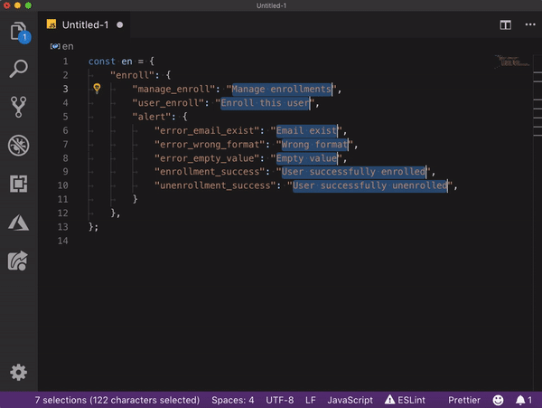
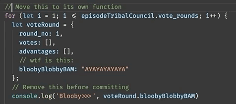
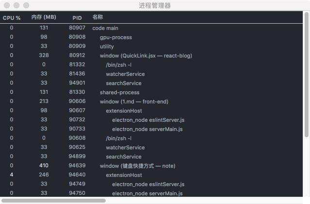

## 快捷键

### 禅模式编程模式

- 按下 `⌘ + k` 后，再按 `Z` 进入禅模式

编码无干扰。要退出禅模式，按 `ESC` 即可。

### 选中当前行 `⌘ + L`

### 选中所有找到的匹配项 `⇧ + ⌘ + L`

### 复制光标 `command + Option + 上下箭头`

### 格式化部分代码 `⌘ + K ⌘ + F`

### 在所选的每一行的末尾插入光标

| Windows           | Mac         |
| ----------------- | ----------- |
| `SHIFT + ALT + I` | `⇧ + ⌥ + I` |

## 插件

### 翻译插件 Google Translate

这里我修改了快捷键 `⌘ + T` 翻译并替换。查看翻译是 `shift + commad + T`

### Better Comments

[Better Comments](https://github.com/aaron-bond/better-comments),你可以使用不同的前缀来让注释显示为不同的颜色。非常适合快速扫描并发现重要的代码片段。

... 网上挺多

## vscode 打开进程管理器

打开左下角的设置的按钮，点击键盘快捷方式 或者 `⌘ + K ⌘ + M`, 搜索进程，绑定一个快捷键就可以了。

