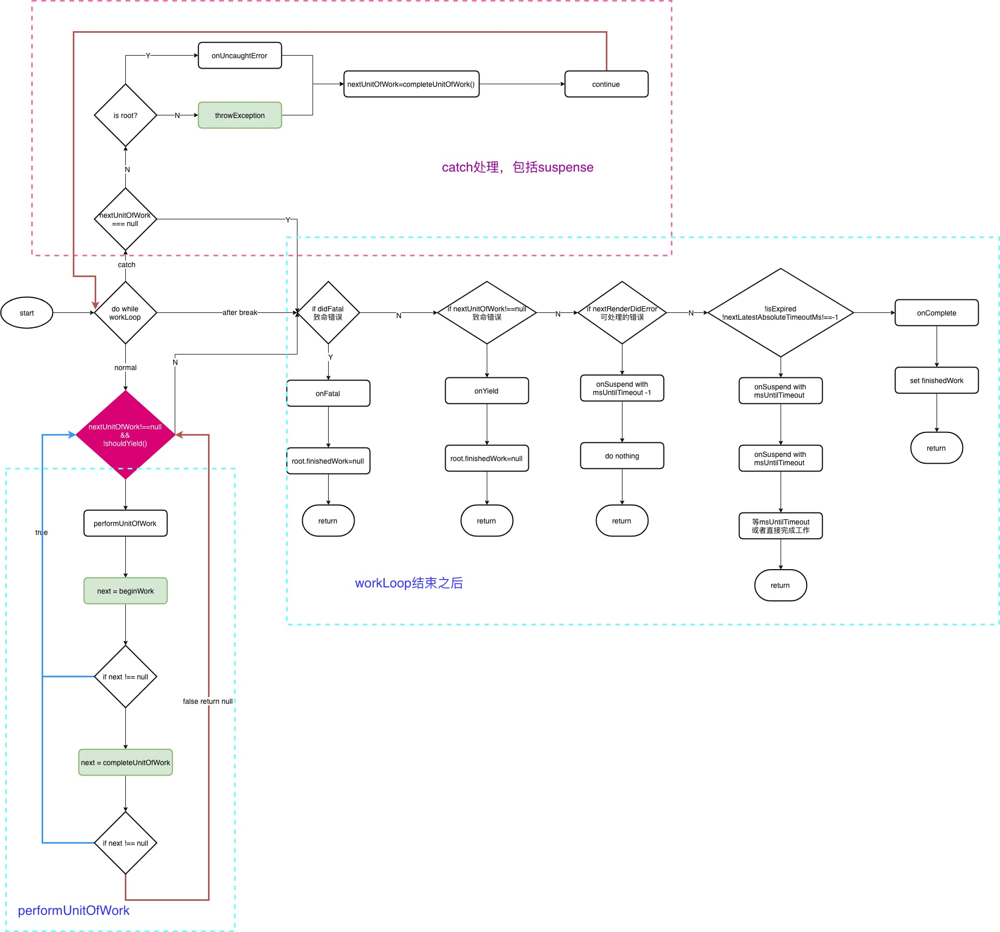

## 前言

- 关于版本: v16.8.6
- 关于工具: vscode 推荐阅读源码工具: Bookmarks
- 关于来源
  - from [Jokcy](https://react.jokcy.me/)
  - from [yck](https://yuchengkai.cn/react/)

> 阅读源码并不只是让你深入的理解一个框架的运作原理，更能让你在一些实现方案上学习到一些更优的方法

## 流程图概览

### React 的调度过程


::: details 查看流程解析

1. `ReactDOM.render`、`setState`、`forceUpdate` 都会 `createUpdate`，产生 `update` 对象之后进入 **schedulework**，进行调度。
2. `schedulework` 进行的第一步是 **addRootToSchedule**，**addRootToSchedule** 是什么意思呢？我们预想的是在 `react` 当中可能不止一个 `root` 节点，通过 ReactDOM.render 就会创建一个 `root` 节点，如果我们多次调用 `ReactDOM.render` 就会产生多个 `root` 节点，这时我们的 react 应用就会存在多个 `root` 节点，这些节点我们可以单独在内部进行 `setState` 等进行调度，他们都有独立的 `updateQueue`, 有独立的 `FiberTree`，进行应用的更新。一个应用有多个 `root` ，就需要它来维护，这就是 `addRootToSchedule` 的作用。
3. **加入之后，我们需要先判断是否在 `render` 阶段或者前后的 `root` 不同，**
   - 如果是正在 `render` 阶段或者前后的 `root` 不同，我们调用 `requestWork` 进行工作。
   - 如果不是，则 `return`，因为之前的任务在做或者处于目前的阶段我们不需要主动的调用 `requestWork` 一次更新。
4. `requestWork` 判断 `expirationTime` 是否是 `Sync`，回想一下我们在 `createUpdate` 的时候，就是我们调用 `ReactDOM.render`、`setState` 或者 `forceUpdate` 的时候我们要计算一个 `expirationTime` ，我们调用的是 [computeExpirationForFiber](./expirationTime.md#expirationtime) ， **这时候我们根据 `fiber` 是否有 `concurrent-mode` 的特性来计算 `Sync` 或者异步的 `expirationTime`**, 这最终导致一个整体更新模式的不同。
   - `Sync` 模式代表我们的更新要立马执行最终的 `DOM-Tree` 上面，所以我们调用的是 `performSyncWork`
   - 如果它是 `async` 模式，说明它优先级不是特别高。那么它会进入一个调度的流程，因为它可以不立即的更新，它本身的期望就是在 `expirationTime` 在结束之前能够被更新完成就可以了。
5. `async scheduler work`: **scheduleCallbackWithExpirationTime** ，这一部分涉及到整个异步的调度过程，它利用了浏览器一个较新的 api **requestIdleCallback** ，它能够让浏览器优先进行它自己的任务，比如更新动画，在每一帧有多余的时候它来调用 react 给她设置的 callback，然后他就可以执行 react 的更新，然后 react 会自己计时，在这个时间内我可以执行自己的工作，如果这个时间我的工作没有执行完，我要把 JavaScript 运行的主动权交还给浏览器，来保证浏览器的一些操作它的高优先级的工作可以被立即执行。
6. 最终 **同步和异步模式** 都调用 **preformWork**，只不过 `Sync` 调用时是没有 `deadline`的，而 `async` 调用的是带 `deadline` 的。
7. 根据是否有 **deadline** 我们会进入一个循环，这个循环就是我们要遍历整棵树，每一个 `fiber` 节点进行更新的操作。
   - 对于同步任务就执行这个工作就可以了。
   - 对于异步来讲，是否符合条件进入 `preformWorkOnRoot` 找到一个最高优先级的节点 `findHighestPriorityRoot` 对这个节点进行更新
8. 最终还有个循环去判断 deadline 因为要等 `preformWorkOnRoot` 返回之后我们才会进行下一个操作，对于一个有 `deadline` 需要重新请求一个时间来判断 `deadline` 是否已经过期，如果过期回过头来符合异步条件，继续调用 `scheduleCallbackWithExpirationTime` 再次进行异步的回调，因为这是一个递归的过程，在 `addRootToSchedule` 有一个队列在维护着所有的更新的情况。对于每次更新一个优先级的任务以及一个 `root` 上的任务。`deadline` 用于判断是否跳出循环，如果一直处于这个循环，可能占用的 javascript 的运行时间会非常长 导致动画停滞，用于输入卡顿
9. `deadline` 超出之后，循环跳出到 `scheduleCallbackWithExpirationTime` 再次进入调度，把 `JavaScript` 执行权交给浏览器先执行动画或者用户的响应。等空出时间，在执行任务调度。最终达到的目的是把所有 root 节点的更新执行完毕为止。

:::

### React 的渲染更新的过程



## React 中的数据结构

### FiberRoot

定位到 `packages/react-reconciler/src/ReactFiberRoot.js`

```ts
type BaseFiberRootProperties = {|
   // root节点，render方法接收的第二个参数 比如 document.getElementById('root')
  containerInfo: any,

  // 只有在持久更新中会用到，也就是不支持增量更新的平台，react-dom不会用到
  pendingChildren: any,

  // 当前应用对应的Fiber对象，是 RootFiber
  // 这里 FiberRoot 引用了 RootFiber
  current: Fiber,

  // 以下的 time 是来区分
  // 1 没有提交 committed 的任务
  // 2 没有提交的挂起任务
  // 3 没有提交的可能被挂起的任务
  // 我们选择不追踪每个单独的阻塞登记，为了兼顾性能
  // The earliest and latest priority levels that are suspended from committing.
  // 最老和新的在提交的时候被挂起的任务
  earliestSuspendedTime: ExpirationTime,
  latestSuspendedTime: ExpirationTime,

  // The earliest and latest priority levels that are not known to be suspended.
  // 最老和最新的不确定是否会挂起的优先级（所有任务进来一开始都是这个状态）
  earliestPendingTime: ExpirationTime,
  latestPendingTime: ExpirationTime,

  // The latest priority level that was pinged by a resolved promise and can
  // be retried.
  // 最新的通过一个promise被reslove并且可以重新尝试的优先级
  latestPingedTime: ExpirationTime,

  // 如果有错误被抛出并且没有更多的更新存在，我们尝试在处理错误前同步重新从头渲染
  // 在`renderRoot`出现无法处理的错误时会被设置为`true`
  didError: boolean,

  // 正在等待提交的任务的`expirationTime`
  pendingCommitExpirationTime: ExpirationTime,
  // 已经完成的任务的FiberRoot对象，如果你只有一个Root，那他永远只可能是这个Root对应的Fiber，或者是null
  // 在commit阶段只会处理这个值对应的任务
  finishedWork: Fiber | null,
  // 在任务被挂起的时候通过setTimeout设置的返回内容，用来下一次如果有新的任务挂起时清理还没触发的timeout
  timeoutHandle: TimeoutHandle | NoTimeout,
  // 顶层context对象，只有主动调用`renderSubtreeIntoContainer`时才会有用
  context: Object | null,
  pendingContext: Object | null,
  // 用来确定第一次渲染的时候是否需要融合
  +hydrate: boolean,
  // 当前root上剩余的过期时间
  // TODO: 提到renderer里面区处理
  nextExpirationTimeToWorkOn: ExpirationTime,
  // 当前更新对应的过期时间
  expirationTime: ExpirationTime,
  // List of top-level batches. This list indicates whether a commit should be
  // deferred. Also contains completion callbacks.
  // TODO: Lift this into the renderer
  // 顶层批次（批处理任务？）这个变量指明一个commit是否应该被推迟
  // 同时包括完成之后的回调
  // 貌似用在测试的时候？
  firstBatch: Batch | null,
  // root之间关联的链表结构
  nextScheduledRoot: FiberRoot | null,
｜}
```

### Fiber

什么是 `Fiber`?

1. 每一个 `ReactElement` 对应一个 `Fiber` 对象，用于记录节点的各种状态。
   - 比如组件的 `props`、`state` 等等都会记录在 `Fiber` 对象当中，`Fiber` 对象更新之后才会更新到各个组件当中！
2. 串联整个应用形成树结构。`Fiber` 会记录每个节点的应用并且串联起来！
   - `return` `child` `sibling`。

通过 `Fiber` 我们能够将 JS 渲染的这样一个单线程语言，能够让他表现为一个多线程。在计算机厘面，无非是时间和空间上面，他们两者之间的一个妥协，舍弃时间去换取空间，使用更大的空间换取时间，这就是它的一个思路，一个实现，当然这里面借助了链表、树这些数据结构。

定位到 `packages/react-reconciler/src/ReactFiber.js`

```ts
// Fiber对应一个组件需要被处理或者已经处理了，一个组件可以有一个或者多个Fiber

type Fiber = {|
  // 标记不同的组件类型
  tag: WorkTag,

  // ReactElement里面的key
  key: null | string,

  // ReactElement.type，也就是我们调用`createElement`的第一个参数
  elementType: any,

  // The resolved function/class/ associated with this fiber.
  // 异步组件resolved之后返回的内容，一般是`function`或者`class`
  type: any,

  // The local state associated with this fiber.
  // 跟当前Fiber相关本地状态（比如浏览器环境就是DOM节点）
  stateNode: any,

  // 指向他在Fiber节点树中的`parent`，用来在处理完这个节点之后向上返回
  return: Fiber | null,

  // 单链表树结构
  // 指向自己的第一个子节点
  child: Fiber | null,
  // 指向自己的兄弟结构
  // 兄弟节点的return指向同一个父节点
  sibling: Fiber | null,
  index: number,

  // ref属性
  ref: null | (((handle: mixed) => void) & { _stringRef: ?string }) | RefObject,

  // 新的变动带来的新的props
  pendingProps: any,
  // 上一次渲染完成之后的props
  memoizedProps: any,

  // 该Fiber对应的组件产生的Update会存放在这个队列里面
  updateQueue: UpdateQueue<any> | null,

  // 上一次渲染的时候的state
  memoizedState: any,

  // 一个列表，存放这个Fiber依赖的context
  firstContextDependency: ContextDependency<mixed> | null,

  // 用来描述当前Fiber和他子树的`Bitfield`
  // 共存的模式表示这个子树是否默认是异步渲染的
  // Fiber被创建的时候他会继承父Fiber
  // 其他的标识也可以在创建的时候被设置
  // 但是在创建之后不应该再被修改，特别是他的子Fiber创建之前
  mode: TypeOfMode,

  // Effect
  // 用来记录Side Effect
  effectTag: SideEffectTag,

  // 单链表用来快速查找下一个side effect
  nextEffect: Fiber | null,

  // 子树中第一个side effect
  firstEffect: Fiber | null,
  // 子树中最后一个side effect
  lastEffect: Fiber | null,

  // 代表任务在未来的哪个时间点应该被完成
  // 不包括他的子树产生的任务
  expirationTime: ExpirationTime,

  // 快速确定子树中是否有不在等待的变化
  childExpirationTime: ExpirationTime,

  // 在Fiber树更新的过程中，每个Fiber都会有一个跟其对应的Fiber
  // 我们称他为`current <==> workInProgress`
  // 在渲染完成之后他们会交换位置
  alternate: Fiber | null,

  // 下面是调试相关的，收集每个Fiber和子树渲染时间的

  actualDuration?: number,

  // If the Fiber is currently active in the "render" phase,
  // This marks the time at which the work began.
  // This field is only set when the enableProfilerTimer flag is enabled.
  actualStartTime?: number,

  // Duration of the most recent render time for this Fiber.
  // This value is not updated when we bailout for memoization purposes.
  // This field is only set when the enableProfilerTimer flag is enabled.
  selfBaseDuration?: number,

  // Sum of base times for all descedents of this Fiber.
  // This value bubbles up during the "complete" phase.
  // This field is only set when the enableProfilerTimer flag is enabled.
  treeBaseDuration?: number,

  // Conceptual aliases
  // workInProgress : Fiber ->  alternate The alternate used for reuse happens
  // to be the same as work in progress.
  // __DEV__ only
  _debugID?: number,
  _debugSource?: Source | null,
  _debugOwner?: Fiber | null,
  _debugIsCurrentlyTiming?: boolean
|}
```

### Update & UpdateQueue

什么是 `Update`？

1. `Update` 用于记录组件状态的改变
2. 存放在 `UpdateQueue` 中， `UpdateQueue` 是一个单向链表的结构，一次整体的更新过程当中，可能在这个 `Queue` 会存在多个 `Update`, 然后在这次的更新过程当中会根据这些 `Update` 的一个实际的结果然后算出最终的一个新的 `state` 的一个结果。
3. 多个 `Update` 可以同时存在。比如我们在一个事件里面调用了 3 次 `setState`, 那么这 3 次 `setState` 产生 3 个 `Update` 对象，他们并不会一次 `setState` 就更新整个应用。而是会等 3 个 `setState` 执行完了，3 个 `Update` 创建完放到 `UpdateQueue` 里面，然后再进行更新操作。

```ts {22}
export type Update<State> = {
  // 更新的过期时间
  expirationTime: ExpirationTime

  // export const UpdateState = 0;
  // export const ReplaceState = 1;
  // export const ForceUpdate = 2;
  // export const CaptureUpdate = 3;
  // 指定更新的类型，值为以上几种
  tag: 0 | 1 | 2 | 3
  // 更新内容，比如 setState 接收的第一个参数
  payload: any
  // 对应的回调，setState，render都有
  callback: (() => mixed) | null

  // 指向下一个更新
  next: Update<State> | null
  // 指向下一个 side effect
  nextEffect: Update<State> | null
}

export type UpdateQueue<State> = {
  // 每次操作完更新之后的 state
  baseState: State

  // 队列中的第一个 Update
  firstUpdate: Update<State> | null
  // 队列中的最后一个 Update
  lastUpdate: Update<State> | null

  // 第一个捕获类型的 Update
  firstCapturedUpdate: Update<State> | null
  // 最后一个捕获类型的 Update
  lastCapturedUpdate: Update<State> | null

  // 第一个 side effect
  firstEffect: Update<State> | null
  // 最后一个 side effect
  lastEffect: Update<State> | null

  // 第一个和最后一个捕获产生的 side effect
  firstCapturedEffect: Update<State> | null
  lastCapturedEffect: Update<State> | null
}
```

### effectTags

React 的一个精妙的设定就是它对类型的指定，它使用的是二进制，然后按二进制的按位与、按位或这样的一个操作来去取得它最终的一个渲染类型。

```ts
export type SideEffectTag = number

// Don't change these two values. They're used by React Dev Tools.
export const NoEffect = /*              */ 0b00000000000
export const PerformedWork = /*         */ 0b00000000001

// You can change the rest (and add more).
export const Placement = /*             */ 0b00000000010
export const Update = /*                */ 0b00000000100
export const PlacementAndUpdate = /*    */ 0b00000000110
export const Deletion = /*              */ 0b00000001000
export const ContentReset = /*          */ 0b00000010000
export const Callback = /*              */ 0b00000100000
export const DidCapture = /*            */ 0b00001000000
export const Ref = /*                   */ 0b00010000000
export const Snapshot = /*              */ 0b00100000000

// Update & Callback & Ref & Snapshot
export const LifecycleEffectMask = /*   */ 0b00110100100

// Union of all host effects
export const HostEffectMask = /*        */ 0b00111111111

export const Incomplete = /*            */ 0b01000000000
export const ShouldCapture = /*         */ 0b10000000000
```
