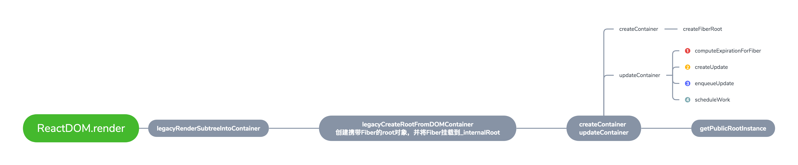
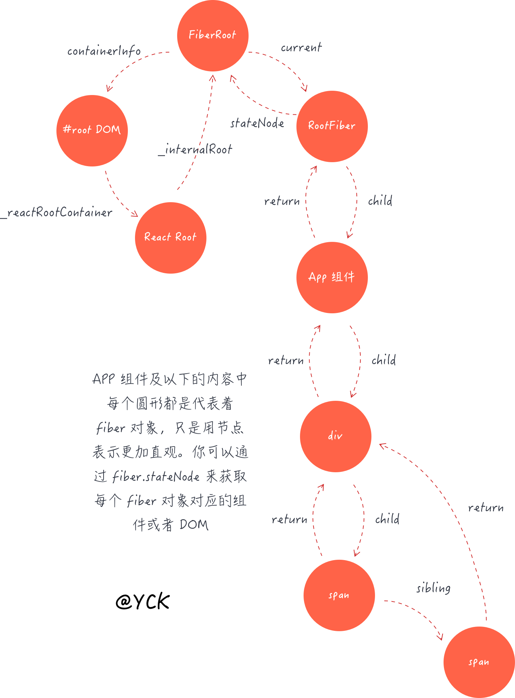
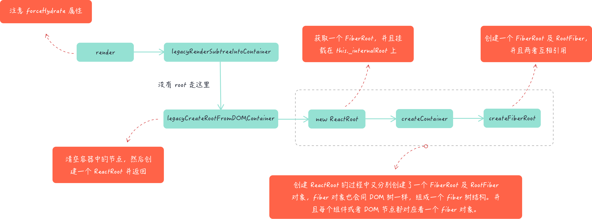

## 前言

这一章主要将 `React` 当中创建更新的一个过程 `ReactDOM.render`, 在 `React` 当中创建更新的主要有以下的方式:

- `ReactDom.render` `ReactDom.hydrate` : 这两个 `API` 都是 `React` 要把整个应用第一次渲染页面上面展现出来，这样的一个过程。
- `setState` `forceUpdate`: 后续我们需要更新这个应用需要调用的 `API`

`ReactDOM.render` 需要做什么事情呢？

1. 创建 `ReactRoot`：包含 `React` 整个应用的一个最顶点的对象。
2. 创建 `FiberRoot`和 `RootFiber`：这两个有点绕，他们两个是非常非常重要的一个知识点。
3. 创建更新：应用进入到更新调度的阶段，更新调度是下一章的内容～进入调度之后的后续操作都是由调度器去管理的。



:::tip
如上图（如果不清晰请打开新标签页查看，图来自于[合一大师](https://juejin.im/post/5df398f3518825125b21cbd3)）

本章只讲 `render` 函数中创建 `root` 的过程，调度更新等请看下一章节。

也即 `ReactDOM.render` -> `legacyRenderSubtreeIntoContainer` -> `legacyCreateRootFromDOMContainer` -> `createContainer` -> `createFiberRoot` 的过程
:::

## ReactDOM.render

想必大家在写 React 项目的时候都写过类似的代码

```jsx
ReactDOM.render(<APP />, document.getElementById('root')
```

这句代码告诉了 `React` 应用我们想在容器中渲染出一个组件，这通常也是一个 React 应用的入口代码，接下来我们就来梳理整个 `render` 的流程

定位到 `packages/react-dom/src/client/ReactDOM.js`

```ts {7,25}
render(
  element: React$Element<any>,
  container: DOMContainer, // 挂载到哪个 dom 节点
  callback: ?Function,
) {

  return legacyRenderSubtreeIntoContainer(
    null,
    element,
    container,
    false, // forceHydrate 服务端渲染 这里是客户端渲染 所以写死 false
    callback,
  );
}

function legacyRenderSubtreeIntoContainer(
  parentComponent: ?React$Component<any, any>,
  children: ReactNodeList,
  container: DOMContainer,
  forceHydrate: boolean,
  callback: ?Function
) {
  let root: Root = (container._reactRootContainer: any)
  if (!root) {
    root = container._reactRootContainer = legacyCreateRootFromDOMContainer(container, forceHydrate)
    // unbatchedUpdates -> 不批量更新
    unbatchedUpdates(() => {
      if (parentComponent != null) {
        root.legacy_renderSubtreeIntoContainer(parentComponent, children, callback)
      } else {
        root.render(children, callback)
      }
    })
  } else {
    // 有root的情况...
  }
  return getPublicRootInstance(root._internalRoot)
}
```

这部分代码其实没啥好说的，唯一需要注意的是在调用 `legacyRenderSubtreeIntoContainer` 函数时写死了第四个参数 `forceHydrate` 为 `false`。表示的是服务端渲染还是客户端渲染，这里是写死调用了客户端渲染。

接下来进入 `legacyRenderSubtreeIntoContainer` 函数，这部分代码分为两块来讲。

- 第一部分是没有 `root` 之前我们首先需要创建一个 `root`
- 第二部分是有 `root` 之后的渲染流程

## ReactRoot 对象

> 一开始进来函数的时候肯定是没有 root 的，因此我们需要去创建一个 root。

创建 `ReactRoot` 的时候会调用 `createContainer` 创建 [FiberRoot](/react-code-read/home.html#fiberroot)，在后期调度更新的过程中这个节点非常重要 这两个数据结构看[这里](/react-code-read/home.html#fiberroot)

```ts {16,21,27}
function legacyCreateRootFromDOMContainer(container, forceHydrate) {
  // SSR 相关
  const shouldHydrate = forceHydrate || shouldHydrateDueToLegacyHeuristic(container)

  // First clear any existing content.
  if (!shouldHydrate) {
    let warned = false
    let rootSibling
    while ((rootSibling = container.lastChild)) {
      container.removeChild(rootSibling)
    }
  }

  // 对于 Root 来说不需要异步
  const isConcurrent = false
  return new ReactRoot(container, isConcurrent, shouldHydrate)
}

function ReactRoot(container, isConcurrent, hydrate) {
  // 创建一个 fiberRoot 对象，并挂载到 _internalRoot 上。
  const root = createContainer(container, isConcurrent, hydrate)
  this._internalRoot = root
}

// from react-reconciler/inline.dom from react-reconciler/src/ReactFiberReconciler.js
export function createContainer(containerInfo, isConcurrent, hydrate) {
  return createFiberRoot(containerInfo, isConcurrent, hydrate)
}
```

#### ReactRoot

```jsx
function ReactRoot(container, isConcurrent, hydrate) {
  // 创建一个 fiberRoot 对象，并挂载到 _internalRoot 上。
  const root = createContainer(container, isConcurrent, hydrate)
  this._internalRoot = root
}
```

在 `ReactRoot` 构造函数内部就进行了一步操作，那就是创建了一个 [FiberRoot](/react-code-read/home.html#fiberroot) 对象，并挂载到了 `_internalRoot` 上。

大家可以发现这个 `root` 对象同样也被挂载在了 `container._reactRootContainer` 上，也就是我们的 `DOM` 容器上。
如果你手边有 `React` 项目的话，在控制台键入如下代码就可以看到这个 `root` 对象了。

```jsx
document.getElementById('root')._reactRootContainer
//  _internalRoot { current: FiberNode, containerInfo: div#root, ... }
```

> 和 `DOM` 树一样，`fiber` 也会构建出一个树结构（每个 DOM 节点一定对应着一个 `fiber` 对象），`FiberRoot` 就是整个 `fiber` 树的根节点.

下来的内容里我们将学习到关于 `fiber` 相关的内容。这里提及一点，`fiber` 和 `Fiber` 是两个不一样的东西，前者代表着数据结构，后者代表着新的架构。

### createFiberRoot

定位到 `packages/react-reconciler/src/ReactFiberRoot.js`

```ts {2}
export function createFiberRoot(containerInfo, isConcurrent, hydrate) {
  const uninitializedFiber = createHostRootFiber(isConcurrent)
  let root
  // ...
  root = {
    current: uninitializedFiber, // FiberRoot 和 Root Fiber 会互相引用
    containerInfo: containerInfo,
    pendingChildren: null
    // ....FiberRootNode 内部创建了很多属性
  }
  uninitializedFiber.stateNode = root
  return ((root: any): FiberRoot)
}
```

在 `createFiberRoot` 函数内部，分别创建了两个 `root`，一个 `root` 叫做 [FiberRoot](/react-code-read/home.html#fiberroot)，另一个 `root` 叫做 [RootFiber](/react-code-read/home.html#fiber)，并且它们两者还是相互引用的。

### createHostRootFiber

定位到 `packages/react-reconciler/src/ReactFiber.js`

```ts {8,12}
export function createHostRootFiber(isConcurrent: boolean): Fiber {
  let mode = isConcurrent ? ConcurrentMode | StrictMode : NoContext

  if (enableProfilerTimer && isDevToolsPresent) {
    mode |= ProfileMode
  }

  return createFiber(HostRoot, null, null, mode)
}

const createFiber = function(tag, pendingProps, key mode) {
  return new FiberNode(tag, pendingProps, key, mode)
}

function FiberNode(
  tag: WorkTag,
  pendingProps: mixed,
  key: null | string,
  mode: TypeOfMode,
) {
    this.stateNode = null;
	this.return = null;
	this.child = null;
	this.sibling = null;
	this.effectTag = NoEffect;
    this.alternate = null;
  // ...
}
```

**`return`、`child`、`sibling` 这三个属性很重要，它们是构成 `fiber` 树的主体数据结构。**

`fiber` 树其实是一个单链表树结构，`return` 及 `child` 分别对应着树的父子节点，并且父节点只有一个 `child` 指向它的第一个子节点，即便是父节点有好多个子节点。

答案是 `sibling`，每个子节点都有一个 `sibling` 属性指向着下一个子节点，都有一个 `return` 属性指向着父节点。这么说可能有点绕，我们通过图来了解一下这个 `fiber` 树的结构。

```jsx
const APP = () => (
  <div>
    <span></span>
    <span></span>
  </div>
)
ReactDom.render(<APP />, document.querySelector('#root'))
```

假如说我们需要渲染出以上组件，那么它们对应的 `fiber` 树应该长这样



从图中我们可以看到，每个组件或者 DOM 节点都会对应着一个 `fiber` 对象。另外你手边有 `React` 项目的话，也可以在控制台输入如下代码，查看 `fiber` 树的整个结构。

```jsx
// 对应着 FiberRoot
const fiber = document.querySelector('#root')._reactRootContainer._internalRoot
```

## 总结

以上就是本文的全部内容了，最后通过一张流程图总结一下这篇文章的内容。


