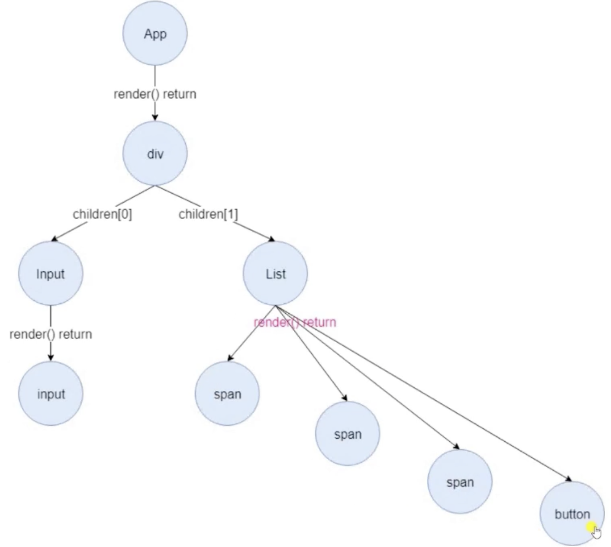

## 前言

这一章主要将 `React` 当中创建更新的一个过程 `ReactDOM.render`, 在 `React` 当中创建更新的主要有以下的方式:

- `ReactDom.render` `ReactDom.hydrate` : 这两个 `API` 都是 `React` 要把整个应用第一次渲染页面上面展现出来，这样的一个过程。
- `setState` `forceUpdate`: 后续我们需要更新这个应用需要调用的 `API`

`ReactDOM.render` 需要做什么事情呢？

1. 创建 `ReactRoot`：包含 `React` 整个应用的一个最顶点的对象。
2. 创建 `FiberRoot`和 `RootFiber`：这两个有点绕，他们两个是非常非常重要的一个知识点。
3. 创建更新：应用进入到更新调度的阶段，更新调度是下一章的内容～进入调度之后的后续操作都是由调度器去管理的。

## ReactDOM.render

通过一个简单的实例了解 `ReactDOM.render`：

```jsx
class List extends Component {
  state = { a: 1, b: 2, c: 3 }

  render() {
    const { a, b, c } = this.state
    return [
      <span key='a'>{a}</span>,
      <span key='b'>{b}</span>,
      <span key='c'>{c}</span>,
      // --
      <button>click</button>
    ]
  }
}

class Input extends Component {
  render() {
    return <input />
  }
}

class App extends Component {
  render() {
    return (
      <div className='main'>
        <Input />
        <List />
      </div>
    )
  }
}

ReactDOM.render(<App />, document.getElementById('root'))
```

执行 `ReactDOM.render` 后形成的一个完整的树结构：



在构建好 `App` 组件后我们调用 `ReactDom.render` 后 `React` 会构建出一个完整的树结构。接下来我们来看一下它的源码的具体的实现流程。

定位到 `packages/react-dom/src/client/ReactDOM.js`

```jsx
render(
  element: React$Element<any>,
  container: DOMContainer, // 挂载到哪个 dom 节点
  callback: ?Function,
) {

  return legacyRenderSubtreeIntoContainer(
    null,
    element,
    container,
    false, // forceHydrate 服务端渲染 这里是客户端渲染 所以写死 false
    callback,
  );
}
```

这部分代码其实没啥好说的，唯一需要注意的是在调用 `legacyRenderSubtreeIntoContainer` 函数时写死了第四个参数 `forceHydrate` 为 `false`。表示的是服务端渲染还是客户端渲染，这里是写死调用了客户端渲染。

接下来进入 `legacyRenderSubtreeIntoContainer` 函数，这部分代码分为两块来讲。

第一部分是没有 `root` 之前我们首先需要创建一个 `root`
第二部分是有 `root` 之后的渲染流程

## legacyRenderSubtreeIntoContainer

```jsx
function legacyRenderSubtreeIntoContainer(
  parentComponent: ?React$Component<any, any>,
  children: ReactNodeList,
  container: DOMContainer,
  forceHydrate: boolean,
  callback: ?Function
) {
  let root: Root = (container._reactRootContainer: any)
  if (!root) {
    root = container._reactRootContainer = legacyCreateRootFromDOMContainer(container, forceHydrate)
  }
  //... 下一章节在讲述，主要是针对 root 去创建更新
}
```

> 一开始进来函数的时候肯定是没有 root 的，因此我们需要去创建一个 root。

大家可以发现这个 `root` 对象同样也被挂载在了 `container._reactRootContainer` 上，也就是我们的 `DOM` 容器上。
如果你手边有 `React` 项目的话，在控制台键入如下代码就可以看到这个 `root` 对象了。

```jsx
document.getElementById('root')._reactRootContainer
//  _internalRoot { current: FiberNode, containerInfo: div#root, ... }
```

大家可以看到 `root` 是 `ReactRoot` 构造函数构造出来的，并且内部有一个 `_internalRoot` 对象，这个对象是本文接下来要重点介绍的 `fiber` 对象，接下来我们就来一窥究竟吧。

```jsx
function legacyCreateRootFromDOMContainer(container, forceHydrate) {
  // SSR 相关
  const shouldHydrate = forceHydrate || shouldHydrateDueToLegacyHeuristic(container)

  // First clear any existing content.
  if (!shouldHydrate) {
    let warned = false
    let rootSibling
    while ((rootSibling = container.lastChild)) {
      container.removeChild(rootSibling)
    }
  }

  // Legacy roots are not async by default.
  // 对于 Root 来说不需要异步
  const isConcurrent = false
  return new ReactRoot(container, isConcurrent, shouldHydrate)
}
```

首先还是和上文中提到的 `forceHydrate` 属性相关的内容，不需要管这部分，反正 `shouldHydrate` 肯定为 `false`。

接下来是将容器内部的节点全部移除，一般来说我们都是这样写一个容器的的

```jsx
<div id='root'></div>
```

这样的形式肯定就不需要去移除子节点了，这也侧面说明了一点那就是容器内部不要含有任何的子节点。

一是肯定会被移除掉，二来还要进行 `DOM` 操作，可能还会涉及到重绘回流等等。

最后就是创建了一个 `ReactRoot` 对象并返回。接下来的内容中我们会看到好几个 `root`，可能会有点绕。

## ReactRoot

```jsx
function ReactRoot(container: DOMContainer, isConcurrent: boolean, hydrate: boolean) {
  // 创建一个 fiberRoot 对象，并挂载到 _internalRoot 上。
  const root = createContainer(container, isConcurrent, hydrate)
  this._internalRoot = root
}

// from react-reconciler/inline.dom from react-reconciler/src/ReactFiberReconciler.js
export function createContainer(containerInfo, isConcurrent, hydrate) {
  return createFiberRoot(containerInfo, isConcurrent, hydrate)
}
```

在 `ReactRoot` 构造函数内部就进行了一步操作，那就是创建了一个 FiberRoot 对象，并挂载到了 `_internalRoot` 上。

> 和 `DOM` 树一样，`fiber` 也会构建出一个树结构（每个 DOM 节点一定对应着一个 `fiber` 对象），`FiberRoot` 就是整个 `fiber` 树的根节点.

下来的内容里我们将学习到关于 `fiber` 相关的内容。这里提及一点，`fiber` 和 `Fiber` 是两个不一样的东西，前者代表着数据结构，后者代表着新的架构。

## createFiberRoot

`packages/react-reconciler/src/ReactFiberRoot.js`

```jsx
export function createFiberRoot(containerInfo, isConcurrent, hydrate) {
  const uninitializedFiber = createHostRootFiber(isConcurrent)
  let root
  // ...
  root = {
    current: uninitializedFiber, // FiberRoot 和 Root Fiber 会互相引用
    containerInfo: containerInfo,
    pendingChildren: null
    // ....FiberRootNode 内部创建了很多属性
  }
  uninitializedFiber.stateNode = root
  return ((root: any): FiberRoot)
}
```

在 `createFiberRoot` 函数内部，分别创建了两个 `root`，一个 `root` 叫做 `FiberRoot`，另一个 `root` 叫做 `RootFiber`，并且它们两者还是相互引用的。

这两个对象内部拥有着数十个属性，现在我们没有必要一一去了解它们各自有什么用处，在当下只需要了解少部分属性即可，其他的属性我们会在以后的文章中了解到它们的用处。

对于 `FiberRoot` 对象来说，我们现在只需要了解两个属性，分别是 `containerInfo` 及 `current`。前者代表着容器信息，也就是我们的 `document.querySelector('#root')`；后者指向 `RootFiber`。

对于 `RootFiber` 对象来说，我们需要了解的属性稍微多点

## FiberNode

```jsx
// packages/react-reconciler/src/ReactFiberRoot.js
const uninitializedFiber = createHostRootFiber(isConcurrent)

// packages/react-reconciler/src/ReactFiber.js
export function createHostRootFiber(isConcurrent: boolean): Fiber {
  let mode = isConcurrent ? ConcurrentMode | StrictMode : NoContext

  if (enableProfilerTimer && isDevToolsPresent) {
    mode |= ProfileMode
  }

  return createFiber(HostRoot, null, null, mode)
}

const createFiber = function(tag, pendingProps, key mode) {
  return new FiberNode(tag, pendingProps, key, mode)
}

function FiberNode(
  tag: WorkTag,
  pendingProps: mixed,
  key: null | string,
  mode: TypeOfMode,
) {
  this.stateNode = null;
	this.return = null;
	this.child = null;
	this.sibling = null;
	this.effectTag = NoEffect;
  this.alternate = null;
  // ...
}
```

**`return`、`child`、`sibling` 这三个属性很重要，它们是构成 `fiber` 树的主体数据结构。**

`fiber` 树其实是一个单链表树结构，`return` 及 `child` 分别对应着树的父子节点，并且父节点只有一个 `child` 指向它的第一个子节点，即便是父节点有好多个子节点。

那么多个子节点如何连接起来呢？

答案是 `sibling`，每个子节点都有一个 `sibling` 属性指向着下一个子节点，都有一个 `return` 属性指向着父节点。这么说可能有点绕，我们通过图来了解一下这个 `fiber` 树的结构。

```jsx
const APP = () => (
  <div>
    <span></span>
    <span></span>
  </div>
)
ReactDom.render(<APP />, document.querySelector('#root'))
```

假如说我们需要渲染出以上组件，那么它们对应的 `fiber` 树应该长这样


从图中我们可以看到，每个组件或者 DOM 节点都会对应着一个 `fiber` 对象。另外你手边有 `React` 项目的话，也可以在控制台输入如下代码，查看 `fiber` 树的整个结构。

```jsx
// 对应着 FiberRoot
const fiber = document.querySelector('#root')._reactRootContainer._internalRoot
```

另外两个属性在本文中虽然用不上，但是看源码的时候笔者觉得很有意思，就打算拿出来说一下。

在说 `effectTag` 之前，我们先来了解下啥是 `effect`，简单来说就是 `DOM` 的一些操作，比如增删改，那么 `effectTag` 就是来记录所有的 `effect` 的，但是这个记录是通过位运算来实现的，这里 是 `effectTag` 相关的二进制内容。

如果我们想新增一个 `effect` 的话，可以这样写 `effectTag |= Update`；如果我们想删除一个 `effect` 的话，可以这样写 `effectTag &= ~Update`

最后是 `alternate` 属性。其实在一个 `React` 应用中，通常来说都有两个 `fiebr` 树，一个叫做 `old tree`，另一个叫做 `workInProgress tree`。

前者对应着已经渲染好的 `DOM` 树，后者是正在执行更新中的 `fiber tree`，还能便于中断后恢复。两棵树的节点互相引用，便于共享一些内部的属性，减少内存的开销。

毕竟前文说过每个组件或 DOM 都会对应着一个 fiber 对象，应用很大的话组成的 fiber 树也会很大，如果两棵树都是各自把一些相同的属性创建一遍的话，会损失不少的内存空间及性能。

当更新结束以后，workInProgress tree 会将 old tree 替换掉，这种做法称之为 double buffering，这也是性能优化里的一种做法，有兴趣的同学可以自行查找资料。

## 总结

以上就是本文的全部内容了，最后通过一张流程图总结一下这篇文章的内容。


