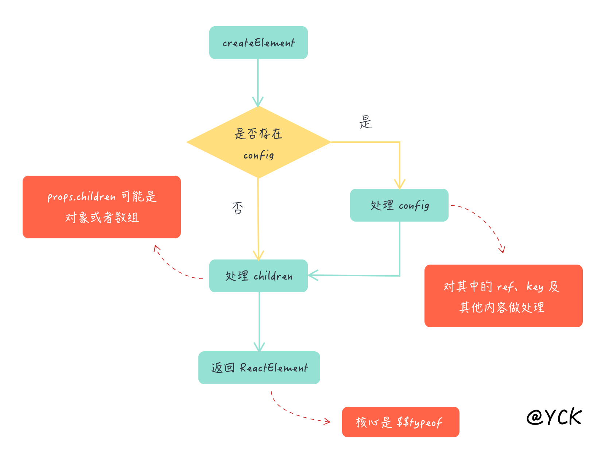
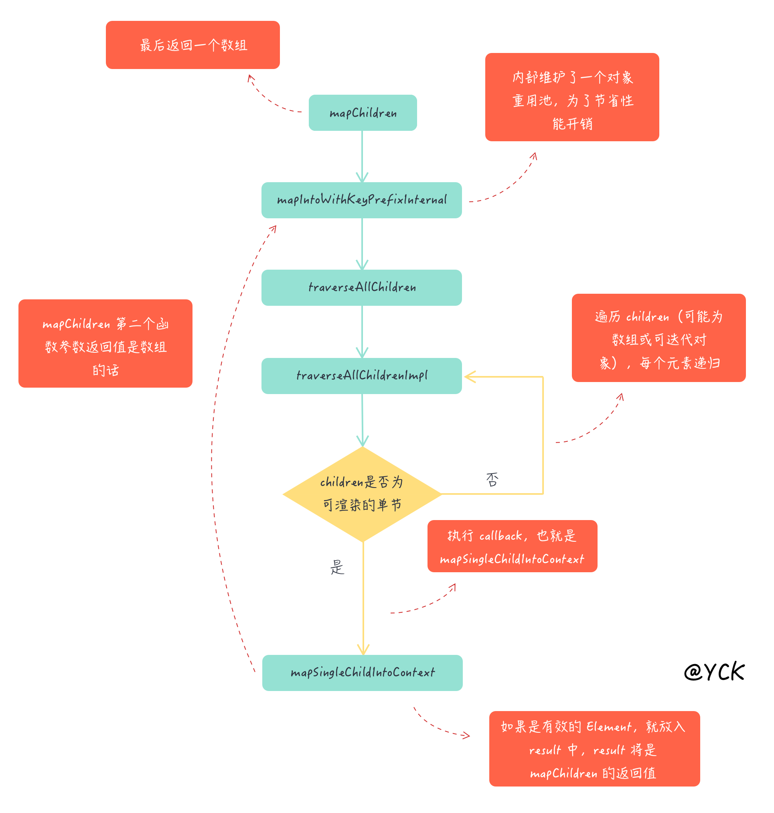

## 前言

**这一章节主要讲 React 的值得一讲的 API 和类方法， 比如 createElement、Children、Component 等等。**

定位到 `packages/react/src/React.js`

```ts
const Children = { map, forEach, count, toArray, only }
export {
  Children,
  createRef,
  Component,
  PureComponent,
  createContext,
  //...
  createElement,
  cloneElement,
  isValidElement //...
}
```

这里可以看到 `React` 导出了一系列的 `API` 和类，`Children`、`createRef`, `Component`等。

先让我们看看我们最熟悉的类 `Component` & `PureComponent`

## Component & PureComponent

定位到 `packages/react/src/ReactBaseClasses.js`

**Component**

```ts
function Component(props, context, updater) {
  this.props = props
  this.context = context
  this.refs = emptyObject
  this.updater = updater || ReactNoopUpdateQueue
}

Component.prototype.isReactComponent = {}

Component.prototype.setState = function(partialState, callback) {
  this.updater.enqueueSetState(this, partialState, callback, 'setState')
}

Component.prototype.forceUpdate = function(callback) {
  this.updater.enqueueForceUpdate(this, callback, 'forceUpdate')
}
```

`Component` 很简单，定义了 `props`、`context`、`refs` 还定义了 [updater](./home.md#update-updatequeue)

另外还在 `prototype` 上挂载了两个熟知的方法 `setState` `forceUpdate`

**PureComponent**

```ts
function ComponentDummy() {}
ComponentDummy.prototype = Component.prototype

function PureComponent(props, context, updater) {
  this.props = props
  this.context = context
  this.refs = emptyObject
  this.updater = updater || ReactNoopUpdateQueue
}
const pureComponentPrototype = (PureComponent.prototype = new ComponentDummy())
pureComponentPrototype.constructor = PureComponent
Object.assign(pureComponentPrototype, Component.prototype)
pureComponentPrototype.isPureReactComponent = true
```

`PureComponent` 继承自 `Component`，继承方法使用了很典型的寄生组合式。在 `PureComponent` 上我们还挂载了一个标示 `isPureReactComponent`. 这是用于判断是否为 `PureComponent`

定位到 `packages/react-reconciler/src/ReactFiberClassComponent.js`

```ts
if (ctor.prototype && ctor.prototype.isPureReactComponent) {
  return !shallowEqual(oldProps, newProps) || !shallowEqual(oldState, newState)
}
```

在这里进行了浅对比。**React 中对比一个 ClassComponent 是否需要更新，只有两个地方。一是看有没有 shouldComponentUpdate 方法，二就是这里的 PureComponent 判断**

## React.createElement

任何 `jsx` 语法都会被 `Babel` 编译为 `React.createElement` 来创建相应的 `ReactElement`。

这也是为什么我们在写 `jsx` 的时候必须加上 `import React from 'react'` 的原因，否则会报错。

```jsx
// jsx
;<div id='app'>content</div>

// babel 会转义为
React.createElement('div', { id: 'app' }, 'content')
```

定位到 `packages/react/src/ReactElement.js`, 我们可以看到 `React.createElement` 的实现函数为

```ts
export function createElement(type, config, children) {
  // 遍历 config 并把内建的几个属性 剔除 ref key 后将属性值赋予 props
  if (config != null) {
    // 验证是否有 ref  key 单独提取出来
    if (hasValidRef(config)) {
      ref = config.ref
    }
    if (hasValidKey(config)) {
      key = '' + config.key
    }

    self = config.__self === undefined ? null : config.__self
    source = config.__source === undefined ? null : config.__source
    // 遍历 config 并把内建的几个属性 剔除 ref key 后将属性值赋予 props
    for (propName in config) {
      if (hasOwnProperty.call(config, propName) && !RESERVED_PROPS.hasOwnProperty(propName)) {
        props[propName] = config[propName]
      }
    }
  }

  // 判断第二个参数之后的参数长度，即 children 长度
  // 例如 <div>content</div> 会编译为 React.createElement("div", null, "content") length === 1
  // 例如 <div><span>content</span></div> 会编译为 React.createElement("div", null, React.createElement("span", null, "content"))
  const childrenLength = arguments.length - 2
  if (childrenLength === 1) {
    props.children = children
  } else if (childrenLength > 1) {
    const childArray = Array(childrenLength)
    for (let i = 0; i < childrenLength; i++) {
      childArray[i] = arguments[i + 2]
    }
    props.children = childArray
  }
  //...
  return ReactElement(type, key, ref, self, source, ReactCurrentOwner.current, props)
}
```

**这段代码对 `ref` 以及 `key` 做了个验证），然后遍历 `config` 并把内建的几个属性（比如 `ref` 和 `key`）剔除后丢到 `props` 对象中**

type 指代这个 ReactElement 的类型，config 相当于 props， children 则是编译的组件内部的 children

## ReactElement

```ts
const ReactElement = function(type, key, ref, self, source, owner, props) {
  const element = {
    // This tag allows us to uniquely identify this as a React Element
    $$typeof: REACT_ELEMENT_TYPE,

    type: type,
    key: key,
    ref: ref,
    props: props,
    _owner: owner // Record the component responsible for creating this element.
  }
  // ...
  return element
}
```

`ReactElement` 只是一个用来承载信息的容器，他会告诉后续的操作这个节点的以下信息：

- `type` 类型，用于判断如何创建节点
- `key` 和 `ref` 这些特殊信息
- `props` 新的属性内容
- `$$typeof` 用于确定是否属于 `ReactElement`

内部代码很简单，核心就是通过 `$$typeof` 来帮助我们识别这是一个 `ReactElement`，后面我们可以看到很多这样类似的类型。另外我们需要注意一点的是：通过 `JSX` 写的 `<APP />` 代表着 `ReactElement`，`APP` 代表着 `React Component`。

从 `createElement` 到返回一个 `ReactElement` 的流程如下：



## React.Children

如果你没有使用过这个 `API`，可以先自行阅读 [文档](https://reactjs.org/docs/react-api.html#reactchildren)

对于 `mapChildren` 这个函数来说，通常会使用在组合组件设计模式上。

如果你不清楚什么是组合组件的话，可以看下 `Ant-design`，它内部大量使用了这种设计模式，比如说 `Radio.Group` `Radio.Button`，另外这里也有篇 [文档](https://react-cn.github.io/react/docs/multiple-components.html) 介绍了这种设计模式。

我们先来看下这个函数的一些神奇用法

```jsx
React.Children.map(this.props.children, c => [[c, c]])
```

对于上述代码，`map` 也就是 `mapChildren` 函数来说返回值是 `[c, c, c, c]`。不管你第二个参数的函数返回值是几维嵌套数组，`map` 函数都能帮你摊平到一维数组，并且每次遍历后返回的数组中的元素个数代表了同一个节点需要复制几次。

如果文字描述有点难懂的话，就来看代码吧：

```jsx
<div>
  <span>1</span>
  <span>2</span>
</div>
```

对于上述代码来说，通过 `c => [[c, c]]` 转换以后就变成了

```jsx
<span>1</span>
<span>1</span>
<span>2</span>
<span>2</span>
```

### mapIntoWithKeyPrefixInternal

接下里我们进入正题，来看看 `mapChildren` 内部到底是如何实现的。

```jsx {16,17,18}
// packages/react/src/ReactChildren.js
function mapChildren(children, func, context) {
  if (children == null) {
    return children
  }
  const result = []
  mapIntoWithKeyPrefixInternal(children, result, null, func, context)
  return result
}

function mapIntoWithKeyPrefixInternal(children, array, prefix, func, context) {
  let escapedPrefix = ''
  if (prefix != null) {
    escapedPrefix = escapeUserProvidedKey(prefix) + '/'
  }
  const traverseContext = getPooledTraverseContext(array, escapedPrefix, func, context)
  traverseAllChildren(children, mapSingleChildIntoContext, traverseContext)
  releaseTraverseContext(traverseContext)
}
```

这段代码有意思的部分是引入了对象重用池的概念，**分别对应 `getPooledTraverseContext` 和 `releaseTraverseContext` 中的代码**。当然这个概念的用处其实很简单，就是维护一个大小固定的对象重用池，每次从这个池子里取一个对象去赋值，用完了就将对象上的属性置空然后丢回池子。

### getPooledTraverseContext & releaseTraverseContext

> 维护这个池子的用意就是提高性能，毕竟频繁创建销毁一个有很多属性的对象会消耗性能。

```jsx
// packages/react/src/ReactChildren.js
const POOL_SIZE = 10
const traverseContextPool = []
function getPooledTraverseContext(mapResult, keyPrefix, mapFunction, mapContext) {
  if (traverseContextPool.length) {
    const traverseContext = traverseContextPool.pop()
    traverseContext.result = mapResult
    traverseContext.keyPrefix = keyPrefix
    traverseContext.func = mapFunction
    traverseContext.context = mapContext
    traverseContext.count = 0
    return traverseContext
  } else {
    return {
      result: mapResult,
      keyPrefix: keyPrefix,
      func: mapFunction,
      context: mapContext,
      count: 0
    }
  }
}

function releaseTraverseContext(traverseContext) {
  traverseContext.result = null
  traverseContext.keyPrefix = null
  traverseContext.func = null
  traverseContext.context = null
  traverseContext.count = 0
  if (traverseContextPool.length < POOL_SIZE) {
    traverseContextPool.push(traverseContext)
  }
}
```

那么按照这个流程来看，是不是 `pool` 永远都只有一个值呢，毕竟推出之后操作完了就推入了，这么循环着。答案肯定是否的，这就要讲到 `React.Children.map` 的一个特性了，那就是对每个节点的 `map` 返回的如果是数组，那么还会继续展开，这是一个递归的过程。接下去我们就来看看。

### traverseAllChildren

```jsx
function traverseAllChildren(children, callback, traverseContext) {
  if (children == null) {
    return 0
  }
  return traverseAllChildrenImpl(children, '', callback, traverseContext)
}

function traverseAllChildrenImpl(children, nameSoFar, callback, traverseContext) {
  const type = typeof children

  if (type === 'undefined' || type === 'boolean') {
    // All of the above are perceived as null.
    children = null
  }

  let invokeCallback = false

  if (children === null) {
    invokeCallback = true
  } else {
    switch (type) {
      case 'string':
      case 'number':
        invokeCallback = true
        break
      case 'object':
        switch (children.$$typeof) {
          case REACT_ELEMENT_TYPE:
          case REACT_PORTAL_TYPE:
            invokeCallback = true
        }
    }
  }

  if (invokeCallback) {
    callback(traverseContext, children, nameSoFar === '' ? SEPARATOR + getComponentKey(children, 0) : nameSoFar)
    return 1
  }
}
```

主体就是在判断 `children` 的类型是什么。如果是可以渲染的节点的话，就直接调用 `callback`，另外你还可以发现在判断的过程中，代码中有使用到 `$$typeof` 去判断的流程。这里的 `callback` 指的是 `mapSingleChildIntoContext` 函数，

```jsx
let child
let nextName
let subtreeCount = 0 // Count of children found in the current subtree.
const nextNamePrefix = nameSoFar === '' ? SEPARATOR : nameSoFar + SUBSEPARATOR

if (Array.isArray(children)) {
  for (let i = 0; i < children.length; i++) {
    child = children[i]
    nextName = nextNamePrefix + getComponentKey(child, i)
    subtreeCount += traverseAllChildrenImpl(child, nextName, callback, traverseContext)
  }
} else {
  const iteratorFn = getIteratorFn(children)
  if (typeof iteratorFn === 'function') {
    //...
  } else if (type === 'object') {
    // 提醒不正确的children类型
  }
}

return subtreeCount
```

这部分的代码首先会判断 `children` 是否为数组。如果为数组的话，就遍历数组并把其中的每个元素都递归调用 `traverseAllChildrenImpl`，也就是说必须是单个可渲染节点才可以执行上半部分代码中的 `callback`。

果不是数组的话，就看看 `children` 是否可以支持迭代，原理就是通过 `obj[Symbol.iterator]` 的方式去取迭代器，返回值如果是个函数的话就代表支持迭代，然后逻辑就和之前的一样了。

讲完了 `traverseAllChildrenImpl` 函数，我们最后再来阅读下 `mapSingleChildIntoContext` 函数中的实现。

#### mapSingleChildIntoContext

```jsx
// packages/react/src/ReactChildren.js
function mapSingleChildIntoContext(bookKeeping, child, childKey) {
  const { result, keyPrefix, func, context } = bookKeeping

  let mappedChild = func.call(context, child, bookKeeping.count++)
  if (Array.isArray(mappedChild)) {
    mapIntoWithKeyPrefixInternal(mappedChild, result, childKey, c => c)
  } else if (mappedChild != null) {
    if (isValidElement(mappedChild)) {
      mappedChild = cloneAndReplaceKey(
        mappedChild,
        keyPrefix +
          (mappedChild.key && (!child || child.key !== mappedChild.key)
            ? escapeUserProvidedKey(mappedChild.key) + '/'
            : '') +
          childKey
      )
    }
    result.push(mappedChild)
  }
}
```

`bookKeeping` 就是我们从对象池子里取出来的东西，然后调用 `func` 并且传入节点（此时这个节点肯定是单个节点），此时的 `func` 代表着 `React.mapChildren` 中的第二个参数。

接下来就是判断返回值类型的过程：如果是数组的话，还是回归之前的代码逻辑，注意这里传入的 `func` 是 `c => c`，因为要保证最终结果是被摊平的；如果不是数组的话，判断返回值是否是一个有效的 `Element`，验证通过的话就 `clone` 一份并且替换掉 `key`，最后把返回值放入 `result` 中，`result` 其实也就是 `mapChildren` 的返回值。

至此，`mapChildren` 函数相关的内容已经解析完毕，还不怎么清楚的同学可以通过以下的流程图再复习一遍。


