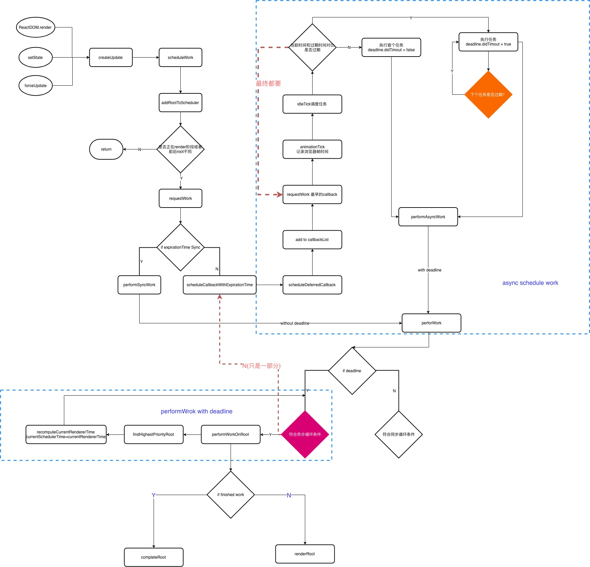

## 前言

`React16.5` 之后把 `scheduler` 单独发一个包了，就叫 `scheduler`。

**scheduler 能够把整个应用树更新的流程拆成每一个 fiber 为单元对象更新的流程，这种单元的形式拆分出来之后我们可以给每个不同的任务提供优先级以及我们在更新的过程当中，我们可以中断，因为我们可以记录我们更新到哪个单元，中断之后可以过一会再回过头来继续从这个单元开始之前没有做完的更新。**

> 为什么需要调度？

大家都知道 `JS` 和渲染引擎是一个互斥关系。如果 `JS` 在执行代码，那么渲染引擎工作就会被停止。假如我们有一个很复杂的复合组件需要重新渲染，那么调用栈可能会很长.

调用栈过长，再加上如果中间进行了复杂的操作，就可能导致长时间阻塞渲染引擎带来不好的用户体验，调度就是来解决这个问题的。

`React` 会根据任务的优先级去分配各自的 `expirationTime`，在过期时间到来之前先去处理更高优先级的任务，并且高优先级的任务还可以打断低优先级的任务（因此会造成某些生命周期函数多次被执行），从而实现在不影响用户体验的情况下去分段计算更新（也就是**时间分片**）

> React 如何实现调度

React 实现调度主要靠两块内容：

1. 计算任务的 `expriationTime`
2. 实现 `requestIdleCallback` 的 `polyfill` 版本

## 总体流程概览



主要代码位于 `packages/react-reconciler/src/ReactFiberScheduler.js`

::: details 查看流程解析

1. `ReactDOM.render`、`setState`、`forceUpdate` 都会 `createUpdate`，产生 `update` 对象之后进入 **schedulework**，进行调度。
2. `schedulework` 进行的第一步是 **addRootToSchedule**，**addRootToSchedule** 是什么意思呢？我们预想的是在 `react` 当中可能不止一个 `root` 节点，通过 ReactDOM.render 就会创建一个 `root` 节点，如果我们多次调用 `ReactDOM.render` 就会产生多个 `root` 节点，这时我们的 react 应用就会存在多个 `root` 节点，这些节点我们可以单独在内部进行 `setState` 等进行调度，他们都有独立的 `updateQueue`, 有独立的 `FiberTree`，进行应用的更新。一个应用有多个 `root` ，就需要它来维护，这就是 `addRootToSchedule` 的作用。
3. **加入之后，我们需要先判断是否在 `render` 阶段或者前后的 `root` 不同，**
   - 如果是正在 `render` 阶段或者前后的 `root` 不同，我们调用 `requestWork` 进行工作。
   - 如果不是，则 `return`，因为之前的任务在做或者处于目前的阶段我们不需要主动的调用 `requestWork` 一次更新。
4. `requestWork` 判断 `expirationTime` 是否是 `Sync`，回想一下我们在 `createUpdate` 的时候，就是我们调用 `ReactDOM.render`、`setState` 或者 `forceUpdate` 的时候我们要计算一个 `expirationTime` ，我们调用的是 [computeExpirationForFiber](./expirationTime.md#expirationtime) ， **这时候我们根据 `fiber` 是否有 `concurrent-mode` 的特性来计算 `Sync` 或者异步的 `expirationTime`**, 这最终导致一个整体更新模式的不同。
   - `Sync` 模式代表我们的更新要立马执行最终的 `DOM-Tree` 上面，所以我们调用的是 `performSyncWork`
   - 如果它是 `async` 模式，说明它优先级不是特别高。那么它会进入一个调度的流程，因为它可以不立即的更新，它本身的期望就是在 `expirationTime` 在结束之前能够被更新完成就可以了。
5. `async scheduler work`: **scheduleCallbackWithExpirationTime** ，这一部分涉及到整个异步的调度过程，它利用了浏览器一个较新的 api **requestIdleCallback** ，它能够让浏览器优先进行它自己的任务，比如更新动画，在每一帧有多余的时候它来调用 react 给她设置的 callback，然后他就可以执行 react 的更新，然后 react 会自己计时，在这个时间内我可以执行自己的工作，如果这个时间我的工作没有执行完，我要把 JavaScript 运行的主动权交还给浏览器，来保证浏览器的一些操作它的高优先级的工作可以被立即执行。
6. 最终 **同步和异步模式** 都调用 **preformWork**，只不过 `Sync` 调用时是没有 `deadline`的，而 `async` 调用的是带 `deadline` 的。
7. 根据是否有 **deadline** 我们会进入一个循环，这个循环就是我们要遍历整棵树，每一个 `fiber` 节点进行更新的操作。
   - 对于同步任务就执行这个工作就可以了。
   - 对于异步来讲，是否符合条件进入 `preformWorkOnRoot` 找到一个最高优先级的节点 `findHighestPriorityRoot` 对这个节点进行更新
8. 最终还有个循环去判断 deadline 因为要等 `preformWorkOnRoot` 返回之后我们才会进行下一个操作，对于一个有 `deadline` 需要重新请求一个时间来判断 `deadline` 是否已经过期，如果过期回过头来符合异步条件，继续调用 `scheduleCallbackWithExpirationTime` 再次进行异步的回调，因为这是一个递归的过程，在 `addRootToSchedule` 有一个队列在维护着所有的更新的情况。对于每次更新一个优先级的任务以及一个 `root` 上的任务。`deadline` 用于判断是否跳出循环，如果一直处于这个循环，可能占用的 javascript 的运行时间会非常长 导致动画停滞，用于输入卡顿
9. `deadline` 超出之后，循环跳出到 `scheduleCallbackWithExpirationTime` 再次进入调度，把 `JavaScript` 执行权交给浏览器先执行动画或者用户的响应。等空出时间，在执行任务调度。最终达到的目的是把所有 root 节点的更新执行完毕为止。

:::

## 组件进行调度的例子


点击 `button` 在 `List` 组件进行 `setState`，当前的 `fiber` 为 `List`， 而最终加入调度的是对应的 `rootFiber` 对象！

::: details 代码详情

```jsx
class App extends Component {
  render() {
    return (
      <div>
        <Input />
        <List />
      </div>
    )
  }
}

class Input extends Component {
  render() {
    return <input type='text' />
  }
}

class List extends Component {
  state = { x: 0, y: 0, z: 0 }
  render() {
    const { x, y, z } = this.state
    return (
      <>
        <span>{x}</span>
        <span>{y}</span>
        <span>{z}</span>
        <button
          onClick={e => {
            this.setState(prev => ({
              x: prev.x + 1,
              y: prev.y + 1,
              z: prev.z + 1
            }))
          }}>
          onClick
        </button>
      </>
    )
  }
}
```

:::
