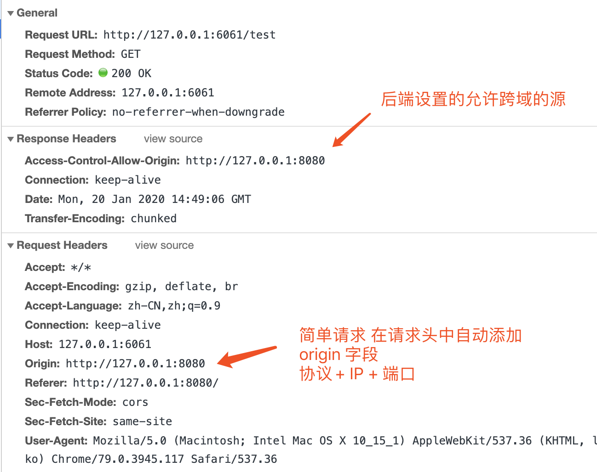
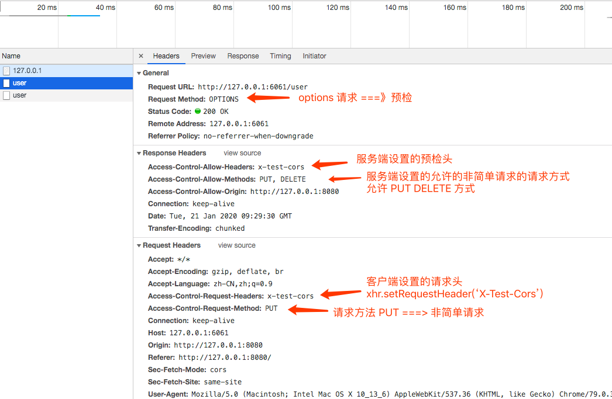

## 什么是跨域

> **跨域，是指浏览器不能执行其他网站的脚本。它是由浏览器的同源策略造成的，是浏览器对 JavaScript 实施的安全限制。**

所谓的同源是指，协议、域名、端口均为相同。

|        源 URL         |        请求 URL         | 是否跨域 |                       说明                       |
| :-------------------: | :---------------------: | :------: | :----------------------------------------------: |
| http://127.0.0.1:1234 | http://127.0.0.1:1234/b |    否    | 同协议 `http`； 同 IP `127.0.0.1`；同端口 `1234` |
|     http://a.com      |     http://a.com/b      |    否    |          同协议 `http`； 同域名 `a.com`          |
|     http://a.com      |     https://a.com/b     |    是    |             不同协议 `http` `https`              |
|     http://a.com      |   http://temp.a.com/b   |    是    |           主域名相同，但是子域名不相同           |
|     http://a.com      |    http://temp.b.com    |    是    |                     域名不同                     |

我们可以简单的重现浏览器的跨域问题：

**客户端**

```html
<!-- index.html -->
<h2>跨域测试页面</h2>
<script>
  var xhr = new XMLHttpRequest()
  xhr.open('GET', 'http://127.0.0.1:6061')
  xhr.send()
</script>
```

让我们用 `http-server` 起一个服务, 访问地址一般为 `http://127.0.0.1:8080`

**服务端**

```js
const http = require('http')
const url = require('url')

http
  .createServer(function(req, res) {
    console.log('request：', req.url)
    res.end('callback string')
  })
  .listen(6061)

console.log('server listening on 6061')
```

`node server.js` 之后控制台报错

Access to XMLHttpRequest at '`http://127.0.0.1:6061/`' from origin '`http://127.0.0.1:8080`' has been blocked by CORS policy: **No 'Access-Control-Allow-Origin' header is present on the requested resource.**

这就是不同端口导致的跨域问题。

## jsonp

`HTML` 标签里，一些标签比如 `script`、`img` 这样的获取资源的标签是没有跨域限制的

**`jsonp` 的原理就是利用就是利用 `script` 标签没有跨域限制，可以通过 `script` 标签的 `src` 属性发送 `GET` 请求。**

基本思想：

1. 客户端利用 `script` 标签可以跨域请求资源的性质，向网页中动态插入 `script` 标签，来向服务端请求数据。
2. 服务端会解析请求的 `url`,至少拿到一个回调函数(比如 `callback=jsonCallback`)参数,之后将数据放入其中返回给客户端。
3. 当然 `jsonp` 不同于平常的 `ajax` 请求,它仅仅支持 `get` 类型的方式

### 实现 jsonp

**客户端**

```html
<h2>跨域测试页面</h2>
<script>
  var requestUrl = 'http://127.0.0.1:6061?username=guosw&callback=jsonCallback'
  var script = document.createElement('script')
  script.src = requestUrl
  document.body.appendChild(script)
  function jsonCallback(data) {
    console.log('recive data:', data)
  }
</script>
```

**服务端**

```js
const http = require('http')
const url = require('url')

http
  .createServer(function(req, res) {
    console.log('request：', req.url)
    const query = url.parse(req.url, true).query
    res.writeHead(200, { 'Content-Type': 'application/json;charset=utf-8' })
    const json = { name: 'guosw' }
    // url = /?username=guosw&callback=onBack
    // 相当于 res.end('onBack({ "name": "guosw"})')
    res.end(`${query.callback}(${JSON.stringify(json)})`)
  })
  .listen(6061)

console.log('server listening on 6061')
```

虽然这种方式非常好用，但是一个最大的缺陷是，只能够实现 `get` 请求

### axios 下封装 jsonp

常规情况下前后分离用 `axios` 这个库多一些，所以做了个基于 `axios` 下的 `jsonp` 方法

```js
axios.jsonp = function(url) {
  if (typeof url !== 'string') {
    throw new Error('url must be string')
  }

  return new Promise((resolve, reject) => {
    try {
      const script = document.createElement('script')
      script.src = `${url}&callback=jsonCallBack`

      document.body.appendChild(script)
      window.jsonCallBack = result => {
        resolve(result)
        document.body.removeChild(script)
      }
    } catch (error) {
      reject(error)
    }
  })
}
```

调用：

```js
axios.jsonp('http://127.0.0.1:6061?username=guos').then(res => {
  console.log(res)
})
```

## Cors

`CORS` 需要浏览器和服务器同时支持。目前，所有浏览器都支持该功能，IE 浏览器不能低于 IE10。

整个 `CORS` 通信过程，都是浏览器自动完成，不需要用户参与。对于开发者来说，`CORS` 通信与同源的 AJAX 通信没有差别，代码完全一样。浏览器一旦发现 AJAX 请求跨源，就会自动添加一些**附加的头信息**，有时还会多出一次附加的请求，但用户不会有感觉。

因此，实现 `CORS` 通信的关键是服务器。只要服务器实现了 `CORS` 接口，就可以跨源通信。

**浏览器将 CORS 请求分成两类：简单请求（simple request）和非简单请求（not-so-simple request）。**

只要同时满足以下两大条件，就属于简单请求。

1. 请求方法是以下三种方法之一：`HEAD` `GET` `POST`
2. HTTP 的头信息不超出以下几种字段：

```yml
Accept
Accept-Language
Content-Language
Last-Event-ID
Content-Type：只限于三个值 application/x-www-form-urlencoded、multipart/form-data、text/plain
```

凡是不同时满足上面两个条件，就属于非简单请求。

### 简单请求

#### 基本流程

对于简单请求，浏览器直接发出 `CORS` 请求。具体来说，就是**在头信息之中，增加一个 `Origin` 字段**。

还是第一个例子，我们进行改造：

```html
<!-- index.html -->
<h2>跨域测试页面</h2>
<script>
  var xhr = new XMLHttpRequest()
  xhr.open('GET', 'http://127.0.0.1:6061')
  xhr.send()
  xhr.onreadystatechange = function() {
    if (xhr.readyState === 4) {
      if (xhr.status === 200) {
        console.log(xhr.responseText)
      }
    }
  }
</script>
```

```js
// server.js
const http = require('http')
const url = require('url')

http
  .createServer(function(req, res) {
    res.writeHead(200, {
      'Access-Control-Allow-Origin': 'http://127.0.0.1:8080'
    })

    res.end('callback string')
  })
  .listen(6061)

console.log('server listening on 6061')
```

浏览器判断跨域为简单请求时候，会在 `Request Header` 中添加 **Origin 协议 + 域名 + 端口**字段 ， 它表示我们的请求源，CORS 服务端会将该字段作为跨源标志。

`CORS` 接收到此次请求后 ， 首先会判断 `Origin` 是否在允许源（由服务端决定）范围之内，如果验证通过，服务端会在 `Response Header` 添加 `Access-Control-Allow-Origin`、`Access-Control-Allow-Credentials` 等字段。



#### 其他的字段

CORS 请求相关的字段，都以 `Access-Control-开头`。

**1. Access-Control-Allow-Origin**

该字段是必须的。它的值要么是请求时 `Origin` 字段的值，要么是一个`*`，表示接受任意域名的请求。

**2. Access-Control-Allow-Credentials**

该字段可选。它的值是一个布尔值，表示是否允许发送 `Cookie`。默认情况下，`Cookie` 不包括在 `CORS` 请求之中。设为 `true`，即表示服务器明确许可，`Cookie` 可以包含在请求中，一起发给服务器。这个值也只能设为 `true`，如果服务器不要浏览器发送 `Cookie`，删除该字段即可。

`CORS` 请求默认不发送 `Cookie` 和 `HTTP` 认证信息。如果要把 `Cookie` 发到服务器，一方面要服务器同意

```js
res.writeHead(200, {
  'Access-Control-Allow-Origin': 'http://127.0.0.1:8080',
  'Access-Control-Allow-Credentials': true
})
```

另一方面，开发者必须在 `AJAX` 请求中打开 `withCredentials` 属性。

```js
xhr.withCredentials = true
```

需要注意的是，如果要发送 `Cookie`，`Access-Control-Allow-Origin` 就不能设为星号，必须指定明确的、与请求网页一致的域名。同时，`Cookie` 依然遵循同源政策，只有用服务器域名设置的 `Cookie` 才会上传，其他域名的 `Cookie` 并不会上传，且（跨源）原网页代码中的 `document.cookie` 也无法读取服务器域名下的 `Cookie`。

**3. Access-Control-Expose-Headers**

该字段可选。`CORS` 请求时，`XMLHttpRequest` 对象的 `getResponseHeader()`方法只能拿到 6 个基本字段：`Cache-Control`、` Content-Language``、Content-Type `、`Expires`、`Last-Modified`、`Pragma`。如果想拿到其他字段，就必须在 `Access-Control-Expose-Headers` `里面指定。上面的例子指定，getResponseHeader('FooBar')`可以返回 `FooBar` 字段的值。

### 非简单请求

非简单请求是那种对服务器有特殊要求的请求，比如请求方法是 `PUT` 或 `DELETE`，或者 `Content-Type` 字段的类型是 `application/json`。

非简单请求的 `CORS` 请求，会在正式通信之前，增加一次 `HTTP` 查询请求，称为"预检"请求（`preflight`）。

**就是会发一个 `options` 请求， 浏览器先询问服务器，当前网页所在的域名是否在服务器的许可名单之中，以及可以使用哪些 HTTP 动词和头信息字段。只有得到肯定答复，浏览器才会发出正式的 `XMLHttpRequest` 请求，否则就报错。**

我们用上面的例子再实现一个 `PUT` 非简单请求

```html
<!-- index.html -->
<h2>跨域测试页面</h2>
<script>
  var xhr = new XMLHttpRequest()
  xhr.open('PUT', 'http://127.0.0.1:6061/user')
  xhr.setRequestHeader('X-Test-Cors') // 设置预检头
  xhr.send()
  xhr.onreadystatechange = function() {
    if (xhr.readyState === 4) {
      if (xhr.status === 200) {
        console.log(xhr.responseText)
      }
    }
  }
</script>
```

```js
// server.js
const http = require('http')
const url = require('url')

http
  .createServer(function(req, res) {
    res.writeHead(200, {
      'Access-Control-Allow-Origin': 'http://127.0.0.1:8080',
      'Access-Control-Allow-Headers': 'x-test-cors' // 设置预检头
      'Access-Control-Allow-Methods': 'PUT, DELETE', // 允许请求的方法
    })

    res.end('callback string')
  })
  .listen(6061)

console.log('server listening on 6061')
```

结果如下：



#### 预检请求

"预检"请求用的请求方法是 `OPTIONS`，表示这个请求是用来询问的。头信息里面，关键字段是 `Origin`，表示请求来自哪个源。

除了 `Origin` 字段，"预检"请求的头信息包括两个特殊字段。

客户端的 **Request Headers**:

**1. Access-Control-Request-Method**

该字段是必须的，用来列出浏览器的 `CORS` 请求会用到哪些 `HTTP` 方法，上例是 `PUT`。

**2. Access-Control-Request-Headers**

该字段是一个逗号分隔的字符串，指定浏览器 CORS 请求会额外发送的头信息字段，上例是 **X-Test-Cors**。

```js
xhr.setRequestHeader('X-Test-Cors', '123') // 设置预检头
```

#### 预检请求的回应

服务器收到"预检"请求以后，检查了 `Origin`、`Access-Control-Request-Method` 和 `Access-Control-Request-Headers` 字段以后，确认允许跨源请求，就可以做出回应。

服务器回应的其他 `CORS` 相关字段如下。

```yml
Access-Control-Allow-Headers: x-test-cors
Access-Control-Allow-Methods: PUT, DELETE
Access-Control-Allow-Origin: http://127.0.0.1:8080
```

**1. Access-Control-Allow-Methods**

该字段必需，它的值是逗号分隔的一个字符串，表明服务器支持的所有跨域请求的方法。注意，返回的是所有支持的方法，而不单是浏览器请求的那个方法。这是为了避免多次"预检"请求。

通过客户端设置预检头

```js
xhr.setRequestHeader('X-Test-Cors', '123') // 设置预检头
```

在服务端协商一致为

```yml
Access-Control-Allow-Headers: x-test-cors
```

**2. Access-Control-Allow-Headers**

我们可以发现，非简单请求单单设置了 `Access-Control-Allow-Origin` 和 `Access-Control-Allow-Headers` （允许跨域的源和预检头）还存在跨域的问题。是因为我们还没设置 `Access-Control-Allow-Headers`, 该字段也是必须的。

它也是一个逗号分隔的字符串，表明服务器支持的所有头信息字段，不限于浏览器在"预检"中请求的字段。

**3. Access-Control-Allow-Credentials**

该字段与简单请求时的含义相同。

**4. Access-Control-Max-Age**

该字段可选，用来指定本次预检请求的有效期，单位为秒。上面结果中，有效期是 20 天（1728000 秒），即允许缓存该条回应 1728000 秒（即 20 天），在此期间，不用发出另一条预检请求。

#### 相比 jsonp

`CORS` 与 `JSONP` 的使用目的相同，但是比 `JSONP` 更强大。

`JSONP` 只支持 GET 请求，`CORS` 支持所有类型的 `HTTP` 请求。`JSONP` 的优势在于支持老式浏览器，以及可以向不支持 `CORS` 的网站请求数据。

## postMessage

`postMessage` 是 `html5` 引入的 API,`postMessage()`方法允许来自不同源的脚本采用异步方式进行有效的通信,可以实现跨文本文档,多窗口,跨域消息传递.多用于窗口间数据通信,这也使它成为跨域通信的一种有效的解决方案.

### 示例

**index.html**

```html
<body style="border:5px solid #333;">
  <h1>this is index</h1>
  <iframe src="./iframe.html" id="myframe"></iframe>
</body>

<script>
  var iFrame = document.getElementById('myframe')

  window.addEventListener('message', listen, false)
  function listen(e) {
    console.log('index 监听 message: ', e, e.data)
  }

  iFrame.onload = function() {
    //iframe加载完立即发送一条消息
    iFrame.contentWindow.postMessage('index 给 iframe 发送的数据', '*')
  }
</script>
```

**iframe.html**

```html
<body style="border:5px solid #333;">
  <h1>this is iframePage</h1>

  <script>
    //给父页面发送消息
    parent.postMessage({ msg: 'iframe 给父窗口发送的消息' }, '*')

    //回调函数
    function receiveMessageFromIndex(e) {
      console.log('iframe 从 index 接收到消息：', e, e.data)
    }

    //监听message事件
    window.addEventListener('message', receiveMessageFromIndex, false)
  </script>
</body>
```

## WebSocket 协议跨域

`WebSocket protocol` 是 `HTML5` 一种新的协议。它实现了浏览器与服务器全双工通信，同时允许跨域通讯，是 `server push` 技术的一种很好的实现。
原生 `WebSocket API` 使用起来不太方便，我们使用 `Socket.io`，它很好地封装了 `webSocket` 接口，提供了更简单、灵活的接口，也对不支持 `webSocket` 的浏览器提供了向下兼容。

**index.html**

```html
<div>user input：<input type="text" /></div>
<script src="https://cdn.bootcss.com/socket.io/2.3.0/socket.io.js"></script>
<script>
  var socket = io('http://127.0.0.1:6061')

  // 连接成功处理
  socket.on('connect', function() {
    // 监听服务端消息
    socket.on('message', function(msg) {
      console.log('data from server: ---> ' + msg)
    })

    // 监听服务端关闭
    socket.on('disconnect', function() {
      console.log('Server socket has closed.')
    })
  })

  document.getElementsByTagName('input')[0].onblur = function() {
    socket.send(this.value)
  }
</script>
```

**server.js**

```js
const http = require('http')
const socket = require('socket.io')

const server = http
  .createServer(function(req, res) {
    res.writeHead(200, { 'Content-type': 'text/html' })
    res.end()
  })
  .listen(6061)

console.log('server listening on 6061')

// 监听socket连接
socket.listen(server).on('connection', function(client) {
  // 接收信息
  client.on('message', function(msg) {
    client.send('hello：' + msg)
    console.log('data from client: ---> ' + msg)
  })

  // 断开处理
  client.on('disconnect', function() {
    console.log('Client socket has closed.')
  })
})
```

## nginx 解决跨域

## 参考

- [阮一峰 跨域资源共享 CORS 详解](http://www.ruanyifeng.com/blog/2016/04/cors.html)
- [postMessage 可太有用了](https://juejin.im/post/5b8359f351882542ba1dcc31)
- [正确面对跨域，别慌](https://juejin.im/post/5a2f92c65188253e2470f16d)
